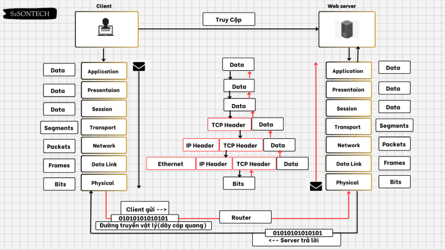

# Tìm hiểu về mô hình OSI

## 1.Mô hình OSI

- Mô hình kết nối các hệ thống mở OSI là mô hình căn bản về các tiến trình truyền thông, thiết lập các tiêu chuẩn kiến trúc mạng ở mức Quốc tế, là cơ sở chung để các hệ thống khác nhau có thể liên kết và truyền thông được với nhau. Mô hình OSI tổ chức các giao thức truyền thông thành 7 tầng, mỗi một tầng giải quyết một phần hẹp của tiến trình truyền thông, chia tiến trình truyền thông thành nhiều tầng và trong mỗi tầng có thể có nhiều giao thức khác nhau thực hiện các nhu cầu truyền thông cụ thể.

**Các tầng của mô hình OSI** 

Mô hình OSI bao gồm 7 tầng :

- Tầng vật lý (Physical layer)    
- Tầng liên kết dữ liệu (Data link layer) 
- Tầng mạng (Network layer)   
- Tầng giao vận (Transport layer) 
- Tầng phiên (Session layer)  
- Tầng trình diễn (Presentation layer)    
- Tầng ứng dụng (Application layer)   

## 2.Chức năng các tầng

1. Tầng Vật lý (Physical Layer)

Chức năng:
- Truyền dữ liệu dưới dạng các bit 0 và 1 qua phương tiện truyền dẫn vật lý (cáp đồng, cáp quang, sóng vô tuyến,…).
- Xác định đặc điểm vật lý của kết nối, như điện áp, tốc độ truyền, loại đầu nối.
- Điều khiển tốc độ truyền dữ liệu giữa hai thiết bị.
- Quản lý các tín hiệu vật lý giữa các thiết bị mạng.

Ví dụ thực tế:
- Cáp mạng Ethernet, cáp quang, Wi-Fi, Bluetooth, USB.

2. Tầng Liên kết dữ liệu (Data Link Layer)

Chức năng:
- Tạo ra các khung dữ liệu (Frames) và kiểm soát lỗi trong quá trình truyền.
- Định danh các thiết bị thông qua địa chỉ MAC.
- Phát hiện và sửa lỗi (nếu có thể) trước khi chuyển dữ liệu lên tầng trên.

Ví dụ thực tế:
- Switch: Hoạt động chủ yếu ở tầng này để chuyển tiếp dữ liệu dựa trên địa chỉ MAC.

3. Tầng Mạng (Network Layer)

Chức năng:
- Định tuyến dữ liệu từ nguồn đến đích qua nhiều mạng khác nhau.
- Gán địa chỉ IP cho thiết bị mạng để nhận diện và giao tiếp.
- Chia nhỏ và tái hợp các gói tin dữ liệu khi cần thiết (Fragmentation & Reassembly).

Ví dụ thực tế:
- IP (IPv4, IPv6): Định danh thiết bị bằng địa chỉ IP.
- Router: Chuyển tiếp gói tin giữa các mạng khác nhau.

4. Tầng Giao vận (Transport Layer)

Chức năng:
- Đảm bảo dữ liệu được truyền tải đúng thứ tự và không bị mất mát.
- Kiểm soát luồng dữ liệu để tránh tình trạng tắc nghẽn mạng.
- Kiểm tra lỗi và đảm bảo dữ liệu đến đúng địa chỉ.

Ví dụ thực tế:
- TCP (Transmission Control Protocol): Truyền dữ liệu có kiểm soát, đáng tin cậy (dùng cho web, email).
- UDP (User Datagram Protocol): Truyền dữ liệu nhanh, không kiểm tra lỗi (dùng cho VoIP, video streaming).
5. Tầng Phiên (Session Layer)

Chức năng:
- Quản lý phiên làm việc (Session) giữa hai thiết bị.
- Thiết lập, duy trì và kết thúc phiên giao tiếp giữa các ứng dụng.
- Đồng bộ hóa luồng dữ liệu để đảm bảo dữ liệu không bị mất khi kết nối bị gián đoạn.

Ví dụ thực tế:
- SSH (Secure Shell): Quản lý phiên làm việc từ xa an toàn.
- NetBIOS: Hỗ trợ chia sẻ tài nguyên trên mạng nội bộ.
- PPTP (Point-to-Point Tunneling Protocol): Hỗ trợ VPN.
6. Tầng Trình diễn (Presentation Layer)

Chức năng:
- Chuyển đổi định dạng dữ liệu giữa hệ thống gửi và hệ thống nhận.
- Mã hóa, nén hoặc giải mã dữ liệu để tối ưu truyền tải.
- Đảm bảo dữ liệu từ nhiều hệ thống khác nhau có thể hiểu được nhau.

Ví dụ thực tế:
- JPEG, PNG, MP3, MP4: Định dạng nén dữ liệu hình ảnh và âm thanh.
- ASCII, Unicode: Mã hóa ký tự.
7. Tầng Ứng dụng (Application Layer)

Chức năng:
- Cung cấp giao diện để người dùng và ứng dụng có thể truy cập vào mạng.
- Hỗ trợ các dịch vụ mạng như gửi email, duyệt web, truyền file, nhắn tin,...
- Quản lý cách ứng dụng giao tiếp với mạng.

Ví dụ thực tế:
- HTTP/HTTPS: Giao thức nền tảng của web (truy cập trang web).
- FTP (File Transfer Protocol): Truyền tải tệp tin giữa các máy tính.

**Tổng quan**

| Tầng | Tên                         | Chức năng chính                                       | Ví dụ thực tế                         |
|------|-----------------------------|------------------------------------------------------|----------------------------------------|
| **7** | Ứng dụng (Application)      | Cung cấp giao diện cho người dùng và ứng dụng       | HTTP, FTP, SMTP, DNS                   |
| **6** | Trình diễn (Presentation)   | Mã hóa, nén và chuyển đổi dữ liệu                   | SSL/TLS, JPEG, ASCII                   |
| **5** | Phiên (Session)             | Quản lý phiên giao tiếp giữa hai thiết bị           | SSH, NetBIOS, PPTP                     |
| **4** | Giao vận (Transport)        | Đảm bảo truyền dữ liệu đúng thứ tự và không mất mát | TCP, UDP                               |
| **3** | Mạng (Network)              | Định tuyến dữ liệu giữa các mạng                    | IP, ICMP, OSPF, BGP, Router            |
| **2** | Liên kết dữ liệu (Data Link)| Điều khiển truy cập vào môi trường truyền dẫn       | Ethernet, ARP, Switch                  |
| **1** | Vật lý (Physical)           | Truyền dữ liệu dạng bit qua môi trường vật lý       | Ethernet, Wi-Fi, Bluetooth             |

## Quy trình hoạt động của mô hình OSI

**Phía máy gửi**

- Tầng 7 (application): Người dùng đưa thông tin vào máy tính ( hình ảnh , văn bản)
- Tầng 6 (presentation): Chuyển dữ liệu thành một dạng chung để mã hóa dữ liệu
- Tầng 5 (session): Xác nhận, bổ sung thông tin cần thiết cho phiên giao dịch
- Tầng 4 (transport): Dữ liệu được cắt ra thành nhiều Segment và cũng bổ sung thông tin về phương thức vận chuyển dữ liệu để đảm bảo tính bảo mật
- Tầng 3 (network): Segment tiếp tục được cắt ra thành nhiều Package và bổ sung thông tin định tuyến , xác định đường đi cho gói dữ liệu
- Tầng 2 (datalink): Package được cắt nhỏ ra thành các Frame và bổ sung thông tin kiểm tra gói tin
- Tầng 1 (phisical): Frame được chuyển thành chuỗi nhị phân để truyền thông tin đến máy nhận

**Phía máy nhận**

- Tầng 1 (physical): Máy nhận kiểm tra quá trình đồng bộ và đưa các chuỗi bit nhị phân vào vùng đệm rồi gửi thông báo cho tầng Datalink là đã nhận dữ liệu
- Tầng 2 (datalink): Kiểm tra các lỗi trong Frame máy gửi tạo ra bằng cách kiểm tra FCS có trong gói tin được gắn phía máy nhận , nếu có lỗi thì frame đó bị hủy. Sau đó kiểm tra địa chỉ Mac Address xem có trùng địa chỉ máy nhận không, nếu đúng thì gỡ bỏ Header của tầng datalink để chuyển lên network
- Tầng 3 (network): Kiểm tra xem địa chỉ trong gói tin này có phải là địa chỉ của máy nhận hay không.Nếu đúng địa chỉ máy nhận, tầng Network sẽ gỡ bỏ Header của nó và tiếp tục chuyển đến tầng Transport để tiếp tục quy trình.
- Tầng 4 (transport): Hỗ trợ phục hồi lỗi và xử lý lỗi bằng cách gửi các gói tin ACK, NAK. Tầng này tiếp tục sắp xếp các thứ tự phân đoạn và đưa dữ liệu đến tầng Session
- Tầng 5 (session): Đảm bảo các dữ liệu trong gói tin nhận được toàn vẹn. Tiến hành gỡ bỏ Header của tầng Session và tiếp tục gửi lên ầng Presentation.
- Tầng 6 (presentation): Xử lý gói tin bằng cách chuyển đối các định dạng dữ liệu cho phù hợp. Sau khi hoàn thành sẽ tiến hành gửi lên tầng Application.
- Tầng 7 (application): Tiến hành xử lý và gỡ bỏ Header cuối cùng. Khi đó ở máy nhận sẽ nhận được dữ liệu của gói tin được truyền đi.

