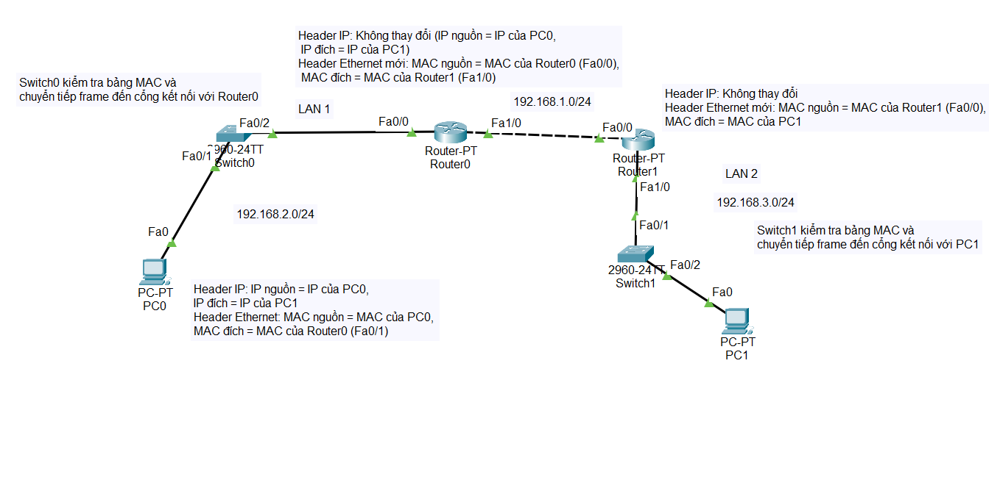
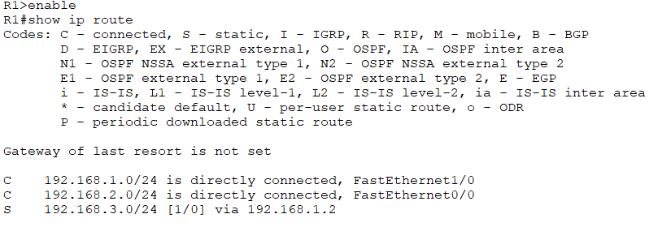
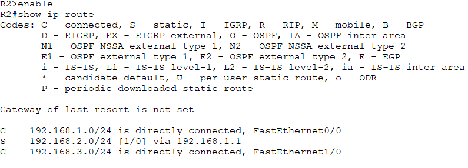
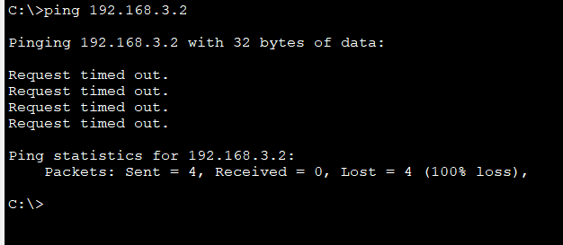

# Quá trình truyền dữ liệu từ PC0 đến PC1:

**1. PC0 chuẩn bị gửi dữ liệu:**
- PC0 kiểm tra địa chỉ IP đích (thuộc 192.168.3.0/24) và thấy nó không nằm trong cùng mạng con của mình (192.168.2.0/24)
- PC0 quyết định gửi gói tin cho Default Gateway (Router0)
- PC0 cần biết địa chỉ MAC của Router0 (giao diện Fa0/1), nên nó sử dụng ARP để tìm địa chỉ MAC tương ứng với IP Gateway
- PC0 đóng gói dữ liệu:
  - Header IP: IP nguồn = IP của PC0, IP đích = IP của PC1
  - Header Ethernet: MAC nguồn = MAC của PC0, MAC đích = MAC của Router0 (Fa0/1)

**2. Switch0 nhận và chuyển tiếp frame:**
- Switch0 hoạt động ở lớp 2, chỉ quan tâm đến địa chỉ MAC
- Switch0 kiểm tra bảng MAC và chuyển tiếp frame đến cổng kết nối với Router0
- Header Ethernet và IP không thay đổi

**3. Router0 xử lý gói tin:**
- Router0 nhận frame, kiểm tra và thấy MAC đích trùng với MAC của mình
- Router0 gỡ bỏ header Ethernet (lớp 2) và kiểm tra header IP (lớp 3)
- Router0 kiểm tra bảng định tuyến để xác định đường đi tới mạng đích 192.168.3.0/24
- Router0 xác định rằng gói tin cần được gửi tới Router1 qua giao diện Fa0/0
- Router0 cần biết địa chỉ MAC của Router1 (giao diện Fa1/0), nên sử dụng ARP nếu chưa có trong bảng ARP 
- Router0 đóng gói lại gói tin:
  - Header IP: Không thay đổi (IP nguồn = IP của PC0, IP đích = IP của PC1)
  - Header Ethernet mới: MAC nguồn = MAC của Router0 (Fa0/0), MAC đích = MAC của Router1 (Fa1/0)

**4. Router1 xử lý gói tin:**
- Router1 nhận frame, kiểm tra và thấy MAC đích trùng với MAC của mình
- Router1 gỡ bỏ header Ethernet và kiểm tra header IP
- Router1 kiểm tra bảng định tuyến và phát hiện mạng đích (192.168.3.0/24) được kết nối trực tiếp với giao diện Fa0/0
- Router1 cần biết địa chỉ MAC của PC1, nên sử dụng ARP để tìm MAC tương ứng với IP của PC1
- Router1 đóng gói lại gói tin:
  - Header IP: Không thay đổi (ngoại trừ TTL giảm thêm 1)
  - Header Ethernet mới: MAC nguồn = MAC của Router1 (Fa0/0), MAC đích = MAC của PC1

**5. Switch1 nhận và chuyển tiếp frame:**
- Switch1 hoạt động ở lớp 2, chỉ quan tâm đến địa chỉ MAC
- Switch1 kiểm tra bảng MAC và chuyển tiếp frame đến cổng kết nối với PC1
- Header Ethernet và IP không thay đổi

**6. PC1 nhận dữ liệu:**
- PC1 nhận frame, kiểm tra và thấy MAC đích trùng với MAC của mình
- PC1 gỡ bỏ header Ethernet và kiểm tra header IP
- PC1 thấy IP đích trùng với IP của mình, nên nó xử lý dữ liệu

# Cấu hình trên Router0
    enable
    configure terminal
    hostname R1
    interface FastEthernet0/0
    ip address 192.168.2.1 255.255.255.0
    no shutdown
    exit
    interface FastEthernet1/0
    ip address 192.168.1.1 255.255.255.0
    no shutdown
    exit

## Bảng định tuyến trên R1

    show ip route

# Cấu hình trên Router1
    enable
    configure terminal
    hostname R2
    interface FastEthernet0/0
    ip address 192.168.1.2 255.255.255.0
    no shutdown
    exit
    interface FastEthernet1/0
    ip address 192.168.3.1 255.255.255.0
    no shutdown
    exit

## Bảng định tuyến trên R2

    show ip route

# Cấu hình trên PC0
    IP Address: 192.168.2.2  
    Subnet Mask: 255.255.255.0  
    Default Gateway: 192.168.2.1  

# Cấu hình trên PC1
    IP Address: 192.168.3.2  
    Subnet Mask: 255.255.255.0  
    Default Gateway: 192.168.3.1  

# dùng định tuyến tĩnh (Static Route)
    Router(config)# ip route (network-address) (subnet-mask) (next-hop ip address/ exit interface)

## Trên R1 , thêm tuyến đường đến 192.168.3.0/24:

    ip route 192.168.3.0 255.255.255.0 192.168.1.2

## Trên R2, thêm tuyến đường đến 192.168.2.0/24:

    ip route 192.168.2.0 255.255.255.0 192.168.1.1

# Ping gói tin từ PC 0 đến PC1

