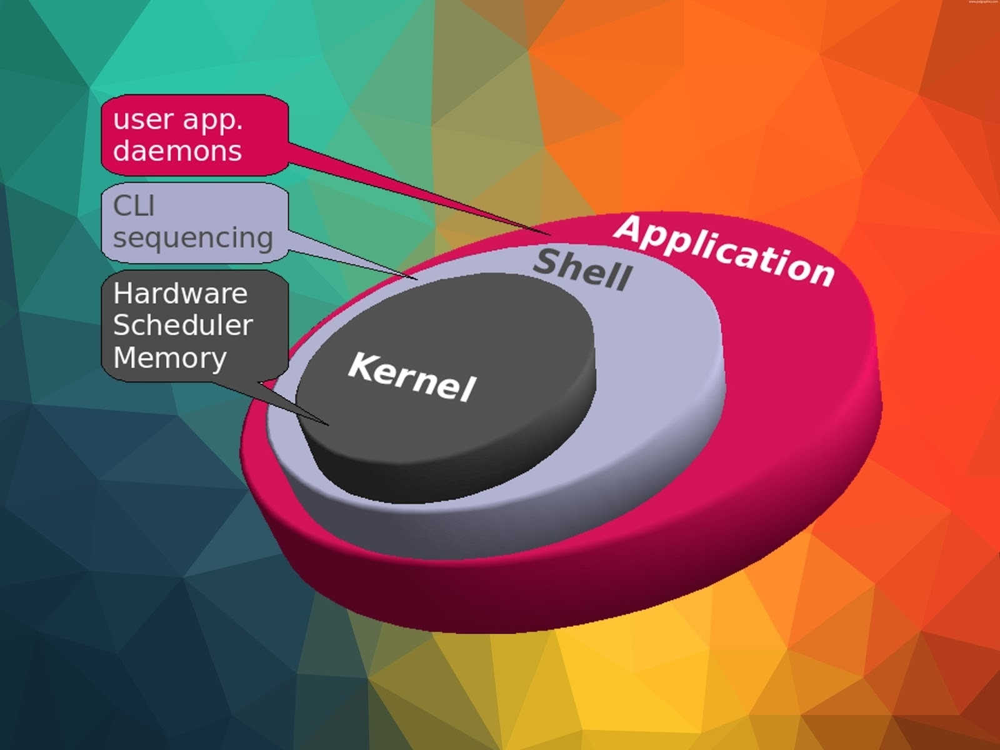
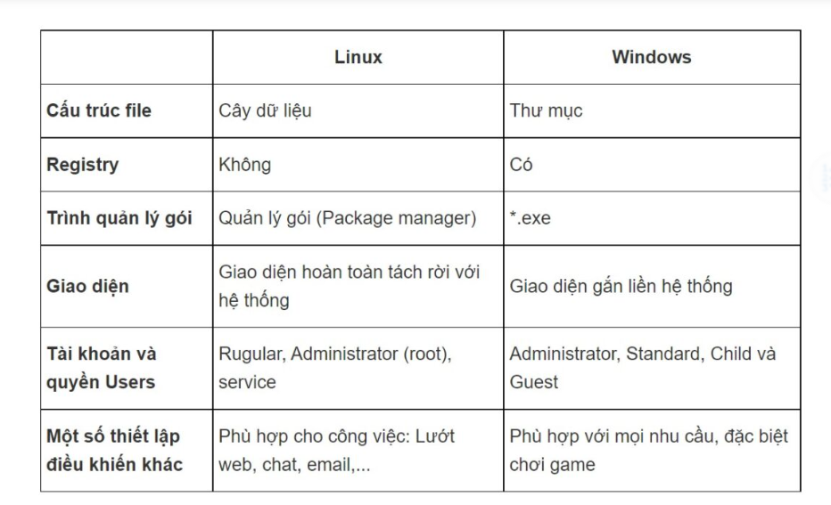

# Linux là gì ?

## 1. Linux là gì ?

- Linux là một hệ điều hành mã nguồn mở (open-source) dựa trên nhân Unix.
- Mã nguồn mở có nghĩa là mã nguồn của hệ điều hành được công khai, cho phép bất kỳ ai sửa đổi mã gốc, tùy chỉnh và phân phối hệ điều hành mới cho người dùng.
- Nó được sử dụng rộng rãi trên nhiều nền tảng, từ máy tính cá nhân đến máy chủ, siêu máy tính, hệ thống nhúng, và cả điện thoại di động.
- Linux được kết hợp với các phần mềm khác để tạo nên các bản phân phối hệ điều hành như: Ubuntu, Debian và CentOS.

## 2 Lịch sử phát triển của Linux
- Linux bắt đầu vào những năm 1991 khi một sinh viên người Phần Lan tên là Linus Torvalds bắt đầu phát triển một hệ điều hành dựa trên Unix.
- Linux ban đầu chỉ là một kernel (phần trung tâm của hệ điều hành) và cần sự đóng góp của các nhà phát triển khác để xây dựng các phần mềm, các công cụ xung quanh.
- Cộng đồng ngày càng phát triển và các dự án phân phối Linux như Debian, Slackware và Red Hat bắt đầu xuất hiện. 
- Linux sau đó đã nhanh chóng trở nên phổ biến trong cộng đồng kỹ thuật và doanh nghiệp, được sử dụng với đa dạng mục đích, từ máy chủ cho đến thiết bị nhúng.
- Vào cuối thập kỷ 1990, các dự án phân phối như Ubuntu đã giúp Linux dễ dàng hơn đối với người dùng thông thường. Các giao diện đồ họa như GNOME và KDE cũng đóng một vai trò quan trọng trong việc làm cho Linux trở nên thân thiện hơn với người dùng.
## 3 Hệ điều hành Linux

- Hệ điều hành (Operating System - OS) là một phần mềm quản lý và điều hành tài nguyên của máy tính, bao gồm bộ xử lý, bộ nhớ, thiết bị ngoại vi và tệp tin. Nó cung cấp giao diện giữa người dùng và phần cứng, cho phép người sử dụng tương tác với máy tính một cách dễ dàng thông qua các ứng dụng và dịch vụ. Linux là một hệ điều hành mã nguồn mở, có nghĩa là mã nguồn có sẵn để xem xét, sửa đổi và phân phối miễn phí.
Hệ điều hành Linux bao gồm các thành phần chính sau:

- Các thành phần trong hệ điều hành Linux

- Kernel 
    - Hay được gọi là phần Nhân vì đây là phần quan trọng nhất trong máy tính bởi chứa đựng các module hay các thư viện để quản lý, giao tiếp giữa phần cứng máy tính và các ứng dụng.

- Shell
    - Shell là phần có chức năng thực thi các lệnh (command) từ người dùng hoặc từ các ứng dụng yêu cầu, chuyển đến cho Kernel xử lý. Shell chính là cầu nối để kết nối Kernel và Application, phiên dịch các lệnh từ Application gửi đến Kernel để thực thi.

    - Có các loại Shell như sau: sh (the Bourne Shell), bash(Bourne-again shell), csh (C shell), ash (Almquist shell), tsh (TENEX C shell), zsh (Z shell).

- Application
    - Đây là phần quen thuộc với chúng ta nhất, phần để người dùng cài đặt ứng dụng, chạy ứng dụng để người dùng có thể phục vụ cho nhu cầu của mình.

## 4 Sự khác biệt giữa Linux và Windows

