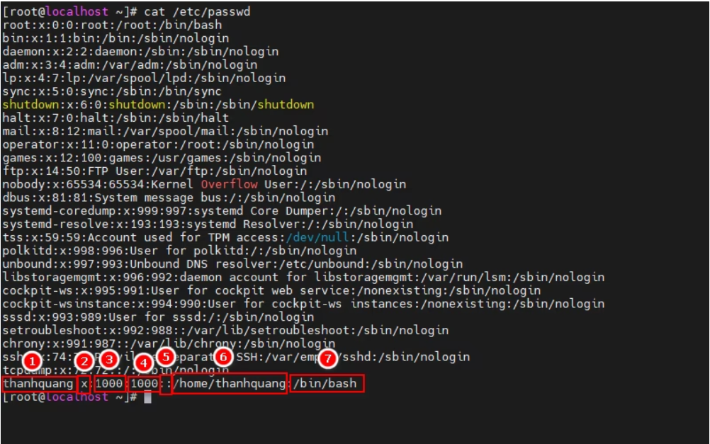
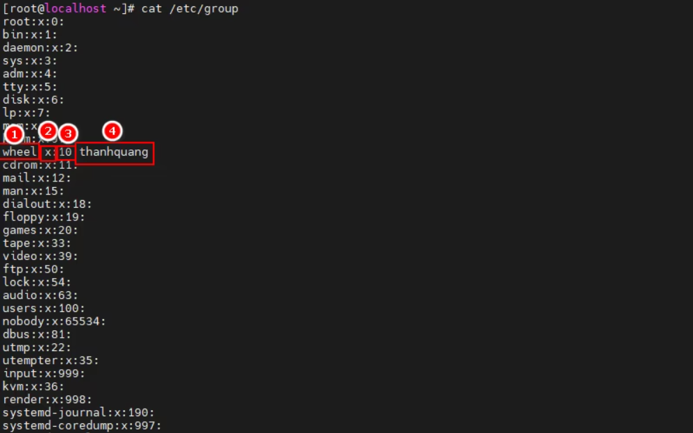
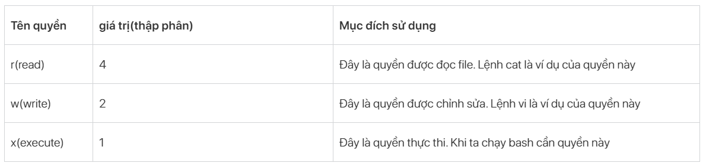
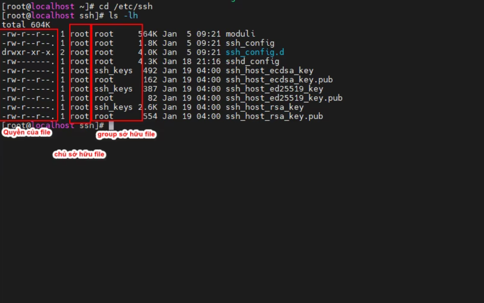

# 1 User,Group trong linux 
Người dùng (user) và nhóm (group) là hai khái niệm quan trọng trong hệ thống Linux. Người dùng là các tài khoản cá nhân được tạo ra trên hệ thống, mỗi người dùng có một tên đăng nhập và mật khẩu riêng. Họ định danh cá nhân và có quyền hạn cụ thể trong hệ thống. Nhóm là một cách để tổ chức người dùng thành các tập hợp. Mỗi người dùng có thể thuộc một hoặc nhiều nhóm khác nhau. Nhóm giúp quản lý và chia sẻ tài nguyên một cách hiệu quả, cũng như xác định quyền truy cập trong Linux.

# 2 Quản trị user 

## 2.1 User là gì ?
- User là tài khoản mà người dùng được cung cấp để thao tác với hệ thống.
- Mỗi tài khoản sẽ có quyền làm gì và không được làm gì.
- Tài khoản có quyền cao nhất là root và root có quyền làm tất cả.
## 2.2 File “/etc/passwd”

Là file văn bản chứa thông tin về các tài khoản user trên máy.
Mỗi user đều có thể đọc tập tin này nhưng chỉ có user root mới có quyền thay đổi.
Cấu trúc file: trong file /etc/passwd được chia làm 4 trường chính và mỗi trường cách nhau bởi dấu hai chấm.

Giải thích:

- Tên user ( login name )
- Mật khẩu group đã được mã hóa ( vì có file /etc/shadow ) nên mặc định ở đây là x
- User ID ( uid )
- Group ID ( gid )
- Tên mô tả người sử dụng ( comment )
- Thư mục home của user ( thường là /home/user_name )
- Loại shell sẽ hoạt động khi user login , thường là /bin/bash

## 2.3 Tạo, sửa, xóa user

Ta có thể tạo user bằng lệnh “useradd”

    useradd [options] [tên user]

Options:

-m : đồng thời tạo thư mục ở home
-d : tên thư mục tạo ở home
-c : thêm mô tả về thư mục đó
Ta có thể xóa user bằng lệnh ”userdel”

    userdel [options] [tên user]

Options:

-m : dùng để xóa user
-r : xóa user đồng thời xóa cả file mà user đó tạo ra
Ta có thể chỉnh sửa user bằng lệnh “usermod”

    usermod [options] [tên user]

options

- G: Thêm user vào group
- c : thay đổi thông tin người dùng
- e : thiết lập ngày hết hạn cho người dùng
- L : Khóa tài khoản
- U : mở khóa tài khoản
- s : thay đổi shell script cho user 

Ta có thể tạo hoặc thay đổi password cho user bằng lệnh “passwd”. Chỉ có quyền root mới có thể thực hiện việc này.

    passwd [user-name]

## 2.4 Chuyển đổi user

Khi ta muốn chuyển từ user này sang user khác ta có thể sử dụng lệnh “su” hoặc “sudo su”

    sudo su [user-name]

Nhưng không phải user nào cũng có quyền sudo để thực hiện chuyển đổi tài khoản. Để có quyền sudo thì user đó phải nằm trong group “wheel” với centos và group “sudo” đối với ubuntu.Bạn có thể tham khảo lệnh sau:

    usermod -aG wheel thanhquang

hoặc:

    usermod -aG sudo thanhquang

# 3. Quản lý group trong Linux

## 3.1 Group là gì?

- Group là một nhóm tập hợp các user.
- Mỗi group có 1 tên duy nhất và 1 mã định danh duy nhất (gid).
- Khi tạo ra 1 user ( không dùng option -g ) thì mặc định 1 group mang tên user được tạo ra.

## 3.2 File “/etc/group”

- Là tập tin văn bản chứa thông tin về các group trên máy.
Mỗi user đều có quyền đọc tập tin này nhưng chỉ có user root mới có quyền thay đổi.
- Cấu trúc file:

Giải thích:

- Tên group
- Mật khẩu group đã được mã hóa (vì có file /etc/gshadow) nên mặc định ở đây là x
- Mã nhóm (gid)
- Danh sách các user nằm trong nhóm

## 3.3 Các lệnh quản lý group

Để tạo 1 group ta sử dụng lệnh “groupadd”.

    groupadd  [group_name]

Để tạo mật khẩu cho group ta sử dụng lệnh “gpasswd”.

    gpasswd [group_name]

Để sửa lại thông tin về group ta sử dụng lệnh “groupmod”.

    groupmod [options] [group_name]

Options

- g [gid] : sửa lại mã nhóm ( gid )
- n [group_name] : sửa lại tên group

Để xóa group ta sử dụng lệnh “groupdel”.

    groupdel [group_name]

# 4. Các quyền quản lý trong linux

Trên thực tế mọi tập tin sẽ đều có chủ sở hữu, nó sẽ bao gồm user và group sở hữu tập tin đó.

Ta có thể sử dụng lệnh “ls -lh” để xem.

        [root@localhost ~]# ls -lh

        total 8.0K

        -rw-------. 1 root root 1.3K Jan 19 03:54 anaconda-ks.cfg

        -rwxr-xr-x. 1 root root 2.1K Jan 21 23:37 cmdlog.sh

        [root@localhost ~]#

## 4.1 Các quyền của file

## 4.2 Các lệnh thay đổi quyền của file

Mỗi file sẽ đều có các quyền của mình và để xem được các quyền đó ta có thể sử dụng câu lệnh “ls -lh”.

Ta nhận thấy rằng mỗi file sẽ quy định quyền cho 3 chủ thể là: user, group và other (user khác) được sắp xếp theo đúng thứ tự trên.

Ví dụ: file ssh_config thì chủ sở hữu file có quyền đọc và sửa, đối với group và other chỉ có quyền đọc.

Để thay đổi chủ sở hữu file ta dùng lệnh “chown”

    chown [tên user mới] [tên file]

Để thay đổi group mới của file ta có dùng lệnh “chgrp”

    chgrp [tên group mới] [tên file]

Để có thể thay đổi các quyền của file ta có thể sử dụng lệnh “chmod”

    chmod [u/g/o][+/-][r/w/x] [tên file]

5. Một số lưu ý cần nhớ

Chỉ có quyền root mới có thể thực hiện câu lệnh “su”, còn các user khác muốn thực lệnh “su” thì đều cần quyền sudo.

Sự khác biệt giữa “su” và “su -”

- Lệnh “su” sẽ giúp chúng ta chuyển đổi user mà vẫn giữ nguyên vị trí đang đứng trước đó.
- Lệnh “su -” sẽ giúp chúng ta chuyển đổi user và đưa luôn chúng ta đến vị trí thư mục “/home/” của user đó.
- Theo mặc định khi tạo ra các user thì nó sẽ không có quyền sudo nếu muốn user có quyền sudo thì phải thêm user đó vào group “wheel” đối với CentOS và group “sudo” đối với Ubuntu. Chỉ có quyền root mới có thể thực hiện điều này.