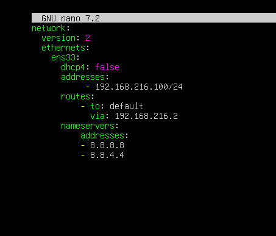
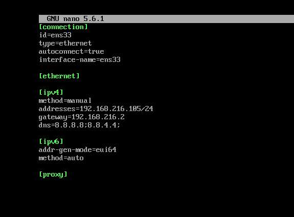

# Cài đặt IP tĩnh trên Linux

## Trên Ubuntu 
Để cài đặt IP tĩnh, chúng ta cần chỉnh sửa file .yaml trong thư mục /etc/netplan


```
sudo nano /etc/netplan/50-cloud-init.yaml
```


Tiếp theo chạy lệnh netplan apply để áp dụng thông số vừa mới thay đổi
```
sudo netplan apply
```

## Trên CentOs 9

Để cài đặt IP tĩnh, chúng ta cần chỉnh sửa file .nmconnection trong thư mục etc/NetworkManager

```
sudo nano /etc/NetworkManager/system-connections/ens33.nmconnection
```



Sau khi chỉnh sửa xong, lưu file và chạy lệnh
```
sudo systemctl restart NetworkManager
```
Kiểm tra ip
```
ip a
````