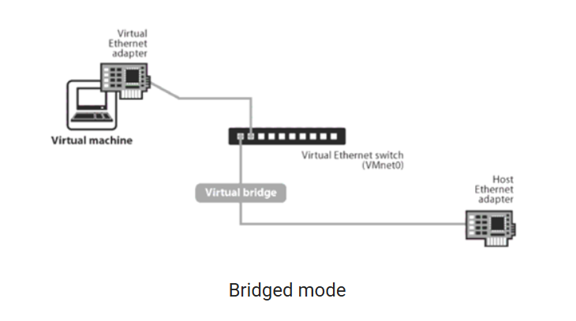
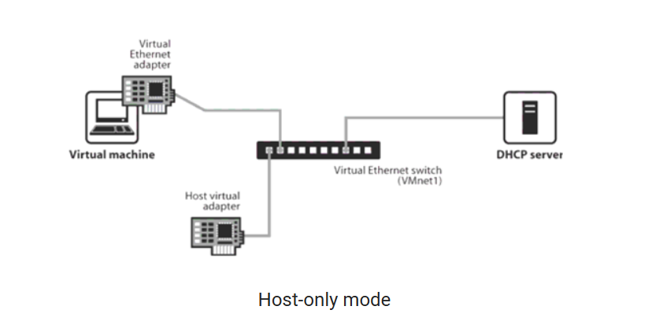
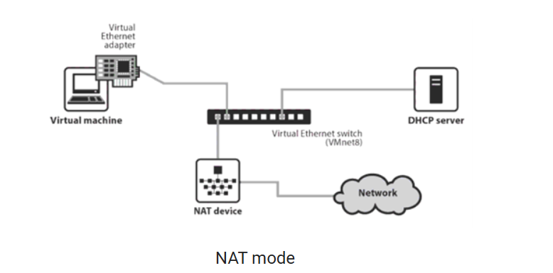
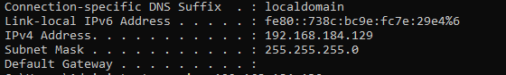
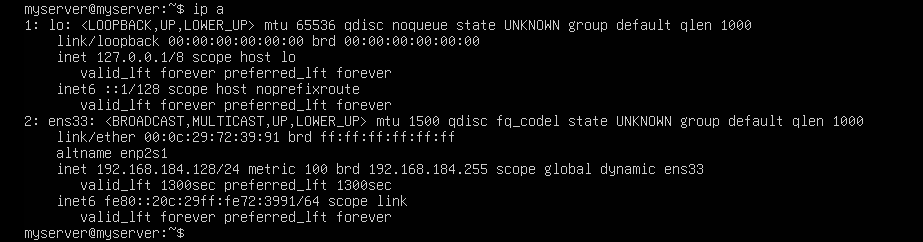
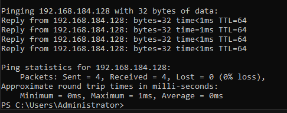
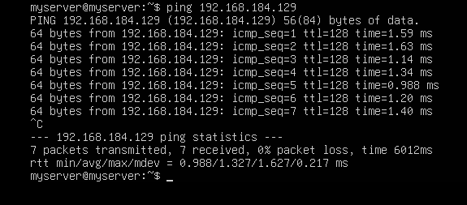
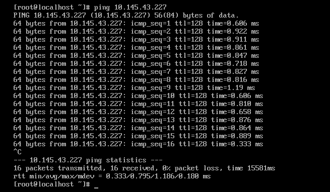

# Cài đặt VMware 
## 1. Cài đặt VMware
## 2. Cài máy ảo
- Bước 1: Truy cập trang chủ của Ubuntu và tải bộ cài đặt dưới dạng file iso.
- Bước 2: Tại cửa sổ chính của VMware, bạn chọn Create a New Virtual Machine để tiến hành khai báo máy ảo mới.
- Bước 3: Chọn Installer disc image file (iso) và bấm vào Browse để tìm file cài đặt.
- Bước 4: Khai báo ổ cứng ảo.
- Bước 5: Thiết lập dung lượng, cách lưu cho ổ cứng ảo.
- Bước 6: Bấm Finish, VMware sẽ tự động khởi chạy máy ảo cho bạn.
- Bước 7: Thiết lập ngôn ngữ, đặt tên server và password.
- Bước 8: Thiết lập các thông số khác, chờ máy chạy và chọn reboot.

## 3. Các chế độ trong VMware

3.1 Chế độ Bridge 

Virtual Ethernet adapter trên VM sẽ kết nối đến VMnet0 switch và thông qua Virtual bridge để kết nối đến Host Ethernet adapter. Vậy nên trong trường hợp này bạn sẽ không thấy có VMnet Card nào được tạo thêm. Lúc này VM và Host sẽ cùng chung đường mạng và VM có thể nhận IP tự động từ DHCP server hoặc thiết lập thủ công. Như vậy trên đường mạng này, tương tác của máy ảo và các thành phần khác sẽ có tính 2 chiều giống như Host.

3.2 Chế độ Host-only

Virtual Ethernet adapter trên VM và Host Ethernet adapter sẽ cùng kết nối đến VMnet1 switch để tạo thành một mạng cô lập (chỉ có VM và Host giao lưu phối hợp với nhau và VM không có kết nối đến mạng vật lý bên ngoài). Lúc này VM và Host sẽ cùng chung đường mạng và VM có thể nhận IP tự động từ DHCP server hoặc thiết lập thủ công. Trong trường hợp này, khi kiểm tra Network Connections trên Host, bạn sẽ thấy có thêm VMware Network Adapter VMnet1 được tạo ra.

3.3 Chế độ NAT

Virtual Ethernet adapter trên VM sẽ kết nối đến VMnet8 switch và nhờ hỗ trợ của NAT device để kết nối đến mạng vật lý bên ngoài (nhưng các thiết bị ngoài mạng vật lý không thể chủ động khởi tạo kết nối đến máy ảo). Lúc này VM và Host sẽ cùng khác đường mạng và VM có thể nhận IP tự động từ DHCP server hoặc thiết lập thủ công. Trong trường hợp này, khi kiểm tra Network Connections trên Host, bạn sẽ thấy có thêm VMware Network Adapter VMnet8 được tạo ra.

## 4. Sử dụng chế độ card Host-only để 2 máy ảo kết nối với nhau
### Cài máy ảo mới và chọn card Host-only
### Kiểm tra ip 2 máy 

### Ping giữa 2 máy 

## 5. Sử dụng chế độ mạng NAT cho các máy ảo để truy cập internet 
- Cài đặt máy ảo với chế độ NAT

- Ping từ máy ảo đến google.com

## 6.  Sử dụng 1 card Bridge để từ máy ảo ping ra máy laptop cá nhân
- Cài đặt máy ảo với chế độ Bridged

- Kiểm tra ip laptop 

- Ping từ máy ảo 

## 7.SNAT ,DNAT

### SNAT 
SNAT (Source Network Address Translation)
- Chuyển đổi IP nguồn của máy ảo thành IP của máy host (máy thật).

- Giúp máy ảo truy cập Internet, nhưng từ ngoài không thể truy cập trực tiếp vào máy ảo.

- VMware dùng SNAT mặc định khi chọn NAT Mode
### DNAT 
DNAT (Destination Network Address Translation)
- Chuyển đổi IP đích để chuyển tiếp port từ máy host vào máy ảo.

- Dùng để máy ngoài truy cập vào máy ảo qua máy host.

- VMware hỗ trợ DNAT bằng cách chuyển tiếp port (Port Forwarding).

### Cách bật DNAT (Port Forwarding) trên VMware

- Mở VMware → Virtual Network Editor → Chọn VMnet8 (NAT).

- Nhấn NAT Settings... → Add...

- Điền thông tin:
    - Host Port: (port trên máy host)

    - Virtual Machine IP:

    - Virtual Machine Port:

    - Protocol:
- Nhấn OK để lưu.

