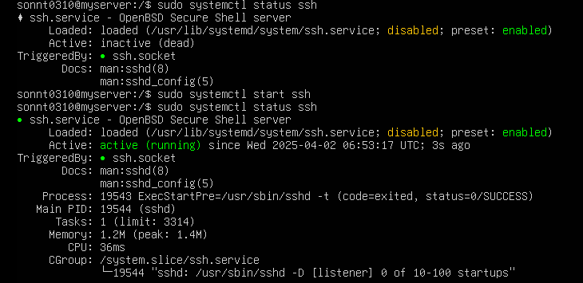
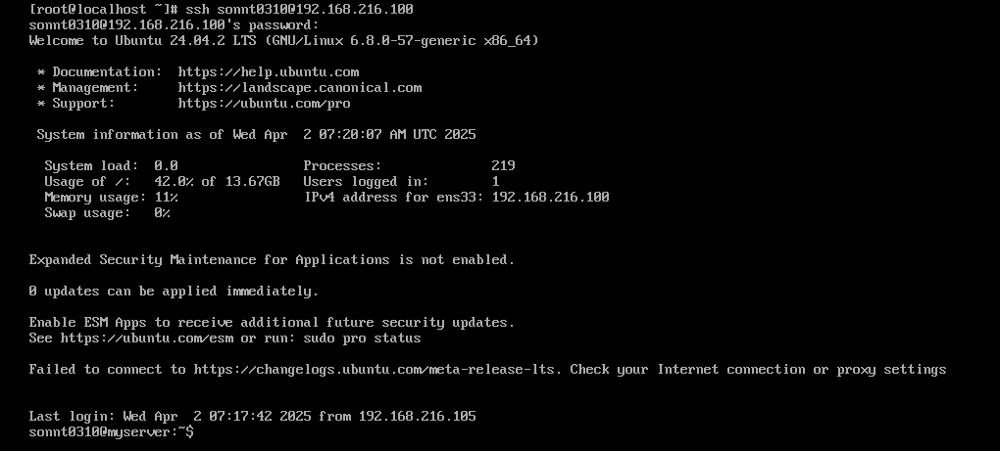
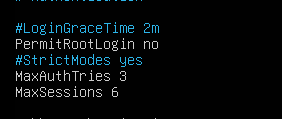
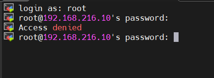
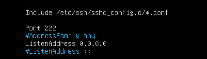

# Cấu hình SSH
## Ubuntu 
- Kiểm tra ssh-client tồn tại chưa
```
ssh -V
```

Trong trường hợp chưa được cài đặt SSH trên hệ thống Linux,  cần thêm các gói và nâng cấp. 

``` 
sudo apt update && sudo apt upgrade
```

- Cài đặt SSH-client :
```
sudo apt install openssh-client   
```

- Cài đặt SSH-server :

```
sudo apt install openssh-server
```

- Kiểm tra xem ssh đã chạy chưa :

```
sudo systemctl status ssh
```
- Nếu chưa chạy, sử dụng lệnh :
```
sudo systemctl start ssh
```



- Khi đã có SSH Server, các máy khác có thể kết nối đến máy của bạn bằng:
```
ssh user@your-ip
```


- Lệnh thoát SSH
```
exit
```


# cấu hình không cho ssh bằng user root

- Vào file config 
```
nano /etc/ssh/sshd_config
```
- Tìm đến dòng ```PermitRootLogin ``` chuyển thành ```no``` và bỏ dấu ```#``` ở đầu


- Resart lại với lệnh:
```
sudo systemctl restart ssh
```
- Kiểm tra


# thay đổi port ssh

- Tương tự vào file ```/etc/ssh/sshd_config```
- Tìm đến dòng ```port```



- Thay đổi port và lưu, sau đó cập nhật lại cấu hình
- bây giờ ở phía clinet cần chạy lệnh: 
```
ssh -p 222 root@192.168.216.10
```
