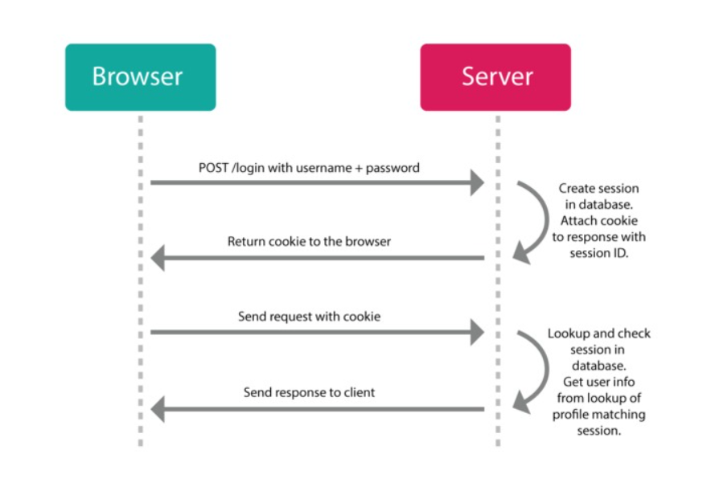

# 1. Tìm hiểu về giao thức HTTP
## 1.1Giao thức HTTP là gì ?

- Http (HyperText Transfer Protocol) là giao thức truyền tải siêu văn bản, giao tiếp trên cơ sở TCP/IP, được sử dụng để phân phối dữ liệu (các tệp HTML, các file ảnh, …) trong www dùng để truyền tải dữ liệu giữa Web server đến các trình duyệt Web và ngược lại. Giao thức này sử dụng cổng 80 (port 80) là chủ yếu (ngoài ra có thể dùng cổng 8080).

## 1.2 Mô hình hoạt động của giao thức HTTP

- HTTP hoạt động dựa trên mô hình Client – Server. Trong mô hình này, các máy tính của người dùng sẽ đóng vai trò làm máy khách (Client). Sau một thao tác nào đó của người dùng, các máy khách sẽ gửi yêu cầu đến máy chủ (Server) và chờ đợi câu trả lời từ những máy chủ này

- Các phiên bản của HTTP

    - HTTP/1.0: Phiên bản đầu tiên được phát hành vào năm 1996. Tại thời điểm này, mỗi kết nối chỉ có thể xử lý một yêu cầu-phản hồi.
    - HTTP/1.1: Được giới thiệu vào năm 1997, đây là phiên bản phổ biến nhất hiện nay. HTTP/1.1 cải tiến khả năng giữ kết nối mở (persistent connection) cho phép thực hiện nhiều yêu cầu trên cùng một kết nối.
    - HTTP/2: Phiên bản này tối ưu hóa khả năng truyền tải dữ liệu bằng cách đóng gói các yêu cầu và phản hồi vào các khung (frame), giúp cải thiện tốc độ và hiệu suất của website.
    - HTTP/3: Một bước tiến mới với việc sử dụng giao thức QUIC, giúp giảm độ trễ và tăng tốc độ truyền tải dữ liệu trên web.

- Phương thức HTTP (HTTP Methods)

    - GET: Yêu cầu truy xuất tài nguyên từ máy chủ (ví dụ: tải một trang web).
    - POST: Gửi dữ liệu đến máy chủ để tạo mới hoặc cập nhật tài nguyên.
    - PUT: Tương tự POST, nhưng thường dùng để cập nhật toàn bộ tài nguyên.
    - DELETE: Xóa tài nguyên trên máy chủ.
    - HEAD: Tương tự GET nhưng không trả về phần nội dung chính của tài nguyên, chỉ trả về các tiêu đề.
    - PATCH: Cập nhật một phần tài nguyên (khác với PUT cập nhật toàn bộ).
    - OPTIONS: Lấy thông tin về các phương thức HTTP mà máy chủ hỗ trợ cho tài nguyên cụ thể.
## 1.3 Các đặc trưng của HTTP 

- HTTP là giao thức connectionless (kết nối không liên tục): một trình duyệt khởi tạo một yêu cầu HTTP từ phía client và sau đó một yêu cầu được tạo ra, Client ngắt kết nối từ Server và đợi cho một phản hồi. Server xử lý yêu cầu và thiết lập lại sự kết nối với Client để gửi phản hồi trở lại.
- HTTP là một phương tiện độc lập: Nó nghĩa là, bất kỳ loại dữ liệu nào cũng có thể được gửi bởi HTTP miễn là Server và Client biết cách để kiểm soát nội dung dữ liệu. 
- HTTP là stateless: Như đã được đề cập ở trên, HTTP là connectionless và nó một kết quả trực tiếp là HTTP trở thành một giao thức Stateless. Server và Client biết về nhau chi trong một yêu cầu hiện tại. Sau đó, cả hai chúng nó quên tất cả về nhau. Do bản chất của giao thức, cả Client và các trình duyệt có thể giữ lại thông tin giữa các yêu cầu khác nhau giữa các trang web.

## 1.4 Cấu trúc cơ bản của HTTP

## 1.5 Tiến trình hoạt động 

- HTTP client thiết lập một kết nối TCP đến server. Nếu thiết lập thành công, client và server sẽ truyền nhận dữ liệu với nhau thông qua kết nối này, kết nối được thiết lập còn gọi là socket interface bao gồm các thông tin: địa chỉ IP, loại giao thức giao vận (chính là TCP), và port (mặc định là 80).
- Sau khi kết nối thành công, client gửi một HTTP request đến server thông qua socket interface vừa được thiết lập.  
- Server sẽ nhận và xử lý request từ client thông qua socket, sau đó đóng gói dữ liệu tương ứng và gửi một HTTP response về cho client. Dữ liệu trả về sẽ là một file HTML chứa các loại dữ liệu khác nhau như văn bản, hình ảnh,…
- Server đóng kết nối TCP.
- Client nhận được dữ liệu phản hồi từ server và đóng kết nối TCP.
## 1.6 URL
URL (Uniform Resource Locator) là địa chỉ của tài nguyên trên mạng mà client muốn truy cập. Một URL tiêu chuẩn bao gồm:

- Scheme (HTTP/HTTPS): Định nghĩa giao thức truyền tải.
- Host (Tên miền): Địa chỉ của máy chủ lưu trữ tài nguyên.
- Path (Đường dẫn): Vị trí cụ thể của tài nguyên trên máy chủ.
- Tham số: Các tham số bổ sung có thể được truyền qua URL để điều chỉnh hoặc tùy chỉnh truy cập tài nguyên.

## 1.7 Proxy 
Proxy (hay máy chủ proxy) là một hệ thống trung gian hoạt động như một cầu nối giữa client (ví dụ: trình duyệt web của bạn) và server (máy chủ chứa tài nguyên, như trang web). Proxy nhận yêu cầu từ client, chuyển tiếp yêu cầu đó đến server, nhận phản hồi từ server, và gửi lại cho client.

### Cách proxy hoạt động trong HTTP
Khi sử dụng HTTP, tiến trình hoạt động của proxy thường diễn ra như sau:

- Client gửi yêu cầu HTTP đến proxy:
    - Thay vì gửi yêu cầu trực tiếp đến server, client gửi yêu cầu đến proxy.
- Proxy xử lý yêu cầu:
    - Proxy nhận yêu cầu HTTP từ client.    
    - Tùy thuộc vào loại proxy, nó có thể:Chuyển tiếp yêu cầu đến server đích mà không thay đổi nội dung.Sửa đổi yêu cầu (ví dụ: thêm header, ẩn IP của client).Lưu trữ nội dung (caching) nếu tài nguyên đã được truy cập trước đó.Chặn yêu cầu nếu nội dung bị hạn chế(ví dụ: firewall hoặc bộ lọc).
- Proxy gửi yêu cầu đến server đích:
    - Proxy thay mặt client gửi yêu cầu HTTP đến server (ví dụ: example.com).Server chỉ thấy địa chỉ IP của proxy, không thấy IP của client (trong trường hợp proxy ẩn danh).
- Server trả về phản hồi:
    - Server gửi phản hồi HTTP về proxy.
- Proxy chuyển tiếp phản hồi đến client: Proxy nhận phản hồi từ server và gửi lại cho client. Nếu có caching, proxy có thể trả về nội dung đã lưu trữ mà không cần liên hệ lại server.

### Các loại máy chủ Proxy 

- Loại 1: Transparent Proxy (Proxy không màu)
    - Proxy trong suốt là loại Proxy sử dụng IP của bạn để xác nhận yêu cầu truy cập trang web. Loại Proxy này thường được những nơi công cộng như thư viện, nhà sách, trường học, công viên, siêu thị sử dụng. Lý do là bởi vì bọn chúng khá dễ lọc nội dung truy cập do dễ dàng lập tên máy chủ và máy khách. 
- Loại 2: Incognito Proxy( Proxy ẩn danh)
    - Proxy ẩn danh nó hoạt động giống như trang web ẩn danh mà bạn hay dùng với mục đích cá nhân. Thay vì lấy IP của bạn để truy cập web thì Proxy ẩn danh sẽ không lấy. Nhưng nó vẫn cho phép bạn truy cập web, điều này giúp bạn bảo mật thông tin của mình, và không để lại dấu vết gì khi vào những trang web khác. 
- Loại 3: Distorting Proxy (Proxy mạo danh) 
    - Proxy mạo danh hoạt động như 1 máy chủ không tên, nó lấy IP và sửa thành một IP mạo danh. Điều này có thể giúp bạn truy cập vào các trang web đã bị chặn một cách dễ dàng. 
- Loại 4: High Anonymity Proxy (Proxy ẩn danh cao)
    - Với việc thay đổi định kỳ IP của bạn để truy cập vào máy chủ trang web. Điều này khiến cho việc kiểm soát lưu lượng truy cập của trang web trở nên khó khăn hơn. Proxy ẩn danh cao có lợi hơn Proxy ẩn danh là nó giúp bạn truy cập Internet an toàn và bảo mật hơn rất nhiều lần. 
## 1.8 Session 

- Session (phiên làm việc) là một cơ chế được sử dụng để duy trì trạng thái hoặc thông tin liên quan đến một người dùng trong suốt quá trình tương tác của họ với một ứng dụng web.
- Giao thức HTTP Có đặc trưng "stateless" ,nên session sinh ra như một cách để lưu trữ thông tin của các user qua nhiều request.

- Một session được tính bắt đầu từ khi user (người dùng) gửi request (yêu cầu thực hiện một thao tác nào đó) đến server (máy chủ). Session sẽ không tự động kết thúc khi bạn di chuyển giữa các trang khác nhau của một ứng dụng/ nền tảng. Một session chỉ chính thức kết thúc khi timeout (hết thời gian) hoặc khi đóng ứng dụng/ nền tảng. Trong mỗi phiên làm việc, các dữ liệu/ giá trị của session được lưu tạm thời trên server, từ đó giúp hệ thống đưa ra những quyết định về quyền hạn hoặc tuỳ chọn riêng tuỳ thuộc vào từng user.

- Mỗi session sẽ được cung cấp một mã định danh duy nhất, gọi là SessionID. Khi truy cập lại vào nền tảng/ ứng dụng sau khi đã tắt, người dùng sẽ được cấp một SessionID khác với trước đó.

## 1.9 HTTP massage
- Các yêu cầu được tạo bởi client gửi tới web server và khi các web server gửi lại dữ liệu được gọi lần lượt là HTTP request và HTTP response. Chúng đều được gọi là HTTP message, là các message có cấu trúc đơn giản.
- HTTP Message rất đơn giản, ta hoàn toàn có thể đọc được mà không nhất thiết phải có công cụ phân tích riêng biệt, nó làm giảm đi sự phức tạp khi phát triển hay khi debug ứng dụng.

Cấu trúc chung của Request/Response có 4 thành phần:

- Dòng đầu tiên (một dòng): Cho biết thông tin yêu cầu hoặc trạng thái (thành công hay lỗi) của response.
- Phần header (các dòng sau dòng đầu tiên trước một dòng trắng): Nó là một tập hợp các dòng chứa thông tin về HTTP Message, thông tin về phần body
- Một dòng trắng cho biết phần thông tin (dòng đầu và header) đã gửi hết
- Phần body chứa dữ liệu đính kèm với request (như HTML Form) hoặc nội dung văn bản đính kèm cùng response. Kích cỡ dữ liệu này (size) có được xác định bởi thông tin trong header.

### Mã Trạng Thái HTTP

### 1.  Mã Trạng Thái Thành Công (2xx)
| Mã | Trạng Thái | Ý Nghĩa |
|----|-----------|---------|
| `200 OK` | Thành công | Yêu cầu được xử lý thành công |
| `201 Created` | Đã tạo | Tài nguyên mới được tạo thành công |
| `204 No Content` | Không có nội dung | Yêu cầu thành công nhưng không có dữ liệu trả về |

### 2. Mã Trạng Thái Lỗi Client (4xx)
| Mã | Trạng Thái | Ý Nghĩa |
|----|-----------|---------|
| `400 Bad Request` | Yêu cầu không hợp lệ | Server không hiểu được request |
| `401 Unauthorized` | Chưa xác thực | Yêu cầu cần đăng nhập |
| `403 Forbidden` | Bị từ chối | Không có quyền truy cập tài nguyên |
| `404 Not Found` | Không tìm thấy | Tài nguyên không tồn tại |

### 3. Mã Trạng Thái Lỗi Server (5xx)
| Mã | Trạng Thái | Ý Nghĩa |
|----|-----------|---------|
| `500 Internal Server Error` | Lỗi máy chủ | Máy chủ gặp lỗi không xác định |
| `502 Bad Gateway` | Cổng lỗi | Máy chủ trung gian nhận phản hồi không hợp lệ |
| `503 Service Unavailable` | Dịch vụ không khả dụng | Máy chủ đang quá tải hoặc bảo trì |
| `504 Gateway Timeout` | Hết thời gian chờ | Máy chủ trung gian không nhận phản hồi kịp thời |

# 2 Giao thức HTTPS

HTTPS (Hypertext Transfer Protocol Secure) là giao thức truyền tải siêu văn bản an toàn và bảo mật, là một phiên bản nâng cấp an toàn của giao thức HTTP. Bằng cách sử dụng chứng chỉ SSL/TLS để mã hóa dữ liệu truyền đi, HTTPS tạo ra một lớp bảo mật vững chắc, giúp bảo vệ thông tin cá nhân và giao dịch trực tuyến của người dùng. 
## 2.1 Chứng chỉ TLS/SSL

Là một tệp dữ liệu số được sử dụng để:

- Xác thực danh tính của website hoặc máy chủ (đảm bảo người dùng đang kết nối đúng đích).
- Mã hóa dữ liệu truyền tải giữa client (trình duyệt) và server (máy chủ), ngăn chặn việc nghe lén hoặc giả mạo.
Đảm bảo tính toàn vẹn của dữ liệu (dữ liệu không bị thay đổi trong quá trình truyền).
- TLS (Transport Layer Security) là phiên bản hiện đại của SSL (Secure Sockets Layer), nhưng cả hai thuật ngữ thường được dùng thay thế nhau. Chứng chỉ TLS/SSL hoạt động dựa trên mã hóa bất đối xứng (public/private key) và được cấp bởi các Certificate Authority (CA) đáng tin cậy.

## 2.2 Các hoạt động chính của chứng chỉ TLS/SSL
- Khi người dùng gửi yêu cầu kết nối đến server đối tượng, server gửi SSL server certificate có chứa [puplic key] . Ở trình duyệt của người dùng sử dụng root certificate được cài đặt sẵn trong trình duyệt để kiểm chứng SSL server certificate. Nếu không có vấn đề gì thì mã hóa khóa chung của chính nó bằng [puplic key] được gửi từ server rồi gửi đến server. Phía server thì bằng cách giải mã bằng [secret key] , lấy được khóa chung và thực hiện truyền tin bằng cách sử dụng khóa chung này.

- Chứng chỉ không được các tổ chức đáng tin cậy chứng nhận thì không thể xác minh bằng root certificate.

## 2.3 Cấp chứng chỉ SSL 
- Tạo cặp khóa công khai/bí mật(có thể OpenSSL trên máy chủ).
- Cần tạo CSR (Certificate Signing Request), là một đoạn văn bản chứa thông tin về tên miền, thông tin tổ chức và khóa công khai của bạn. CSR được tạo ra trên máy chủ web và sau đó được gửi đến CA để ký.
- CA (Certificate Authorit) sẽ kiểm tra thông tin này trước khi cấp chứng chỉ.
- Sau khi CSR được xác thực hoặc duyệt, CA sẽ cung cấp chứng chỉ ký tự hóa cho bạn. Chứng chỉ này bao gồm thông tin về tên miền, tổ chức, chữ ký số của CA và khóa công khai.
- Kích hoạt HTTPS trên website:  Sao chép chứng chỉ và private key lên máy chủ.

Trình duyệt có sẵn Root Certificates của các CA đáng tin cậy, dùng để kiểm tra chứng chỉ TLS/SSL mà website gửi. Điều này giúp chúng xác minh website mà không cần bạn làm gì, đảm bảo an toàn và nhanh chóng.

 