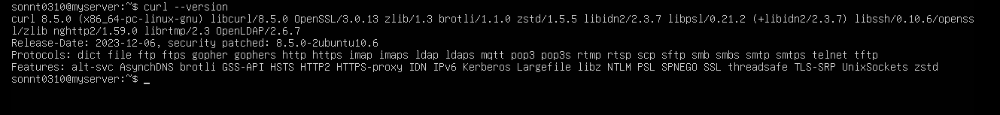
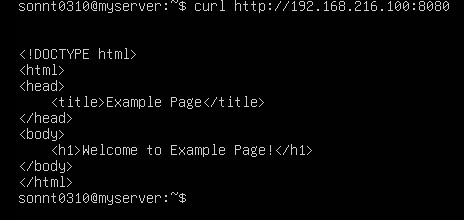
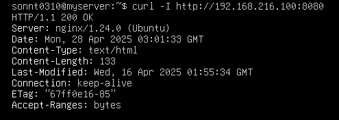
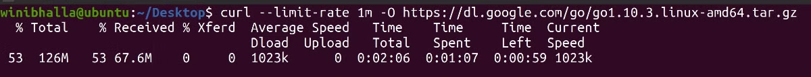

# 1 Tìm hiểu về lệnh Curl
## 1.1. cURL là gì?
- `curl` là một công cụ dòng lệnh mạnh mẽ dùng để truyền dữ liệu qua nhiều giao thức, phổ biến nhất là HTTP/HTTPS. 
- Lệnh này được ưa chuộng để tự động hóa, vì nó được thiết kế để hoạt động mà không có sự tương tác của người dùng. curl có thể vận chuyển nhiều tập tin cùng lúc
## 1.2 Các tính năng chính của curl
- Hỗ trợ nhiều giao thức: HTTP, HTTPS, FTP, SFTP, SMTP, v.v.
- Gửi các phương thức HTTP: GET, POST, PUT, DELETE, HEAD, v.v.
- Tải lên/tải xuống file.
- Hỗ trợ proxy, SSL/TLS, và các tùy chọn cấu hình chi tiết.
## Sử dụng curl trong Linux

- Trong Linux, curl thường được cài sẵn hoặc có thể cài qua trình quản lý gói:

    - Ubuntu/Debian: `sudo apt install curl`
    - CentOS: `sudo yum install curl`
- Sau khi cài đặt xong ta kiểm tra thử phiên bản đã cài đặt 

`curl --version` 

## Cú pháp cơ bản

```curl [tùy chọn] [URL]```

## Các tùy chọn phổ biến:

- X : Chỉ định phương thức (GET, POST, PUT, DELETE)
- d : Dữ liệu gửi đi (body request)
- H : Thêm custom header
- i : Hiển thị Header + Body
- I : Chỉ Header, không Body
- o : Lưu nội dung vào file
- O : Download file, giữ tên file gốc

## Ví dụ:

### Hiển thị nội dung của URL trên màn hình
```
curl [url]
```


### 1. Tải xuống tệp bằng curl
 Lệnh này có hai cờ (flag) mà bạn có thể sử dụng; -o và -O .
- Đây là một ví dụ về cả hai lệnh này:
```
curl -O https://cdn.jsdelivr.net/npm/vue/dist/vue.js
```
- Tệp được tải xuống trong thư mục hiện tại, với tên ban đầu của nó như trên máy chủ từ xa.
```
curl -o newfile.tar.gz http://yourdomain.com/yourfile.tar.gz
```
- curl sẽ tải xuống và lưu tệp dưới dạng newfile.tar.gz.

### 2. Tiếp tục tải xuống bị gián đoạn

- Sử dụng cờ -C với một trong hai cờ -o hoặc -O để tiếp tục quá trình tải xuống bị gián đoạn.
```
curl -C -O http://yourdomain.com/yourfile.tar.gz
```

### 3. Nhận tiêu đề HTTP của một trang web
```
curl -I [url]
```



- Lệnh -I hiển thị nhiều thông tin khác nhau bao gồm chi tiết phần mềm máy chủ, ngày tháng, loại nội dung, trạng thái X-cache, v.v.

### 4. Chỉ định tốc độ truyền tối đa
- Sử dụng phương thức (method) –limit-rate theo sau là modifier k , m hoặc g (biểu thị kilobyte, megabyte hoặc gigabyte).
- Lệnh sau hạn chế tốc độ truyền xuống còn 1MBps:
```
curl --limit-rate 1m -O https://dl.google.com/go/go1.10.3.linux-amd64.tar.gz
```


### 5. Truyền tệp qua FTP 

Có thể chuyển tệp bằng Giao thức FTP bằng cách truy cập bất kỳ máy chủ FTP nào bằng curl. Curl cung cấp cho bạn chức năng tải xuống và tải lên các tệp sau khi kết nối với máy chủ FTP.

Sử dụng lệnh sau để kết nối với máy chủ FTP:
```
curl -u username:password ftp://ftp.example.com/
```
- trong đó username và password là thông tin xác thực để đăng nhập vào máy chủ.

- Có thể tải xuống bất kỳ tệp nào từ máy chủ bằng cách chỉ định URL tệp trong lệnh sau:
```
curl -u username:password -O ftp://ftp.example.com/file.tar.gz
```
- Cũng có thể tải tệp lên máy chủ FTP bằng cờ -T:
```
curl -T newfile.tar.gz -u username:password ftp://ftp.example.com
```
Lệnh -T theo sau là tệp được chỉ định tải tệp đó lên máy chủ FTP.