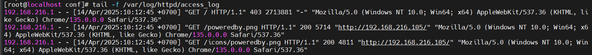

# File Log Apache
## 1. Đường dẫn file log Apache
## Trên CentOS
- Tên gói: httpd
- Đường dẫn mặc định:
    - Access Log (ghi lại các yêu cầu truy cập): `/var/log/httpd/access_log`
    - Error Log (ghi lại lỗi): `/var/log/httpd/error_log`
- File cấu hình liên quan: Các đường dẫn này được định nghĩa trong `/etc/httpd/conf/httpd.conf.`
## Trên Ubuntu
- Tên gói: apache2
- Đường dẫn mặc định:
    - Access Log: `/var/log/apache2/access.log`
    - Error Log: `/var/log/apache2/error.log`
- File cấu hình liên quan: Định nghĩa trong`/etc/apache2/apache2.conf` hoặc `/etc/apache2/sites-available/000-default.conf.`

## 2.Cách xem và quản lý log
## Xem log
- Access Log:
```
tail -f /var/log/httpd/access_log  # CentOS
tail -f /var/log/apache2/access.log  # Ubuntu
```
- Error Log:
```
tail -f /var/log/httpd/error_log  # CentOS
tail -f /var/log/apache2/error.log  # Ubuntu
```

## Tùy chỉnh định dạng log
- Trong file cấu hình Apache (httpd.conf hoặc apache2.conf):
    - Tìm dòng LogFormat để chỉnh định dạng.

 ```
LogFormat "%h %l %u %t \"%r\" %>s %b \"%{Referer}i\" \"%{User-Agent}i\"" combined

CustomLog /var/log/httpd/access_log combined  # CentOS
```
- Trong đó:

    - %h: địa chỉ của máy client    
    - %l: nhận dạng người dùng được xác định bởi identd (thường không SD vì không tin cậy)    
    - %u: tên người dung được xác định bằng xác thức HTTP   
    - %t: thời gian yêu cầu được nhận    
    - %r: là yêu cầu từ người sử dụng (client)    
    - %>s: mã trạng thái được gửi từ máy chủ đến máy khách    
    - %b: kích cỡ phản hồi đối với client    
    - Refer: tiêu đề Refeer của yêu cầu HTTP (chứa URL của trang mà yêu cầu này được khởi tạo)    
    - User_agent: chuỗi xác định trình duyệt
# File Log Ngnix

- Cấu hình Log trong Nginx mặc định được đặt trong file `/etc/nginx/nginx.conf` . Cấu hình này sẽ áp dụng cho toàn bộ.
- Các log của Nginx thường được lưu tại:

    - Log truy cập: `/var/log/nginx/access.log`
    - Log lỗi: `/var/log/nginx/error.log`

## Cấu Hình Log Trong File Cấu Hình Nginx    
- Để tùy chỉnh cấu hình log, chỉnh sửa file cấu hình Nginx. Mở file bằng các lệnh chỉnh sử văn bản :
ví dụ: 
```
sudo vi /etc/nginx/nginx.conf
````
- Để tùy chỉnh log, sử dụng các directive `error_log` và `access_log` vào các khối http, server, hoặc location trong tệp cấu hình Nginx Virtual hosting của bạn

- kiểm tra cấu hình để phát hiện lỗi:
```
sudo nginx -t
```
- reload Nginx
```
sudo systemctl reload nginx
```

## Giám Sát Log

Để kiểm tra log, Sử dụng các công cụ như tail :
- Giám Sát Log Error Log
```
sudo tail -f /var/log/nginx/error.log
```
- Giám Sát Log Access Log
```
sudo tail -f /var/log/nginx/access.log
```
## Log Format Mặc Định
Log format mặc định của Nginx là combined, bao gồm các chi tiết cơ bản về yêu cầu và phản hồi:
```
127.0.0.1 - - [15/Apr/2025:15:42:37 +0000] "GET /index.html HTTP/1.1" 200 1043 "-" "Mozilla/5.0 (X11; Linux x86_64) AppleWebKit/537.36 (KHTML, like Gecko) Chrome/91.0.4472.114 Safari/537.36"
```

Giải Thích Các Thành Phần:
1. IP của client (127.0.0.1):

    - Địa chỉ IP của client gửi yêu cầu đến máy chủ.

2. Khách hàng (User) (-):

    - Thông tin người dùng (tên đăng nhập nếu có). Nếu không có, sẽ là dấu -.

3. Thời gian yêu cầu ([15/Apr/2025:15:42:37 +0000]):

    - Thời gian yêu cầu được gửi, bao gồm cả múi giờ.

4. Dòng yêu cầu ("GET /index.html HTTP/1.1"):

    - Đây là dòng yêu cầu HTTP, bao gồm phương thức HTTP (GET, POST, PUT, DELETE, v.v.), đường dẫn (URL) và phiên bản giao thức HTTP.

5. Mã trạng thái HTTP (200):

    - Mã trạng thái HTTP trả về từ máy chủ cho client. Mã 200 nghĩa là yêu cầu thành công, và có thể là các mã khác như 404 (Not Found), 500 (Internal Server Error), v.v.

6. Kích thước phản hồi (1043):

    - Kích thước của dữ liệu phản hồi (tính bằng byte) từ máy chủ gửi lại cho client.

7. Referrer ("-"):

    - Referrer (nguồn gốc của yêu cầu) là URL từ trang web mà client đã truy cập trước khi yêu cầu URL hiện tại. Nếu không có referrer, trường này sẽ là dấu -.

8. User-Agent ("Mozilla/5.0 (X11; Linux x86_64) AppleWebKit/537.36 (KHTML, like Gecko) Chrome/91.0.4472.114 Safari/537.36"):

    - Thông tin về trình duyệt và hệ điều hành của client gửi yêu cầu. Thông tin này có thể được sử dụng để phân tích các kiểu trình duyệt hay hệ điều hành phổ biến.


