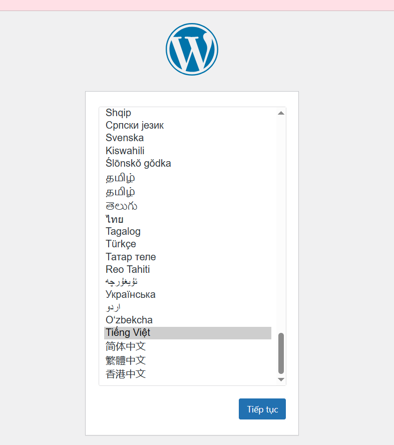
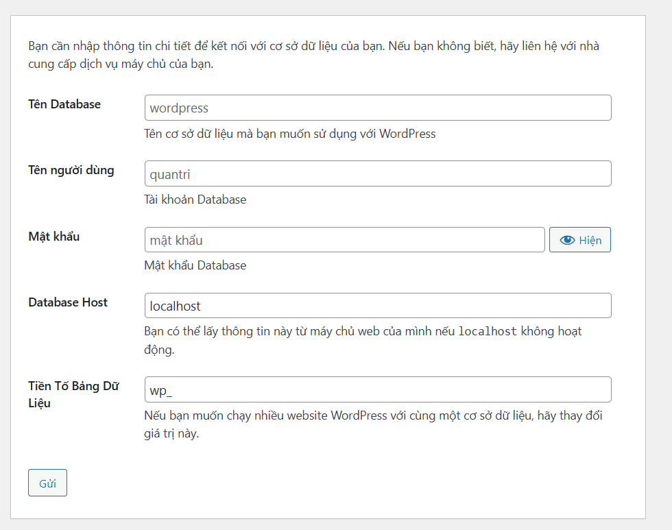
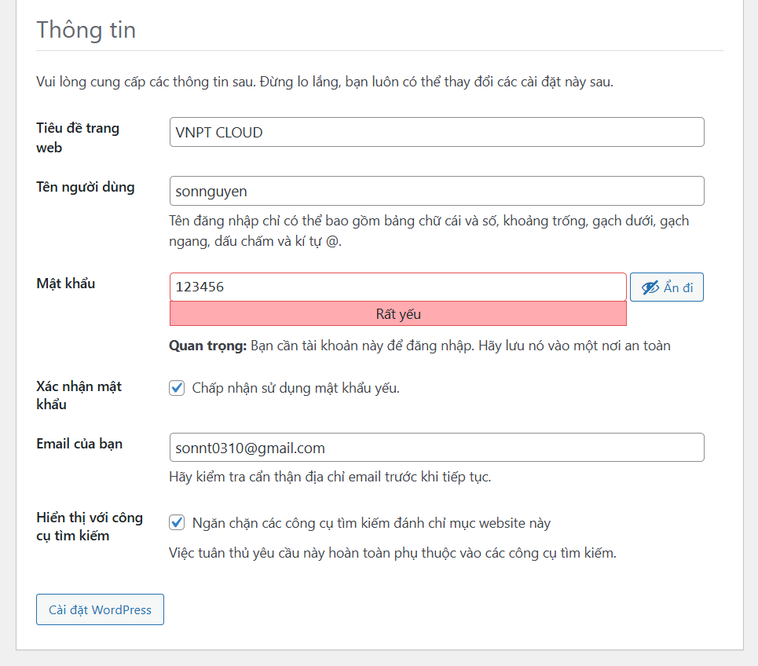
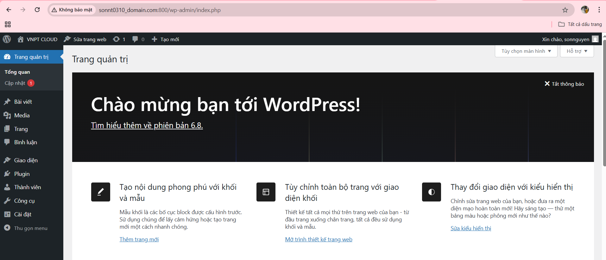

# Triển khai WordPress với LAMP Stack (Ubuntu)

## Bước 1: Cài đặt LAMP
```
sudo apt update

sudo apt install apache2 mysql-server php php-mysql libapache2-mod-php php-cli php-curl php-gd php-xml php-mbstring php-zip unzip
```
`apache2`: cài Web Server Apache

`mysql-server`: cài MySQL để quản lý dữ liệu

`php` và các `php-*`: cài PHP và module cần thiết cho WordPress

`unzip`: để giải nén gói WordPress
## Bước 2: Tạo database cho WordPress
```
sudo mysql
```
```
CREATE DATABASE wordpress;
CREATE USER 'Sonnt0310'@'localhost' IDENTIFIED BY '123456';
GRANT ALL PRIVILEGES ON wordpress.* TO 'sonnt0310'@'localhost';
FLUSH PRIVILEGES;
EXIT;

```
- Tên người dùng: sonnt0310

- Mật khẩu: 123456

- Database Host: localhost

## Bước 3: Cài đặt WordPress
```
cd /var/www/html
sudo wget https://wordpress.org/latest.zip
sudo unzip latest.zip
sudo mv wordpress/* .
sudo chown -R www-data:www-data /var/www/html
sudo chmod -R 755 /var/www/html
```
- Tải gói WordPress chính thức
- Giải nén và chuyển nội dung vào thư mục gốc web của Apache
- www-data là user của Apache – cần quyền đọc/ghi thư mục web
- 755 cho phép truy cập và thực thi, nhưng bảo mật tốt hơn 777
## Bước 4: Cấu hình Apache
```
sudo nano /etc/apache2/sites-available/wordpress.conf
```
```
<VirtualHost *:800>
    ServerAdmin admin@example.com
    DocumentRoot /var/www/html
    ServerName sonnt0310_domain.com

    <Directory /var/www/html>
        AllowOverride All
    </Directory>

    ErrorLog ${APACHE_LOG_DIR}/error.log
    CustomLog ${APACHE_LOG_DIR}/access.log combined
</VirtualHost>
```
```
sudo a2ensite wordpress.conf  
sudo a2dissite 000-default.conf    
sudo a2enmod rewrite
sudo systemctl restart apache2  
```
- Cấu hình domain trỏ về thư mục WordPress
- Chỉnh `ports.conf` để Apache lắng nghe port mới
`sudo nano /etc/apache2/ports.conf`
- Sửa hoặc thêm dòng :
`Listen 800`
- (Nếu có firewall) Mở port mới
`sudo ufw allow 800`
## Bước 5: Cài đặt WordPress qua trình duyệt
Truy cập bằng trình duyệt : `http://sonnt0310_domain.com`



- Nhập thông tin database đã cài bên trên 



- Nhập thông tin website, tài khoản admin :



- Sau khi nhập thành công và đăng nhập, hiện ra giao diện trang web 




# Triển khai WordPress với LEMP Stack (Ubuntu)

## Bước 1: Cài đặt thành phần LEMP 

- PHP-FPM là trình quản lý PHP riêng cho Nginx (vì Nginx không xử lý PHP trực tiếp như Apache).

Cài các module cần thiết cho WordPress như:

php-mysql: Kết nối MySQL.

php-gd, php-mbstring, php-xml...: Hỗ trợ đa phương tiện, charset, xử lý XML...
```
sudo apt install php-fpm php-mysql php-gd php-mbstring php-xml php-zip -y
```
Cài PHP 8.3-FPM
```
sudo apt install php8.3-fpm
```
```
sudo systemctl start php8.3-fpm
```
```
sudo systemctl enable php8.3-fpm
```

## Bước 2: Tải và chuẩn bị mã nguồn WordPress
```
curl -O https://wordpress.org/latest.tar.gz
tar xzvf latest.tar.gz
```
- Tải từ trang chính thức (wordpress.org), đảm bảo phiên bản mới nhất.

- Giải nén và đặt vào thư mục /var/www/wordpress (hoặc thư mục bạn muốn).
```
sudo mkdir -p /var/www/wordpress
sudo cp -a wordpress/. /var/www/wordpress
``` 
-   Cấp quyền cho Nginx truy cập:
```
sudo chown -R www-data:www-data /var/www/wordpress
sudo chmod -R 755 /var/www/wordpress
```

## Bước 3: Cấu hình Nginx để phục vụ WordPress
```
sudo nano /etc/nginx/sites-available/wordpress
```

```
server {
    listen 801;
    server_name sonnt0310_domain.com.vn;

    root /var/www/wordpress;
    index index.php index.html index.htm;

    location / {
        try_files $uri $uri/ /index.php?$args;
    }

    location ~ \.php$ {
        include snippets/fastcgi-php.conf;
        fastcgi_pass unix:/run/php/php8.3-fpm.sock;
    }

    location ~ /\.ht {
        deny all;
    }

    error_log /var/log/nginx/wp_error.log;
    access_log /var/log/nginx/wp_access.log;
}

```
Kích hoạt site:
```
sudo ln -s /etc/nginx/sites-available/wordpress /etc/nginx/sites-enabled/
```

```
sudo systemctl reload nginx
```