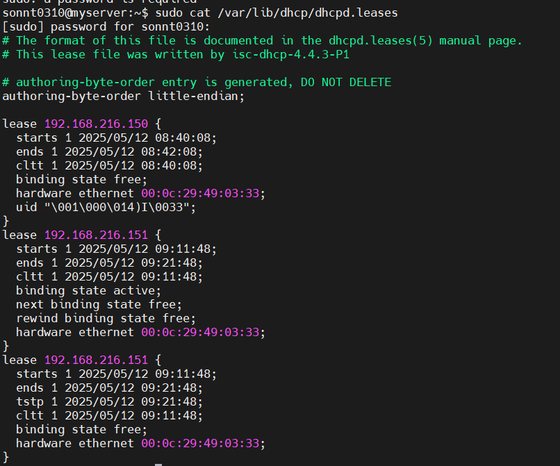

# File Log DHCP Server 
## 1. Danh sách địa chỉ IP đã cấp phát bởi DHCP
```
sudo cat /var/lib/dhcp/dhcpd.leases
```


## 2. Xem log DHCP server
```
sudo journalctl -u isc-dhcp-server
```


#  DHCP client

Trên DHCP client (centos) xem file log với lệnh:
```
sudo grep dhclient /var/log/messages
```
