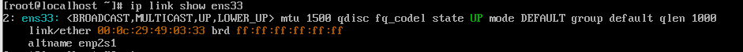

# Cấp phát IP theo địa chỉ MAC
## Bước 1. Xác định MAC của client 

CentOS:
```
ip link show ens33
```
hoặc
```
ip a
```


Windows:
```
ifconfig /all
```

## Bước 2: Chỉnh sửa file cấu hình DHCP server
Mở file 
```
sudo nano /etc/dhcp/dhcpd.conf
```
thêm một đoạn cấu hình dạng sau vào bên trong hoặc ngay sau subnet:


- Khởi động lại DHCP server
```
sudo systemctl restart isc-dhcp-server

```

## Bước 3: Cấp phát lại IP
### CentOS

### Giải phóng IP cũ
```
sudo dhclient -r ens33
```
### Yêu cầu cấp phát IP mới
```
sudo dhclient -v ens33
```
### Bước 4: Kiểm tra lại 

