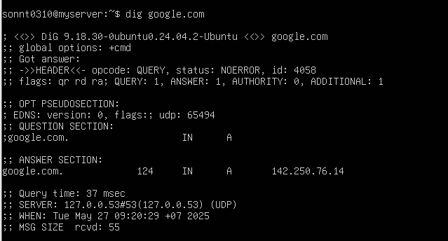

## Lệnh Dig
- lệnh `dig` (Domain Information Groper) là một công cụ dòng lệnh dùng để tra cứu thông tin DNS (Domain Name System). Nó cung cấp chi tiết về các bản ghi DNS như A, MX, NS, TXT, v.v.
Nó hữu ích cho:

- Quản trị hệ thống.

- Gỡ lỗi mạng.

- Phân tích sự cố về tên miền (domain).


## 1. Cú pháp cơ bản
```
dig [tùy chọn] tên_miền [loại_bản_ghi]
```

- tên_miền: Tên miền bạn muốn tra cứu (ví dụ: example.com).
- loại_bản_ghi: Loại bản ghi DNS muốn tra cứu (A, MX, NS, SOA, TXT, v.v.). Nếu không chỉ định, mặc định là A.
- tùy chọn: Các tham số bổ sung để tùy chỉnh truy vấn.

## 2. Cài đặt lệnh `dig`

- Trên Ubuntu: 
```
sudo apt update
sudo apt install dnsutils
```
- Trên CentOS:
```
sudo dnf install bind-utils
```
## 3. Tra cứu DNS cho một tên miền
```
dig google.com
```


Phân tích kết quả: 
1. Phiên bản lệnh `dig`: 
```
DiG 9.18.30-0ubuntu0.24.04.2-Ubuntu
```

2. Trạng thái phản hồi DNS:
```
;; ->>HEADER<<- opcode: QUERY, status: NOERROR, id: 4058
```
- `opcode: QUERY`: bạn đang thực hiện truy vấn DNS thông thường.

- `status: NOERROR:` truy vấn thành công, không có lỗi.

- `id: 4058`: ID truy vấn (giá trị nội bộ dùng để theo dõi).

3. Cờ DNS (flags):
```
;; flags: qr rd ra;
```

- `qr`: Đây là một phản hồi (not a query).

- `rd`: Đã yêu cầu truy vấn đệ quy (recursive).

- `ra`: Máy chủ DNS hỗ trợ truy vấn đệ quy.

4. Phần truy vấn (QUESTION SECTION):
```
;google.com.  IN  A
```
Bạn đang hỏi địa chỉ IP (A record) của tên miền `google.com.`

5. Phần trả lời (ANSWER SECTION):
```
google.com.  124  IN  A  142.250.76.14
```
- `google.com.`: tên miền được truy vấn.

- `124`: thời gian còn lại (TTL - Time To Live) là 124 giây.

- `IN`: lớp Internet.

- `A`: loại bản ghi IPv4.

- `142.250.76.14`: là địa chỉ IPv4 của google.com.

6. Máy chủ DNS được sử dụng:
```
SERVER: 127.0.0.53#53(127.0.0.53)
```
- DNS server đang sử dụng là 127.0.0.53, tức là systemd-resolved đang xử lý DNS cục bộ trên Ubuntu.

- Nếu bạn xem file /etc/resolv.conf, bạn sẽ thấy dòng trỏ về 127.0.0.53.

 7. Thông tin khác:
 ```
 ;; Query time: 37 msec
```
- Truy vấn mất 37 mili giây — khá nhanh.
```
;; WHEN: Tue May 27 09:20:29 +07 2025
```
- Thời điểm truy vấn.
```
;; MSG SIZE  rcvd: 55
```
Kích thước gói tin DNS nhận về là 55 byte.

## 4. Sử dụng dig với các truy vấn ngắn
4.1 Truy vấn IP:
```
dig +short <domain>
```
Ví dụ: 
```
dig +short google.com 
```


Có thể lấy kết quả chi tiết hơn, ta có thể dùng 2 tùy chọn sau: `+noall` và `+answer`
```
dig google.com +noall +answer
```


- `+noall` : tắt tất cả các section
- `+answer` : chỉ mở với section ANSWER

## 5. Truy vấn với name server cụ thể

- Theo mặc định nếu khi sử dụng lệnh dig mà không chỉ rõ name server nào thì server sẽ sử dụng name server được khai báo trong file /etc/resolv.conf
- Để chỉ định name server mà truy vấn sẽ thực hiện, sử dụng biểu tượng `@ + <địa chỉ IP/hostname>`
- Truy vấn name server Google có địa chỉ là `8.8.8.8` để lấy thông tin về tên miền `google.com`

 

 ## 6. Truy vấn bản ghi 

 ví dụ: 
 - Bản ghi TXT :
    ```
    dig +nocmd google.com txt +noall +answer
    ```
    

- Bản ghi MX :
    
    

- Bản ghi NS:

    

- Truy vấn tất cả các bản ghi: 

    

- Tra cứu DNS ngược: 

    Để truy vấn tên máy chủ được liên kết với một địa chỉ IP cụ thể, hãy sử dụng tùy chọn -x.

    Ví dụ: Tra cứu IP 142.250.71.142 thành tên miền

    dig -x 142.250.71.142 +noall +answer 

    

    - `142.71.250.142.in-addr.arpa.`	Đây là dạng viết ngược của địa chỉ IP để tra cứu DNS ngược.

    - `3902	TTL (Time to Live)` – giá trị này được cache trong 3902 giây.

    - `IN`	Internet – lớp của bản ghi DNS.

    - `PTR`	Loại bản ghi "Pointer" – trỏ từ IP về hostname.

    - `nchkga-aa-in-f14.1e100.net.`	Tên miền tương ứng với địa chỉ IP 142.250.71.142. Đây là tên máy chủ của Google.

- Truy vấn DNS bằng TCP:

Theo mặc định thì lệnh dig truy vấn DNS qua udp, để có thể dùng lệnh dig truy vấn DNS qua tcp chúng ta thực hiện như sau:
```
dig +tcp [domain]
```

- Điều chỉnh mặc định với tệp `~/.digrc`

    - Mở hoặc tạo tệp: 
    ```
    nano ~/.digrc
    ```
    - Ví dụ nội dung cấu hình:
    ```
    +nocmd
    +noquestion
    +noauthority
    +noadditional
    +comments
    +answer
    +stats
    ```
    - ví dụ Tạo .digrc như sau:
    ```
    +short
    ```

    - Kết quả khi chạy dig google.com sẽ chỉ ra IP ngắn gọn:
    ```
    142.250.76.14
    ```
    
