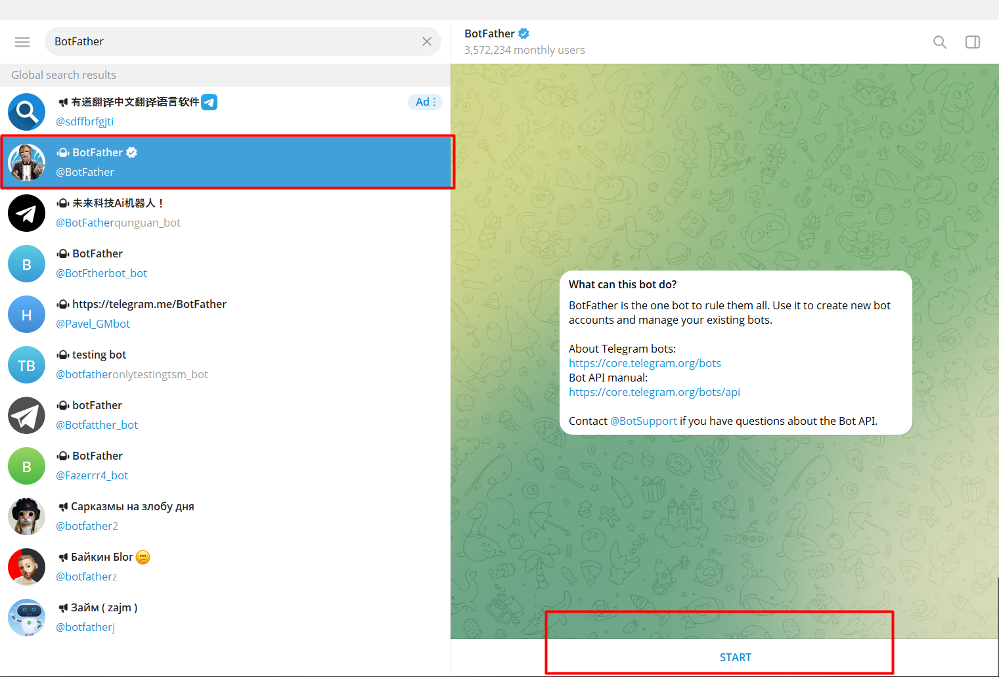
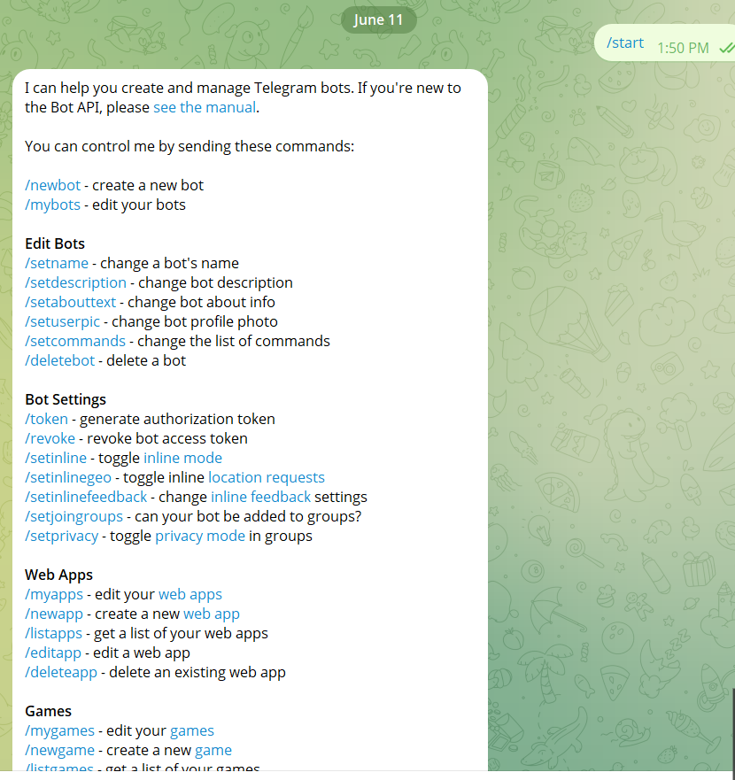
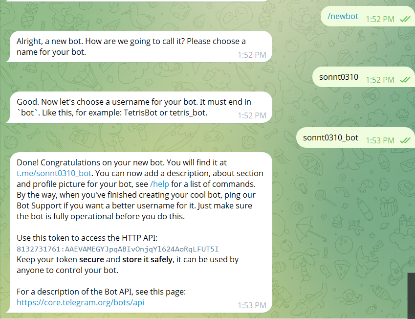
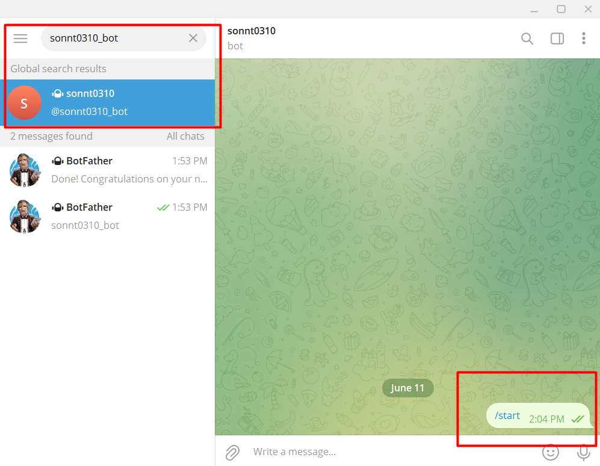
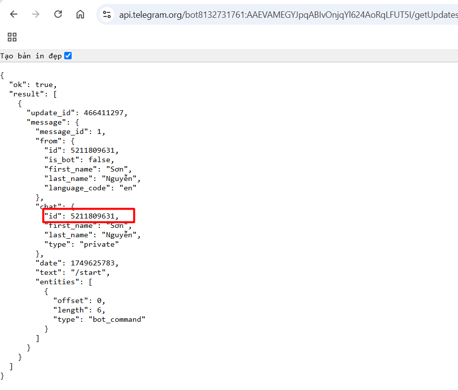
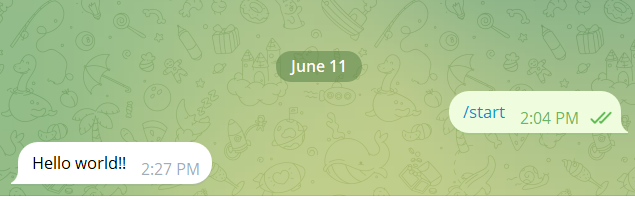

# 1. Telegram bot  ?
**Bot**

- ***Trong telegram:*** Nó là ứng dụng của bên thứ ba sử dụng trong telegram. Người dùng có thể tương tác với Bot bằng cách gửi tin nhắn đến nó hoặc sử dụng câu lệnh... Bạn có thể tạo ra một con Bot cho riêng mình từ BotFather của telegram và điều khiển(ra lệnh) nó thực hiện một công việc cụ thể thông qua API (VD: tự động gửi tin nhắn cho một người dùng nào đó)

- ***Trong internet:*** Thì nó được hiểu là một robot, là một ứng dụng để tự động hóa các tác vụ lặp đi lặp lại chẳng hạn như cài đặt báo thức, báo cho bạn biết thời tiết hoặc tìm kiếm trực tuyến.

Bạn có thể làm được những gì với  ***Bot*** ???

- Tích hợp với một dịch vụ bên ngoài. Ví dụ bạn có tích với Gmail để gửi mail thông qua telegram, hoặc với github, youtube...
- Lập trình một trò chơi
- ChatBot để tìm kiếm những người bạn nói chuyện dựa trên cùng sở thích hay cùng khu vục hoặc ngẫu nhiên
- Thanh toán từ người dùng telegram
- Tạo ra một chương trình để gửi nhắc nhở, thông báo cho bạn như thời tiết...
# 2. Bot hoạt động như thế nào?
Đối với Telegram, Bot là những tài khoản đặc biệt không yêu cầu sử dụng số điện thoại để thiết lập và được sinh ra từ BotFarther. Có hai cách để tương tác với Bot:

- Gửi một tin nhắn hoặc command giống như bạn thực hiện chat với một người bạn của mình.

- Gửi một request trực tiếp.

Tin nhắn, command hoặc request do người dùng gửi đến được truyền cho phần mềm chạy trên máy chủ của bạn. Máy chủ trung gian xử lý mã hóa và giao tiếp với telegram API cho bạn. Bạn cũng có thể giao tiếp với nó thông qua HTTPS-interface
# 3. Cách khởi tạo và sử dụng telegram bot


- Tìm kiếm `BotFather` trên ô search trong ứng dụng telegram và nhấn `Start ` để bắt đầu.



- Bot sẽ trả về cho mình danh sách các commands để bạn control



- Sử dụng command `new bot` để tạo 1 con Bot cho riêng mình
- Nhập tên cho Bot
- Nhập usename cho Bot theo hướng dẫn



- Sau khi tạo xong bạn sẽ nhận được token để xác thực với con Bot của bạn. 
- Lưu lại TOKEN, bạn sẽ dùng nó để gọi API. chuỗi token bạn phải tuyệt đối bảo mật

# 4. Viết script “Hello world!!!” để Bot gửi qua Telegram
- Quay lại ô Search tìm kiếm Bot của bạn, gõ usename bot vừa nhập ở trên
- Truy cập Bot và nhấp `Start`



- Truy cập đường dẫn sau để xem chat ID: 
```
https://api.telegram.org/bot<YOUR_TOKEN>/getUpdates
```

Thay <YOUR_TOKEN> bằng token bạn vừa nhận.

- Kết quả trả về một đoạn code như sau: 


- Lấy số id đó chính là `CHAT_ID `để gửi tin nhắn.

- Viết Bash " Hello World ! " với nội dung sau :

```
#!/bin/bash

# Thông tin bot
TOKEN="8132731761:AAEVAMEGYJpqABIvOnjqYl624AoRqLFUT5I"
CHAT_ID="5211809631"

# Nội dung gửi
MESSAGE="Hello world!!"

# Gửi tin nhắn
curl -s -X POST "https://api.telegram.org/bot$TOKEN/sendMessage" \
     -d chat_id="$CHAT_ID" \
     -d text="$MESSAGE"
```
- Phân tích nội dụng: 
    - Khai báo các biến TOKEN, CHAT_ID, MESSAGE
    - `curl` : công cụ dòng lệnh dùng để gửi HTTP request.

    - `-s`: silent mode, ẩn progress bar.

    - `-X POST`: yêu cầu gửi request HTTP dạng POST (vì ta gửi dữ liệu).

    - "https://api.telegram.org/bot$TOKEN/sendMessage": URL gọi API gửi tin nhắn.
    - `-d` gửi dữ liệu dạng form 

- Sau đó chạy bash `./hello-world.sh` tin nhắn sẽ được gửi qua Telegram 

