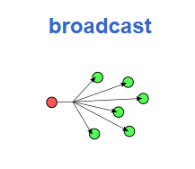
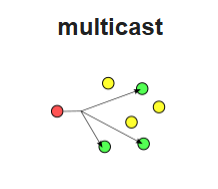

# Tìm hiểu về IPv4 

## 1.IPv4 là gì ?

IPv4 (Internet Protocol version 4) là phiên bản thứ tư của giao thức Internet (Internet Protocol). IPv4 là một giao thức phổ biến dùng để truyền dữ liệu giữa các thiết bị trên Internet hoặc mạng nội bộ. Đây là một giao thức không kết nối, nghĩa là dữ liệu có thể được gửi đi mà không cần kiểm tra xem thiết bị nhận có sẵn sàng hay không.

## 2.Tại sao lại không có IPv1,v2,v3,v5 ?

 - Trong lịch sử TCP thì phiên bản đầu tiên được thiết kế vào năm 1973 sau khi mạng ARPANET đi vào hoạt động. TCP phiên bản 2 ra đời vào năm 1977 với cuộc thử nghiệm kết nối ba mạng lưới TCP/IP, giữa Mỹ, Anh và Na Uy. Cũng từ đó các nhà nghiên cứu nhận ra họ đang đi sai hướng với các giao thức khi các nguyên tắc lớp liên tục bị vi phạm.

 - Tại thời điểm này, TCP/ IP được phân chia và đồng thời được gắn mác phiên bản số 3, sau đó ổn định hóa với phiên bản TCP/IP v4 - giao thức tiêu chuẩn hiện dùng của Internet ngày nay.

 - IPv5 là phiên bản lỗi, một nỗ lực không thành công để mở rộng và giải quyết một số vấn đề của IPv4.

## 3. Cấu trúc của IPv4 

- IP address sẽ bao gồm 32 bit nhị phân, và chúng sẽ được phân chia thành 4 cụm 8 bit (được biết đến với tên gọi là các octet). Các octet này sẽ được biểu diễn dưới dạng thập phân và được phân tách bởi các dấu chấm (.) .

 

Đặt địa chỉ IP cần tuân thủ quy tắc bên dưới:

- Các bit phần network không được phép đồng thời bằng 0.

Ví dụ: Địa chỉ IP 0.0.0.1 với phần network là 0.0.0 và phần host là 1 được xem là không hợp lệ.

- Nếu các bit của phần host đều có giá trị là 0, thì lúc này chúng ta có một địa chỉ mạng.

Ví dụ: 193.167.1.1 là một địa chỉ có thể gán cho host nhưng địa chỉ 193.167.1.0 là một địa chỉ mạng, và không gán được cho host.

- Nếu các bit của phần host đều có giá trị là 1, ta sẽ có một địa chỉ broadcast.

Ví dụ: 193.167.1.255 là địa chỉ broadcast cho mạng 193.167.1.0

## 4. Các thành phần của IPv4

IP gồm thành hai thành phần: phần host và phần mạng (network).

- **Phần network** Xác định địa chỉ mạng mà thiết bị đang kết nối vào.Giúp định tuyến các gói tin dữ liệu đến đích đúng trên mạng.
- **Phần host** Xác định địa chỉ của thiết bị trong mạng.Cho phép các gói tin dữ liệu được gửi đến đúng thiết bị trong mạng.

## 5. Các lớp của IPv4

Địa chỉ IP được chia thành 5 lớp (class) A, B, C, D và E. 

- Lớp A : 

    - Địa chỉ IP lớp A dùng một octet đầu làm phần network, ba octet sau làm phần host.
    - Bit đầu của một IP lớp A luôn là 0.
    - Các địa chỉ mạng lớp A sẽ bao gồm: 1.0.0.0 -> 126.0.0.0.
    - Mạng 127.0.0.0 được sử dụng như mạng loopback.
    - Phần host có 24 bit => mỗi network lớp A có (224 – 2) host.

- Lớp B :

    - Địa chỉ lớp B sử dụng 2 octet đầu làm phần mạng, 2 octet sau làm phần
    - 2 bit đầu của một IP lớp B sẽ luôn là 1 0.
    - Các địa chỉ mạng lớp B sẽ bao gồm: 128.0.0.0 -> 191.255.0.0. Có tổng cộng 214 mạng trong lớp IP lớp
    - Phần host dài 16 bit, vì vậy một mạng lớp B có (216– 2) host.

- Lớp C : 

    - IP lớp C sử dụng ba octet đầu làm phần network, một octet sau làm phần
    - Ba bit đầu của một IP lớp C luôn là 1 1 0.
    - Các địa chỉ mạng lớp C sẽ bao gồm: 192.0.0.0 -> 223.255.255.0. Có tổng cộng 221 mạng trong lớp C.
    - Phần host dài 8 bit vì vậy nên một mạng lớp C sẽ có (28– 2) host.

- Lớp D : 
    - Bao gồm các địa chỉ nằm trong dải: 224.0.0.0 -> 239.255.255.255
    - Thường dùng làm địa chỉ
    - Ví dụ: 224.0.0.9 sử dụng cho RIPv2; 0.0.5 sử dụng cho OSPF.

- Lớp E :
    - Từ 240.0.0.0 trở đi.
    - Thường sử dụng vào mục đích dự phòng.

## 6. IP Public và Private

### 6.1 IP Public 
- Là địa chỉ IP sử dụng cho các gói tin đi trên môi trường Internet, được định tuyến trên môi trường Internet, không sử dụng trong mạng LAN.
- Địa chỉ public phải là duy nhất cho mỗi host tham gia vào Internet. 

### 6.2 IP Private 
- Chỉ được sử dụng trong mạng nội bộ (mạng LAN), không được định tuyến trên môi trường Internet.
- Có thể được sử dụng lặp đi lặp lại
trong các mạng LAN khác nhau. 

- Dải địa chỉ private (được quy định trong RFC 1918):

 Lớp A: 10.x.x.x

 Lớp B: 172.16.x.x -> 172.31.x.x

 Lớp C: 192.168.x.x 

## 7, Chia subnet 
- **Mạng con (Subnet)** là một phần của một mạng lớn được chia nhỏ thành các phần nhỏ hơn để quản lý hiệu quả và để tăng cường bảo mật. Khi một mạng lớn được chia thành các mạng con, mỗi mạng con có thể được quản lý một cách độc lập và tối ưu hóa cho mục đích cụ thể của nó.
- Mạng con thường được định nghĩa bằng một phạm vi các địa chỉ IP liên tiếp, cùng với một subnet mask hoặc độ dài tiền tố (prefix length).

- **Subnet mask** là một dải 32 bit nhị phân đi kèm với một địa chỉ IP, được các host sử dụng để xác định địa chỉ mạng của địa chỉ IP này. Để làm được điều đó, host sẽ đem địa chỉ IP thực hiện phép tính AND từng bit một của địa chỉ với subnet mask của nó, kết quả host sẽ thu được địa chỉ mạng tương ứng của địa chỉ IP. 

Ví dụ: Xét địa chỉ 192.168.1.1 với subnet mask tương ứng là 255.255.255.0 

|...| Dạng thập phân | Dạng nhị phân |
|---|---|---|
| Địa chỉ IP | 192.168.1.1 |11000000.10101000.00000001.00000001|
|Subnet mask |255.255.255.0 |11111111.11111111.11111111.00000000|
|Địa chỉ mạng |192.168.1.0 |11000000.10101000.00000001.00000000|

- **Số prefix**: Như đã nêu ra ở trên, subnet mask được sử dụng kèm với địa chỉ IP để một host có thể căn cứ vào đó xác dịnh được địa chỉ mạng tương ứng của địa chỉ này. Vì vậy, khi khai báo một địa chỉ IP ta luôn phải khai báo kèm theo một subnet mask. Tuy nhiên, subnet mask dù đã được viết dưới dạng số thập phân vẫn khá dài dòng nên để mô tả một địa chỉ IP một cách ngắn gọn hơn, người ta dùng một đại lượng được gọi là số prefix. Số prefix đơn giản chỉ là số bit mạng trong một địa chỉ IP, được viết ngay sau địa chỉ IP, và được ngăn cách với địa chỉ này bằng một dấu “/”.

Ví du: 192.168.1.1/24, 172.16.0.0/16 hay 10.0.0.0/8,.v.v… 

- **Nguyên lý cơ bản của kỹ thuật chia subnet:** Để có thể chia nhỏ một mạng lớn thành nhiều mạng con bằng nhau, người ta thực hiện mượn thêm một số bit
bên phần host để làm phần mạng, các bit mượn này được gọi là các bit subnet. Tùy thuộc vào số bit subnet mà ta có được các số lượng các mạng con khác nhau với các kích cỡ khác nhau:

## 8, Broadcast và Multicast 

### 8.1 Broadcast 
**Broadcast** là cách thức truyền tin được gửi từ một điểm đến tất cả các điểm khác trong cùng một mạng.

### 8.2 Multicast 
**Multicast** là cách thức truyền tin được gửi từ một điểm đến một tập hợp các điểm khác, và do đó là một hình thức kết nối đa điểm.

