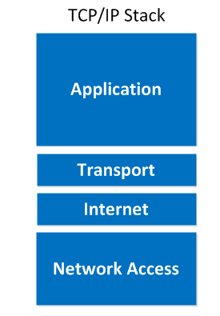
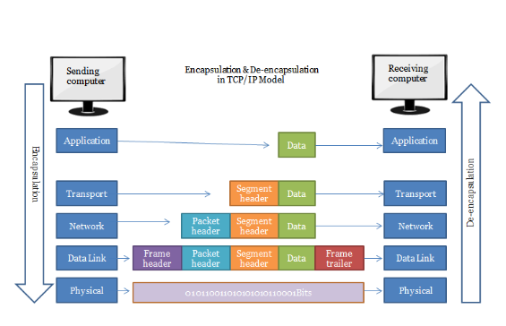
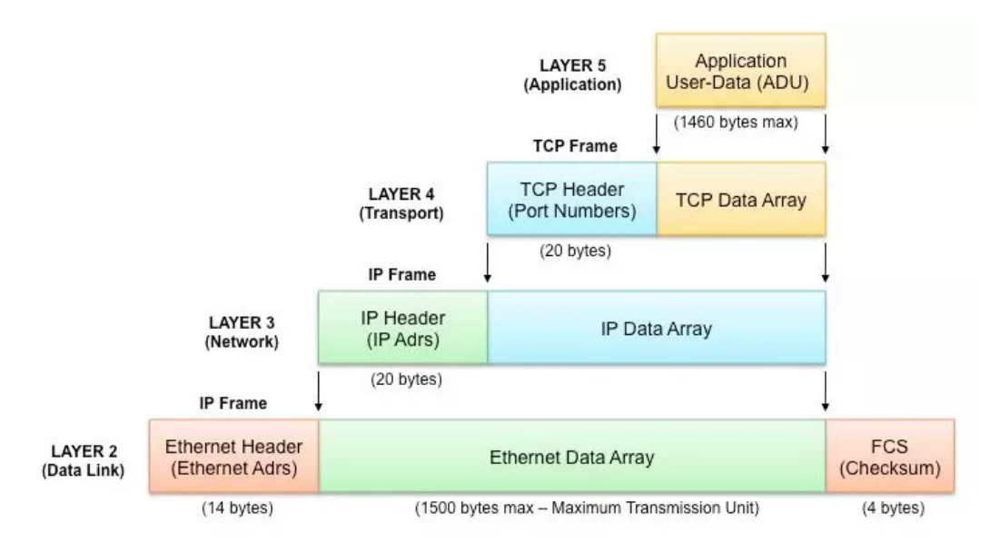
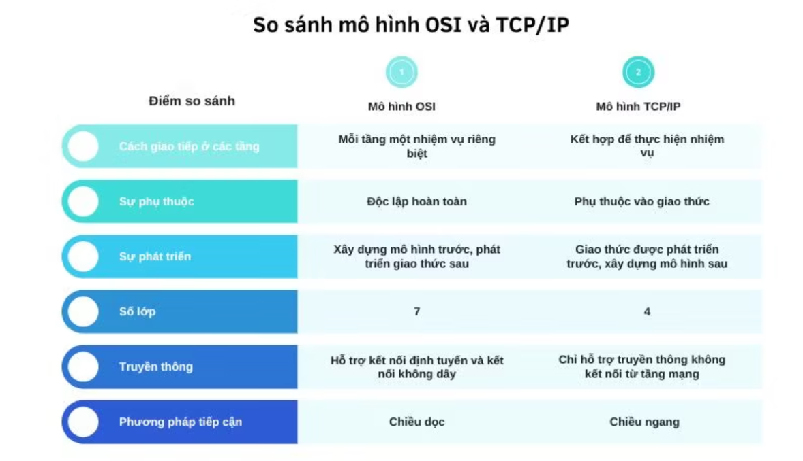
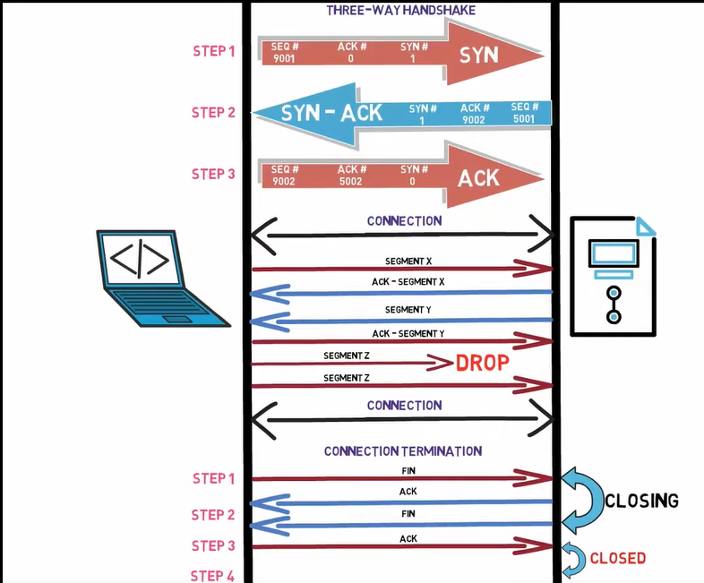

# Mô hình TCP-IP

## Mô hình TCP/IP là gì?

TCP/ IP (Transmission Control Protocol/ Internet Protocol - Giao thức điều khiển truyền nhận/ Giao thức liên mạng), là một bộ giao thức trao đổi thông tin được sử dụng để truyền tải và kết nối các thiết bị trong mạng Internet. TCP/IP được phát triển để mạng được tin cậy hơn cùng với khả năng phục hồi tự động.

## Cách thức hoạt động của mô hình TCP/IP

TCP/IP là sự kết hợp giữa 2 giao thức. Trong đó IP (Giao thức liên mạng) cho phép các gói tin được gửi đến đích đã định sẵn, bằng cách thêm các thông tin dẫn đường vào các gói tin để các gói tin được đến đúng đích đã định sẵn ban đầu. Và giao thức TCP (Giao thức truyền vận) đóng vai trò kiểm tra và đảm bảo sự an toàn cho mỗi gói tin khi đi qua mỗi trạm. Trong quá trình này, nếu giao thức TCP nhận thấy gói tin bị lỗi, một tín hiệu sẽ được truyền đi và yêu cầu hệ thống gửi lại một gói tin khác. 

## Chức năng của các tầng trong mô hình TCP/IP

Một mô hình TCP/IP tiêu chuẩn bao gồm 4 lớp được chồng lên nhau, bắt đầu từ tầng thấp nhất là Tầng vật lý (Physical) → Tầng mạng (Network) → Tầng giao vận (Transport) và cuối cùng là Tầng ứng dụng (Application)

Tầng 4 - Tầng Ứng dụng (Application) 

- Tầng ứng dụng đảm nhận vai trò giao tiếp dữ liệu giữa 2 máy khác nhau thông qua các dịch vụ mạng khác nhau (duyệt web, chat, gửi email, một số giao thức trao đổi dữ liệu: SMTP, SSH, FTP,...). Dữ liệu khi đến đây sẽ được định dạng theo kiểu Byte nối Byte, cùng với đó là các thông tin định tuyến giúp xác định đường đi đúng của một gói tin.

Tầng 3 - Tầng Giao vận (Transport) 

- Chức năng chính của tầng 3 là xử lý vấn đề giao tiếp giữa các máy chủ trong cùng một mạng hoặc khác mạng được kết nối với nhau thông qua bộ định tuyến. Tại đây dữ liệu sẽ được phân đoạn, mỗi đoạn sẽ không bằng nhau. Cấu trúc đầy đủ của một Segment lúc này là Header chứa thông tin điều khiển và sau đó là dữ liệu.

- Trong tầng này còn bao gồm 2 giao thức cốt lõi là TCP và UDP.

Tầng 2 - Tầng mạng (Internet) 

- là một giao thức chịu trách nhiệm truyền tải dữ liệu một cách logic trong mạng. Các phân đoạn dữ liệu sẽ được đóng gói (Packets) với kích thước mỗi gói phù hợp với mạng chuyển mạch mà nó dùng để truyền dữ liệu. Lúc này, các gói tin được chèn thêm phần Header chứa thông tin của tầng mạng và tiếp tục được chuyển đến tầng tiếp theo. Các giao thức chính trong tầng là IP, ICMP và ARP.

Tầng 1 - Tầng Vật lý (Physical) 

- Là sự kết hợp giữa tầng Vật lý và tầng liên kết dữ liệu của mô hình OSI. Chịu trách nhiệm truyền dữ liệu giữa hai thiết bị trong cùng một mạng. Tại đây, các gói dữ liệu được đóng vào khung (gọi là Frame) và được định tuyến đi đến đích đã được chỉ định ban đầu.

## Quy trình hoạt động mô hình TCP/IP

**Bên gửi**

- Tầng 4 (application): Người dùng đưa thông tin vào máy tính ( hình ảnh , văn bản...). Data sẽ được gửi xuống tầng vận chuyển
- Tầng 3 (transport): Data ở đây sẽ được chia nhỏ thành các Segment,cấu trúc đầy đủ của segment lúc này là Header chứa thông tin điều khiển và sau đó là dữ liệu . Các Segment tiếp tục được chuyển xuống tầng Internet.
- Tầng 2 (internet): Các Segment ở đây sẽ được đóng gói Packet với phần Header chứa thông tin tầng mạng. Các Packet tiếp tục được đóng vào các Frames được định tuyến đi đến đích chỉ định ban đầu
- Tầng 1 (physical): Ở đây Frame sẽ được mã hóa thành chuỗi nhị phân

**Bên nhận**

- Tầng 1 (physical):Máy nhận kiểm tra quá trình đồng bộ và đưa các chuỗi bit nhị phân vào vùng đệm rồi gửi thông báo đã nhận dữ liệu
- Tầng 2 (internet): Tại đây thông tin sẽ được kiểm tra xem frame có bị lỗi không, nếu lỗi thì hủy và gửi lại. Kiểm tra các định tuyến, thông tin tầng mạng có đúng địa chỉ hay không, nếu đúng sẽ chuyển lên transport
- Tầng 3 (transport):Hỗ trợ phục hồi và xử lý lỗi , ghép các gói tin lại
- Tầng 4 (application): Gỡ bỏ những header còn lại để nhận được dữ liệu bên gửi

## So sánh mô hình OSI và TCP/IP 

- TCP/IP và OSI là hai giao thức mạng truyền thông tin được sử dụng phổ biến nhất. Tuy nhiên sự khác biệt giữa hai giao thức đó là mô hình OSI chỉ là mô hình khái niệm, nó chỉ sử dụng để tham chiếu mà không được sử dụng trong thực tế. Mặt khác, TCP/IP được sử dụng rộng rãi giúp thiết lập các liên kết và tương tác trong môi trường mạng hiện nay.

- Điểm tương đồng

    - Cả mô hình OSI và TCP IP đều có cấu trúc các giao thức xếp chồng lên nhau theo các lớp.
    - Cả hai đều được coi là mô hình logic.
    - Hai mô hình phân chia các giao tiếp mạng thành các lớp rõ ràng.
    - Cung cấp các tiêu chuẩn giúp cho nhà sản xuất tạo ra thiết bị. Hệ thống mạng có thể hoạt động, giao tiếp với các thiết bị, hệ thống được sản xuất từ nhà cung cấp khác.

- Điểm khác nhau

    - TCP/IP chỉ sử dụng tầng ứng dụng (Application) để xác định chức năng của các tầng trên. Trong khi đó, OSI sử dụng đến 3 tầng (Application, Presentation, Session).
    - OSI cần sử dụng 2 tầng Physical và Datalink để xác định các chức năng của tầng dưới cùng, TCP/IP chỉ sử dụng tầng Network để thực hiện điều đó.
    - Lớp Network được mô hình OSI sử dụng để xác định các tiêu chuẩn và giao thức định tuyến. Chức năng này được quản lý bởi tầng Internet trong TCP/IP.
    - Mô hình TCP/IP là một tiêu chuẩn giao thức định hướng. Còn OSI là một mô hình chung dựa trên chức năng của mỗi lớp.
    - Trong TCP/IP, các giao thức được phát triển trước mô hình. Còn đối với mô hình OSI thì ngược lại.
    - TCP/IP giúp thiết lập kết nối giữa các thiết bị sử dụng với nhau. OSI giúp chuẩn hóa router, switch, bo mạch chủ và các phần cứng khác.

## Phân biệt UDP vs TCP
**1. Tổng quan**
| Đặc điểm          | **TCP (Transmission Control Protocol)** | **UDP (User Datagram Protocol)** |
|------------------|-----------------------------------|----------------------------|
| **Kiểu kết nối** | **Kết nối có hướng (Connection-oriented)** – Cần thiết lập kết nối trước khi truyền dữ liệu. | **Không kết nối (Connectionless)** – Gửi dữ liệu ngay mà không cần thiết lập kết nối. |
| **Độ tin cậy**   | **Đảm bảo tin cậy**, dữ liệu được kiểm tra lỗi và gửi lại nếu bị mất. | **Không đảm bảo tin cậy**, dữ liệu có thể bị mất mà không có cơ chế khôi phục. |
| **Cách truyền dữ liệu** | Dữ liệu được chia thành các **segment**, sắp xếp theo thứ tự và xác nhận (ACK) từng gói. | Dữ liệu được gửi đi dưới dạng **datagram**, không có cơ chế kiểm tra hay đảm bảo thứ tự. |
| **Tốc độ** | **Chậm hơn** do cần xác nhận từng gói tin, kiểm tra lỗi và gửi lại nếu cần. | **Nhanh hơn**, không có bước xác nhận, thích hợp cho ứng dụng cần độ trễ thấp. |
| **Kiểm soát luồng** | Có cơ chế kiểm soát luồng và chống nghẽn mạng (Flow Control, Congestion Control). | Không có cơ chế kiểm soát luồng. |
| **Ứng dụng thực tế** | Dùng cho các ứng dụng yêu cầu **độ tin cậy cao**, như: HTTP (truy cập web), FTP (truyền file), Email, SSH. | Dùng cho các ứng dụng **yêu cầu tốc độ cao, độ trễ thấp**, như: Streaming video, Voice over IP (VoIP), DNS, Gaming online. |

---

- Cách hoạt động của TCP

TCP hoạt động theo mô hình có kết nối (connection-oriented), nghĩa là trước khi gửi dữ liệu, hai thiết bị phải thiết lập kết nối bằng quy trình bắt tay ba bước (Three-Way Handshake):

- Bước 1 (SYN): Bước đầu khi máy khách muốn kết nối với máy chủ , máy khách sẽ gửi một tin nhắn SYN segment(Số thứ tự đồng bộ hóa) để thông báo cho máy chủ rằng máy khách có thể bắt đầu liên lạc với trình tự nào. Tin nhắn SYN bao gồm các thông tin SEQ#(Đánh dấu thứ tự tin gửi tăng dần ),ACK#(chứa số SEQ# kế tiếp cuả thiết bị đích ),SYN#(chỉ 0 hoặc 1 tùy theo dạng tin nhắn ).

- Bước 2(SYN+ACK) : Máy chủ gửi tin nhắn trả lời yêu cầu bằng tin nhắn SYN-ACK biểu thị bằng số thứ tự mà nó có khả năng bắt đầu các phân đoạn đó -

- Bước 3(ACK): Sau khi nhận được tin nhắn đồng ý , máy khác sẽ gửi tin nhắn ACK thông báo nhận được đến với máy chủ và tạo kết nối

**2. Khi nào dùng TCP và UDP?**

| Ứng dụng | **Nên dùng TCP hay UDP?** | **Lý do** |
|----------|---------------------|-------|
| **Truy cập website (HTTP/HTTPS)** | TCP | Cần đảm bảo dữ liệu không bị mất hoặc sai. |
| **Gửi email (SMTP, IMAP, POP3)** | TCP | Cần đảm bảo toàn vẹn dữ liệu. |
| **Tải tệp tin (FTP, SFTP)** | TCP | Cần kiểm tra lỗi và đảm bảo không mất dữ liệu. |
| **Cuộc gọi VoIP, video call (Zoom, Skype, Discord)** | UDP | Cần tốc độ cao, chấp nhận mất dữ liệu nhỏ. |
| **Trò chơi trực tuyến (Online Gaming)** | UDP | Cần độ trễ thấp, tốc độ nhanh hơn. |
| **Truyền phát trực tiếp (Live Streaming)** | UDP | Cần tốc độ cao, mất một vài gói tin không quan trọng. |
| **Tra cứu DNS (Domain Name System)** | UDP | Phản hồi nhanh, không cần kiểm tra lỗi. |
