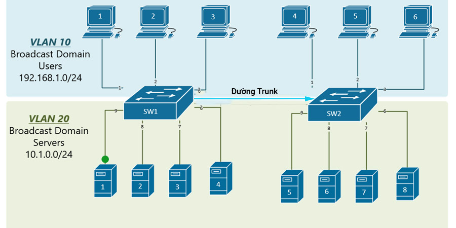
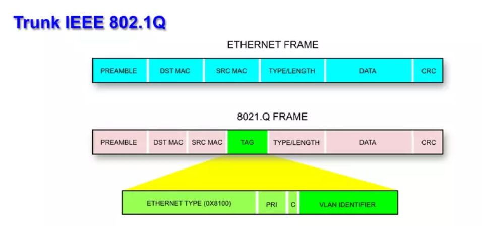
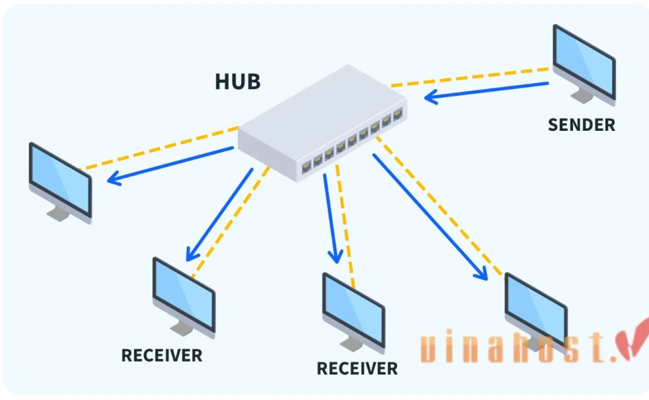
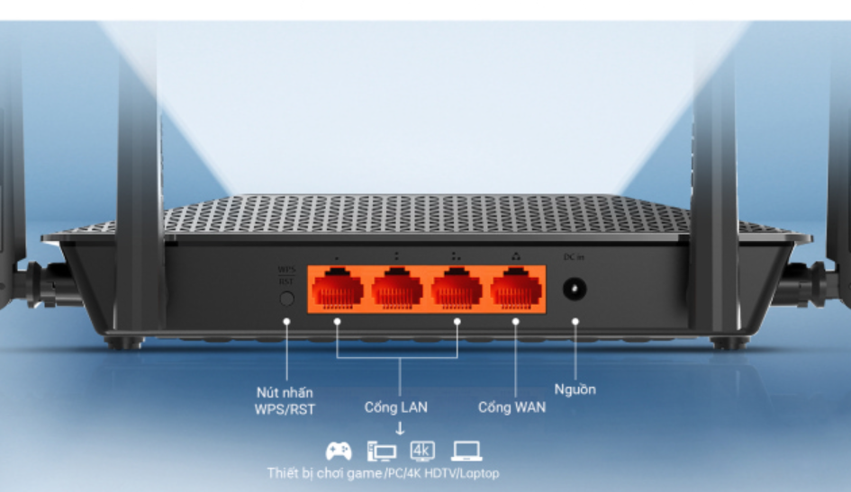
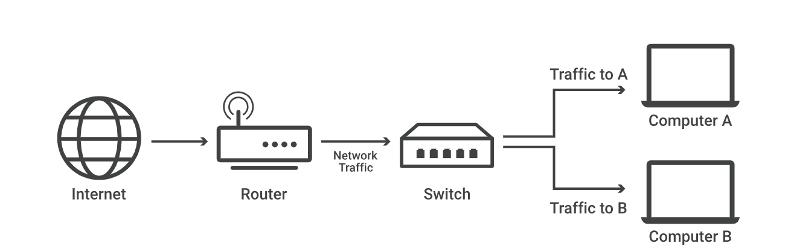
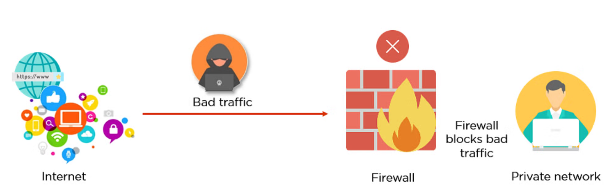
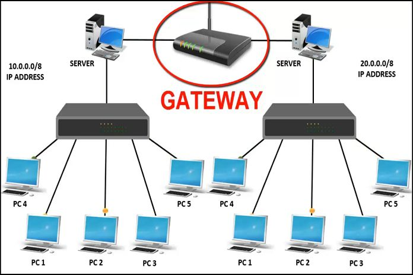

# 1. Tìm hiểu về VLAN

##  1.1 Khái niệm VLAN

VLAN là cụm từ viết tắt của virtual local area network (hay virtual LAN) hay còn được gọi là mạng LAN ảo. VLAN là một kỹ thuật cho phép tạo lập các mạng LAN độc lập một cách logic trên cùng một kiến trúc hạ tầng vật lý. 

Vlan định nghĩa các broadcast domains trong mạng lớp 2. Broadcast domains là tập hợp tất cả các thiết bị sẽ nhận được các broadcast frame có nguồn gốc từ bất kỳ thiết bị nào trong vùng. Broadcast domains thường giới hạn bởi Router vì Router không chuyển tiếp broadcast domains.

## 1.2 Mục đích của VLAN

- VLAN có thể cải thiện hiệu suất làm việc cho các thiết bị nhờ vào khả năng chia LAN thành các đoạn nhỏ, mỗi đoạn là một vùng quảng bá riêng (broadcast domain).

- Phân vùng VLAN là một cách để bảo mật khi các thiết bị ở những VLAN khác nhau không thể truy cập vào nhau.

- Sử dụng VLAN để nhóm các thiết bị có điểm chung lại với nhau giúp quản trị viên quản lý dễ dàng.

## 1.3 Các loại VLAN 

Có 3 loại VLAN, bao gồm:

- Port - based VLAN
    - Là cách cấu hình VLAN đơn giản và phổ biến. Mỗi cổng của Switch được gắn với một VLAN xác định (mặc định là VLAN 1), do vậy bất cứ thiết bị host nào gắn vào cổng đó đều thuộc một VLAN nào đó.

- MAC address based VLAN
    - Cách cấu hình này ít được sử dụng do có nhiều bất tiện trong việc quản lý. Mỗi địa chỉ MAC được đánh dấu với một VLAN xác định.

- Protocol – based VLAN:
    - Cách cấu hình này gần giống như MAC Address based, nhưng sử dụng một địa chỉ logic hay địa chỉ IP thay thế cho địa chỉ MAC. Cách cấu hình không còn thông dụng nhờ sử dụng giao thức DHCP.

## 1.4 VLAN hoạt động như thế nào?

- VLAN hoạt động bằng cách đánh dấu các khung Ethernet với một mã VLAN (VLAN ID). Mã VLAN này xác định VLAN mà khung Ethernet thuộc về. Khi một thiết bị gửi khung Ethernet, chúng sẽ thêm mã VLAN vào khung. Khi khung Ethernet đến bộ chuyển mạch, bộ chuyển mạch sẽ đọc mã VLAN và chuyển khung đến cổng tương ứng với VLAN đó.

# 2.Trunking

- Đường Trunk hay Trunking là một kỹ thuật kết nối các thiết bị mạng với nhau để tạo thành một mạng lớn hơn, đặc biệt trong các mạng LAN (Local Area Network) hoặc các mạng VLAN (Virtual Local Area Network). Đường trunk cho phép chuyển gói dữ liệu từ một VLAN này sang một VLAN khác trên cùng một đường truyền vật lý, điều này giúp tối ưu hóa việc sử dụng băng thông và giảm độ trễ trong mạng.

**Ví Dụ**

- Để kết nối các VLAN dựa trên việc kết nối các cổng tương ứng trên 2 Switch lại với nhau bằng một kết nối vật lý (dây cáp mạng).
- Do đó nếu mở rộng số lượng mạng VLAN lên thì số dây kết nối cho từng mạng VLAN giữa 2 switch cũng tăng theo. Và chúng ta phải cấu hình chính xác cổng nào dành cho VLAN nào trên từng Switch.
- Đường trunk là một kết nối mạng chuyên dụng được thiết lập giữa các thiết bị mạng, như switch hoặc router, để truyền dữ liệu giữa các mạng con (subnet) hoặc VLANs. Đường trunk cho phép truyền thông qua một đường truyền vật lý duy nhất.

- Để biết được gói tin được gửi đến thuộc VLAN nào để chuyển đi, trước khi chuyển gói tin đi người ta sẽ gán nhãn cho nó hay còn gọi là “tagging”. Hiểu đơn giản trên đường Trunk chúng ta sẽ sử dụng một chuẩn đóng gói một cách riêng biệt đó là 802.1Q.

- **Giao thức 802.1Q**

- Đây là giao thức tiêu chuẩn của IEEE dùng để nhận dạng các VLan khi đi qua đường Trunk. Là giao thức gán nhãn frame khi frame đi qua dây trunk kết nối giữa 2 con switch hoặc giữa switch và router. Cách hoạt động của nó là khi SW1 chuẩn bị đẩy gói tin đi thì nó sẽ thêm 1 trường frame tagging để đánh dấu xem gói tin đó thuộc VLAN nào.

## Có 2 loại port khác nhau trong môi trường Switch:

**Access port - cổng Truy cập**

Access Port là cổng trên switch được cấu hình để thuộc về một VLAN duy nhất. Các đặc điểm của VLAN port:

- Chỉ thuộc về một VLAN duy nhất và truyền dữ liệu không có thông tin VLAN Tag.
- Dùng cho kết nối với các thiết bị đầu cuối như PC, máy in, hoặc Access Point.
- Loại bỏ **VLAN Tag** trước khi gửi dữ liệu đến thiết bị đích, vì hầu hết các thiết bị đầu cuối không hiểu được **VLAN Tag**.

**Trunk port - cổng Trung kế**

Trunk Port là cổng trên switch có thể truyền dữ liệu của nhiều VLAN khác nhau thông qua một cổng duy nhất bằng cách sử dụng **VLAN Tagging** (IEEE 802.1Q).

- Dùng để kết nối giữa hai switch hoặc giữa switch và router để truyền nhiều VLAN cùng một lúc.

- Giữ nguyên **VLAN Tag** trong gói tin để switch hoặc router đầu bên kia có thể hiểu và xử lý đúng VLAN.

- Cần phải định nghĩa VLAN nào được phép đi qua Trunk (chỉ định VLAN Allowed).

# 3. Một số thiết bị khác
## 3.1 Hub
 **Khái niệm**

- Hub là một thiết bị mạng hoạt động ở Layer 1 (Physical Layer) của mô hình OSI, dùng để kết nối nhiều thiết bị trong một mạng LAN (Local Area Network). Nó hoạt động như một bộ chia tín hiệu, giúp truyền dữ liệu giữa các thiết bị trong mạng.

**Chức năng của Hub**

- Kết nối các thiết bị trong mạng: Máy tính, máy in, server,…
- Truyền dữ liệu bằng cách phát sóng (Broadcast): Khi một thiết bị gửi dữ liệu, Hub sẽ gửi nó đến tất cả các thiết bị khác.
- Không lưu địa chỉ MAC: Hub không có khả năng phân biệt thiết bị nào gửi hoặc nhận dữ liệu.

**Ưu điểm**

- Hub không cần cấu hình phức tạp, chỉ cần cắm và chạy, rất tiện lợi cho người dùng phổ thông.
- Thiết bị này thường có giá rẻ hơn so với các thiết bị mạng khác như switch hay router, phù hợp cho các mạng nhỏ.
- Thiết bị này cung cấp kết nối cơ bản giữa các thiết bị trong mạng, giúp tạo nên hệ thống mạng nhanh chóng và đơn giản.

**Nhược điểm**

- Tất cả các thiết bị kết nối qua Hub phải chia sẻ cùng một băng thông, dẫn đến tốc độ chậm khi nhiều thiết bị cùng truyền dữ liệu.
- Thiết bị này không phân biệt được địa chỉ đích, do đó phát dữ liệu đến tất cả các thiết bị trong mạng, gây lãng phí tài nguyên và tắc nghẽn.
- Thiết bị này chỉ hỗ trợ chế độ half-duplex, nghĩa là chỉ có thể truyền hoặc nhận dữ liệu tại một thời điểm, không thể làm cả hai cùng lúc.
- Hub không có khả năng kiểm soát truy cập hay bảo mật, khiến mạng dễ bị tấn công hoặc gián đoạn.
## 3.2 Router
**Khái niệm**

- Router (Bộ định tuyến) là thiết bị mạng máy tính dùng để chuyển các gói dữ liệu qua một liên mạng và đến các đầu cuối, thông qua một tiến trình gọi là "định tuyến". Nó hoạt động ở tầng thứ 3 (Tầng giao vận) theo mô hình OSI.

**Chức năng**

-  Router có chức năng gửi các gói dữ liệu mạng giữa 2 hoặc nhiều mạng, từ một tới nhiều điểm đích đến cuối cùng từ router.

**Cấu tạo Router**

- Cổng mạng LAN
    - Hiện nay thường các Router đều có 2 cổng LAN trở lên giúp kết nối từ modem chính đến các thiết bị đầu cuối (tivi, laptop, máy tính,…) để sử dụng mạng internet thông qua cáp mạng. Trên thị trường cổng LAN cũng rất đa dạng với nhiều tốc độ khác nhau đáp ứng được độ truyền tải cao và nhanh chóng.

- Cổng WAN
    - Cổng Wan nằm ở mặt sau Router, được sử dụng để kết nối với modem để truy cập internet từ nhà cung cấp ISP để tận dụng lợi thế của mạng internet trên tất cả các thiết bị được kết hợp với nó.

- Anten
    - Loại phát sóng wifi có thể là anten ngoài hoặc ăngten ngầm. Hiện nay, phổ biến thường là anten ngoài, số lượng anten càng nhiều thì càng tăng cường độ phát sóng Wifi hơn.

- Ngoài ra, cấu tạo Router còn có cổng cắm điện và một số nút chuyên dụng, đèn tín hiệu,...

**Các loại router**
- Wired Router (Router có dây)
- Wireless router (router không dây)
- Virtual Router (Router ảo)

## 3.3 Switch 
**Khái niệm**
- Bộ chuyển mạch hay thiết bị chuyển mạch (switch) là một thiết bị dùng để kết nối các đoạn mạng với nhau theo mô hình mạng hình sao (star). Theo mô hình này, switch đóng vai trò là thiết bị trung tâm, tất cả các máy tính đều được nối về đây.

- Switch dùng để kết nối các thiết bị trong mạng (thường là mạng cục bộ hoặc LAN ) và chuyển tiếp các gói dữ liệu đến và đi từ các thiết bị đó. Không giống như thiết bị định tuyến, switch chỉ gửi dữ liệu đến một thiết bị duy nhất mà nó được sử dụng, không gửi đến mạng của nhiều thiết bị.

- Một switch mạng sẽ có cấu tạo gồm 2 phần bao gồm:     

    - Phần cứng hardware: gồm khung vỏ thiết bị (vỏ nhựa hoặc vỏ sắt), nguồn điện cấp, ở bên trong có các linh kiện mạch bên trong (CPU, bộ nhớ, bo mạch chủ, các Bus hệ thống), các cổng kết nối ngoại vi (4 port, 8 port, 16 port, 24 port, 48 port,…).

    - Phần mềm software: các thuật toán đã được cài đặt sẵn, phần mềm thiết bị switch sử dụng hệ điều hành OS.

**Chức năng của Switch**

- Switch nhận các gói dữ liệu và chuyển tiếp chúng đến đúng thiết bị đích thay vì gửi đến toàn bộ mạng (như Hub).

- Do switch gửi dữ liệu đúng nơi cần đến, nó giúp giảm xung đột dữ liệu so với Hub.

- VLAN giúp phân chia mạng thành nhiều subnet để tăng tính bảo mật và hiệu suất.

- Switch có băng thông cao hơn và hỗ trợ nhiều cổng Ethernet, giúp truyền tải dữ liệu nhanh chóng.

## 3.4 Firewall
**Khái niệm**
- Firewall (tường lửa) là một hệ thống bảo mật mạng giúp kiểm soát và giám sát lưu lượng dữ liệu ra vào giữa các mạng, thường là giữa mạng nội bộ (LAN) và mạng bên ngoài (Internet). Nó hoạt động như một rào cản bảo vệ, chỉ cho phép các kết nối hợp lệ và ngăn chặn các kết nối có hại. 

**Chức năng của Firewall**

- Ngăn chặn hacker và các cuộc tấn công mạng khác.

- Chặn hoặc cho phép các kết nối dựa trên quy tắc (IP, cổng, giao thức, v.v.).

- Quản lý quyền truy cập của người dùng vào mạng nội bộ hoặc Internet.

- Hạn chế quyền truy cập vào các tài nguyên quan trọng của tổ chức.

- Theo dõi lưu lượng mạng để phát hiện các hành vi bất thường hoặc nguy cơ bảo mật.

## 3.5 Gateway
**Khái niệm**

- Gateway (Cổng mạng) là một thiết bị hoặc nút mạng hoạt động như cửa ngõ giao tiếp giữa hai mạng khác nhau, giúp chuyển đổi giao thức và định tuyến dữ liệu giữa chúng. Nó hoạt động ở Layer 3 (Network Layer) của mô hình OSI, nhưng có thể hỗ trợ cả các tầng cao hơn.

**Chức năng của Gateway**

- Kết nối các mạng khác nhau: Ví dụ, mạng LAN kết nối với Internet thông qua Gateway.

- Chuyển đổi giao thức (Protocol Conversion): Hỗ trợ truyền dữ liệu giữa các hệ thống dùng giao thức khác nhau.

- Định tuyến lưu lượng mạng: Xác định đường đi cho gói tin giữa các mạng.

- Kiểm soát truy cập: Một số Gateway có tính năng bảo mật, lọc gói tin hoặc kiểm tra dữ liệu.

