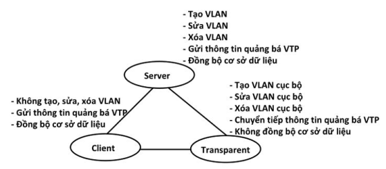

# 1. Tìm hiểu về VLAN

##  1.1 Khái niệm VLAN

VLAN là cụm từ viết tắt của virtual local area network (hay virtual LAN) hay còn được gọi là mạng LAN ảo. VLAN là một kỹ thuật cho phép tạo lập các mạng LAN độc lập một cách logic trên cùng một kiến trúc hạ tầng vật lý. 

Vlan định nghĩa các broadcast domains trong mạng lớp 2. Broadcast domains là tập hợp tất cả các thiết bị sẽ nhận được các broadcast frame có nguồn gốc từ bất kỳ thiết bị nào trong vùng. Broadcast domains thường giới hạn bởi Router vì Router không chuyển tiếp broadcast domains.

## 1.2 Mục đích của VLAN

- Do VLAN có thể chia nhỏ LAN thành các đoạn (là một vùng quảng bá). Khi một gói tin quảng bá, nó sẽ được truyền chỉ trong một VLAN duy nhất, không truyền ở các VLAN khác nên giảm được lưu lượng quảng bá, tiết kiệm được băng thông đường truyền.
- Phân vùng VLAN là một cách để bảo mật khi các thiết bị ở những VLAN khác nhau không thể truy cập vào nhau.
- Sử dụng VLAN để nhóm các thiết bị có điểm chung lại với nhau giúp quản trị viên quản lý dễ dàng.
- Trên một switch nhiều cổng, có thể cấu hình VLAN khác nhau cho từng cổng, do đó dễ dàng kết nối thêm các máy tính với các VLAN.

## 1.3 Các loại VLAN 

Có 3 loại VLAN, bao gồm:

- Port - based VLAN
    - Là cách cấu hình VLAN đơn giản và phổ biến. Mỗi cổng của Switch được gắn với một VLAN xác định, do vậy bất cứ thiết bị host nào gắn vào cổng đó đều thuộc một VLAN nào đó.

- MAC address based VLAN
    - Mỗi địa chỉ MAC được đánh dấu với một VLAN xác định.Cách cấu hình này ít được sử dụng do có nhiều bất tiện trong việc quản lý. 

- Protocol – based VLAN:
    - tương tự với VLAN dựa trên địa chỉ MAC nhưng sử dụng địa chỉ IP thay cho địa chỉ MAC. Cách cấu hình này không còn được thông dụng.

## 1.4 VLAN hoạt động như thế nào?

- VLAN hoạt động bằng cách đánh dấu các khung Ethernet với một mã VLAN (VLAN ID). Mã VLAN này xác định VLAN mà khung Ethernet thuộc về. Khi một thiết bị gửi khung Ethernet, chúng sẽ thêm mã VLAN vào khung. Khi khung Ethernet đến bộ chuyển mạch, bộ chuyển mạch sẽ đọc mã VLAN và chuyển khung đến cổng tương ứng với VLAN đó.

**Access port - cổng Truy cập**

Access Port là cổng trên switch được cấu hình để thuộc về một VLAN duy nhất. Các đặc điểm của VLAN port:

- Chỉ thuộc về một VLAN duy nhất. 
- Dùng cho kết nối với các thiết bị đầu cuối như PC, máy in, hoặc Access Point.

# 2.Trunking

- Đường Trunk hay Trunking là một kỹ thuật kết nối các thiết bị mạng với nhau để tạo thành một mạng lớn hơn, đặc biệt trong các mạng LAN (Local Area Network) hoặc các mạng VLAN (Virtual Local Area Network). Đường trunk cho phép chuyển gói dữ liệu từ một VLAN này sang một VLAN khác trên cùng một đường truyền vật lý, điều này giúp tối ưu hóa việc sử dụng băng thông và giảm độ trễ trong mạng.

- Để biết được gói tin được gửi đến thuộc VLAN nào để chuyển đi, trước khi chuyển gói tin đi người ta sẽ gán nhãn cho nó hay còn gọi là “tagging”. Hiểu đơn giản trên đường Trunk chúng ta sẽ sử dụng một chuẩn đóng gói một cách riêng biệt đó là 802.1Q.

**Trunk port - cổng Trung kế**

Trunk Port là cổng trên switch có thể truyền dữ liệu của nhiều VLAN khác nhau thông qua một cổng duy nhất bằng cách sử dụng **VLAN Tagging** (IEEE 802.1Q).
- Dùng để kết nối giữa hai switch hoặc giữa switch và router để truyền nhiều VLAN cùng một lúc.
- Giữ nguyên **VLAN Tag** trong gói tin để switch hoặc router đầu bên kia có thể hiểu và xử lý đúng VLAN.
- Cần phải định nghĩa VLAN nào được phép đi qua Trunk (chỉ định VLAN Allowed).

- **Giao thức 802.1Q**

- Đây là giao thức tiêu chuẩn của IEEE dùng để nhận dạng các VLan khi đi qua đường Trunk. Là giao thức gán nhãn frame khi frame đi qua dây trunk kết nối giữa 2 con switch hoặc giữa switch và router. Cách hoạt động của nó là khi SW1 chuẩn bị đẩy gói tin đi thì nó sẽ thêm 1 trường frame tagging để đánh dấu xem gói tin đó thuộc VLAN nào.

## VTP 
- VTP (VLAN Trunking Protocol) là giao thức hoạt động ở tầng liên kết dữ liệu trong mô hình OSI. VTP giúp cho việc cấu hình VLAN luôn đồng nhất khi thêm, xóa, sửa thông tin về VLAN trong hệ thống mạng.
- VTP cho phép bạn cấu hình một switch làm “VTP Server” và các switch khác có thể được cấu hình là “VTP Clients“. Khi các thay đổi về VLAN được thực hiện trên VTP Server, nó sẽ tự động đồng bộ hóa thông tin này đến các VTP Clients, giúp giảm thiểu công việc cấu hình thủ công trên từng switch.
- VTP hoạt động ở một trong 3 cơ chế sau:
    - Server
    - Client
    - Transparent

- Cách hoạt động của VTP
    - VTP gửi thông điệp quảng bá qua “VTP domain” mỗi 5 phút một lần, hoặc khi có sự thay đổi xảy ra trong quá trình cấu hình VLAN. Một thông điệp VTP bao gồm “rivision-number”, tên VLAN (VLAN name), số hiệu VLAN. Bằng sự cấu hình VTP Server và việc quảng bá thông tin VTP tất cả các switch đều đồng bộ về tên VLAN và số liệu VLAN của tất cả các VLAN.

    - Một trong những thành phần quan trọng trong các thông tin quảng bá VTP là tham số “revision-number”.  Mỗi thành phần VTP server điều chỉnh thông tin VLAN, nó tăng “revision-number” lên 1, rồi sau đó VTP Server mới gửi thông tin quảng bá VTP đi. Khi một switch nhận một thông điệp VTP với “revision-number” lớn hơn, nó sẽ cập nhật cấu hình VLAN.

# 3. Một số thiết bị khác
## 3.1 Hub
 **Khái niệm**

- Hub là một thiết bị mạng hoạt động ở Layer 1 (Physical Layer) của mô hình OSI, dùng để kết nối nhiều thiết bị trong một mạng LAN (Local Area Network). Nó hoạt động như một bộ chia tín hiệu, giúp truyền dữ liệu giữa các thiết bị trong mạng.

**Chức năng của Hub**

- Kết nối các thiết bị trong mạng: Máy tính, máy in, server,…
- Truyền dữ liệu bằng cách phát sóng (Broadcast): Khi một thiết bị gửi dữ liệu, Hub sẽ gửi nó đến tất cả các thiết bị khác.
- Không lưu địa chỉ MAC: Hub không có khả năng phân biệt thiết bị nào gửi hoặc nhận dữ liệu.

## 3.2 Router
**Khái niệm**

- Router (Bộ định tuyến) là thiết bị mạng có chức năng chuyển tiếp dữ liệu giữa các mạng máy tính.Nói một cách dễ hiểu: router thực hiện điều phối dữ liệu trên Internet, các dữ liệu này sẽ được gửi theo dạng gói từ router này sang router khác thông qua các mạng nhỏ được kết nối với nhau thành một hệ thống mạng liên kết. Gói dữ liệu sẽ được truyền tiếp qua các router cho đến khi chúng tới được điểm đích. Nó hoạt động ở tầng thứ 3 theo mô hình OSI.

**Cấu tạo Router**

- Cổng mạng LAN
    - Hiện nay thường các Router đều có 2 cổng LAN trở lên giúp kết nối từ modem chính đến các thiết bị đầu cuối (tivi, laptop, máy tính,…) để sử dụng mạng internet thông qua cáp mạng. 
- Cổng WAN
    - Cổng Wan nằm ở mặt sau Router, được sử dụng để kết nối với modem để truy cập internet từ nhà cung cấp ISP để tận dụng lợi thế của mạng internet trên tất cả các thiết bị được kết hợp với nó.
- Anten
    - Loại phát sóng wifi có thể là anten ngoài hoặc ăngten ngầm. Hiện nay, phổ biến thường là anten ngoài, số lượng anten càng nhiều thì càng tăng cường độ phát sóng Wifi hơn.

**Các loại router**
- Wired Router (Router có dây)
- Wireless router (router không dây)
- Virtual Router (Router ảo)

## 3.3 Switch 
**Khái niệm**
- Bộ chuyển mạch hay thiết bị chuyển mạch (switch) là một thiết bị dùng để kết nối các đoạn mạng với nhau theo mô hình mạng hình sao (star). Theo mô hình này, switch đóng vai trò là thiết bị trung tâm, tất cả các máy tính đều được nối về đây.

- Một switch mạng sẽ có cấu tạo gồm 2 phần bao gồm:     

    - Phần cứng hardware: gồm khung vỏ thiết bị (vỏ nhựa hoặc vỏ sắt), nguồn điện cấp, ở bên trong có các linh kiện mạch bên trong (CPU, bộ nhớ, bo mạch chủ, các Bus hệ thống), các cổng kết nối ngoại vi (4 port, 8 port, 16 port, 24 port, 48 port,…).

    - Phần mềm software: các thuật toán đã được cài đặt sẵn.

- **Switch Layer 2** truy xuất cập nhật địa chỉ MAC có trong frame, cho phép các thiết bị có thể truyền tin nhanh chóng cho nhau mà không cần phải kết nối trực tiếp.Switch Layer 2 còn có khả năng tạo ra mạng ảo VLAN sẽ tối ưu các nhóm trong mạng một cách dễ dàng.

- **Switch layer 3** bao gồm nhiều tính năng hơn Switch Layer 2. Sở dĩ như vậy là bởi vì một số dịch vụ trong đó làm cho switch layer 3 hoạt động tốt hơn switch layer 2 như: bảng CAM, bảng FIB, địa chỉ IP của next hop, địa chỉ MAC,… Chính vì vậy giá thành của switch Layer 3 cao hơn hẳn switch Layer 2.

## 3.4 Firewall
- Firewall (tường lửa) là một hệ thống bảo mật mạng giúp kiểm soát và giám sát lưu lượng dữ liệu ra vào giữa các mạng, thường là giữa mạng nội bộ (LAN) và mạng bên ngoài (Internet). Nó hoạt động như một rào cản bảo vệ, chỉ cho phép các kết nối hợp lệ và ngăn chặn các kết nối có hại. 

## 3.5 Gateway

- Gateway là bộ chuyển đổi giao thức, được dùng để kết nối hai mạng có giao thức khác nhau, dữ liệu sẽ được giao tiếp đi qua Gateway trước khi định tuyến.

- Gateway là một điểm giao tiếp giữa hai mạng khác nhau, nó có thể phân phối lưu lượng mạng giữa các mạng, định tuyến gói tin và thực hiện các chức năng bảo mật như tường lửa. Gateway có thể được triển khai dưới dạng phần cứng hoặc phần mềm.

**Chức năng của Gateway**

## 3.6 .Repeater
- Repeater là thiết bị khuếch đại, khuếch tán giúp đường truyền tín hiệu mạng đi xa ổn định hơn.

- Có hai loại là LAN Repeater và Wifi Repeater.
