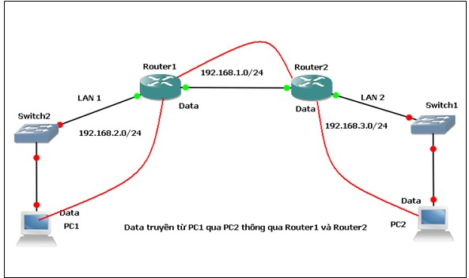

# 1. Routing?
## 1.1 Thế nào là Routing ?
- Định tuyến (Routing) là phương thức mà Router (Bộ định tuyến) hay PC (thiết bị mạng) dùng để chuyển các gói tin đến địa chỉ đích một cách tối ưu nhất, nghĩa là chỉ ra hướng và đường đi tốt nhất cho gói tin. 
- Router thu thập và duy trì các thông tin định tuyến để cho phép truyền và nhận các dữ liệu.Quá trình Routing dựa vào thông tin trên bảng định tuyến (Routing table), là bảng chứa các lộ trình nhanh và tốt nhất đến các mạng khác nhau trên mạng, để hướng các gói dữ liệu đi một cách hiệu quả nhất.
- Thông tin trên bảng định tuyến có thể được cấu hình thủ công hoặc có thể sử dụng một giao thức định tuyến động để tạo ra và tự động cập nhật các thông tin định tuyến. 

## 1.2 Routing table

- Routing table là một dạng database cần thiết để tìm đường đi nhanh nhất (Path determination), nó thể được xây dựng thông qua nhiều cách, có thể là do cấu hình của người quản trị và cũng có thể được tích hợp trong các giao thức định tuyến.

## 1.3 Định tuyến hoạt động như thế nào?

- Khi gửi đi một gói dữ liệu từ một máy tính này sang một máy tính khác, đầu tiên quá trình sẽ xác định xem gói dữ liệu được gửi nội bộ đến máy tính khác trên cùng LAN hay đến Router để định tuyến đến LAN đích.
- Nếu gói dữ liệu được gửi đến một máy tính nằm trong một LAN khác, nó sẽ được gửi đến Router (hoặc gateway). Sau đó Router sẽ xác định tuyến khả thi nhất để chuyển tiếp dữ liệu theo tuyến đó. Gói dữ liệu sẽ được gửi đến Router tiếp theo và quá trình như vậy được lặp lại cho tới khi nó đến được LAN đích.

- Ở LAN đích, Router đích sẽ chuyển tiếp gói dữ liệu này đến máy tính đích. Để xác định xem tuyến nào là tốt nhất, các Router sử dụng thuật toán định tuyến phức tạp, thuật toán này sử dụng một loạt các hệ số gồm có tốc độ của môi trường truyền dẫn, số đoạn mạng và đoạn mạng có khả năng chuyển tải lưu lượng ở mức độ tối thiểu.

- Các Router sẽ chia sẻ trạng thái và các thông tin định tuyến cho nhau để chúng có thể quản lý lưu lượng và tránh được các kết nối chậm.

## 1.4 Các phương thức định tuyến 

Routing được chia làm 2 phương thức chính là Static Routing và Dynamic Routing.
- **Định tuyến tĩnh(Static routing)**
    - Trong định tuyến tĩnh, quản trị viên mạng sử dụng bảng tĩnh để đặt cấu hình và chọn các tuyến mạng theo cách thủ công. Định tuyến tĩnh hữu ích trong các tình huống mà thiết kế mạng hoặc các thông số dự kiến sẽ không thay đổi.

    - Bản chất tĩnh của kỹ thuật định tuyến này đi kèm với những hạn chế dự kiến, chẳng hạn như tắc nghẽn mạng. Mặc dù quản trị viên có thể đặt cấu hình đường dẫn dự phòng trong trường hợp một liên kết bị lỗi, định tuyến tĩnh thường làm giảm khả năng thích ứng và linh hoạt của mạng, dẫn đến hiệu suất mạng bị hạn chế.

- **Định tuyến động (Dynamic routing)**
    - Trong định tuyến động, các bộ định tuyến tạo và cập nhật bảng định tuyến trong thời gian chạy dựa trên điều kiện mạng thực tế. Bộ định tuyến cố gắng tìm đường dẫn nhanh nhất từ nguồn đến điểm đích bằng cách sử dụng một giao thức định tuyến động, đây là một tập hợp các quy tắc giúp tạo, duy trì và cập nhật bảng định tuyến động.
    - Lợi thế lớn nhất của định tuyến động là khả năng thích ứng với các điều kiện mạng thay đổi, bao gồm lưu lượng truy cập, băng thông và lỗi mạng.

# 2. Static Routing 

- Static Routing là phương thức định tuyến mà người quản trị sẽ nhập tất cả thông tin về đường đi cho router. Vậy khi cấu trúc hệ thống mạng có bất kỳ sự thay đổi nào thì người quản trị sẽ thay đổi bằng cách xóa hay thêm các thông tin về đường đi cho router, nói cách khác đường đi này là cố định.

- Nguyên lý hoạt động của Static Routing :

    - Đầu tiên người quản trị sẽ cấu hình các đường cố định cho router

    - Sau đó, router sẽ cài đặt đường đi này vào bảng định tuyến.

    - Và gói dữ liệu được định tuyến theo đường cố định.

- Cấu hình Static Routing trên Cisco Router

                Router(config)# ip route <destination-network> <subnet-mask> <next-hop-IP | exit-interface>

**destination-network**: Mạng đích mà bạn muốn định tuyến đến.  
**subnet-mask**: Subnet mask của mạng đích.     
**next-hop-IP**: Địa chỉ IP của router kế tiếp.     
**exit-interface**: Cổng giao tiếp ra ngoài trên router hiện tại.       