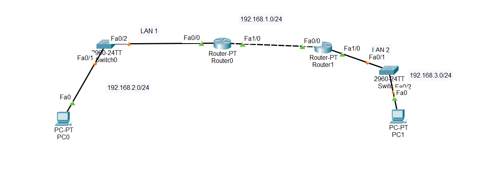
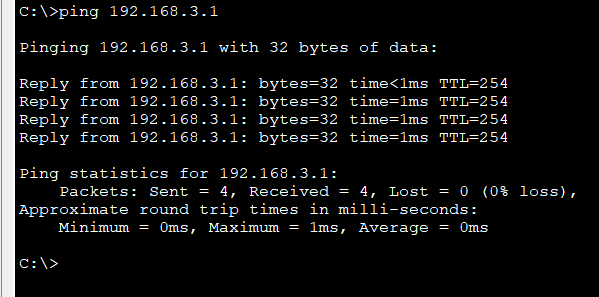

# Cấu hình trên Router0
    enable
    configure terminal
    hostname Router0
    interface FastEthernet0/0
    ip address 192.168.2.1 255.255.255.0
    no shutdown
    exit
    interface FastEthernet0/1
    ip address 192.168.1.1 255.255.255.0
    no shutdown
    exit

# Cấu hình trên Router1
    enable
    configure terminal
    hostname Router1
    interface FastEthernet0/0
    ip address 192.168.1.2 255.255.255.0
    no shutdown
    exit
    interface FastEthernet0/1
    ip address 192.168.3.1 255.255.255.0
    no shutdown
    exit

# Cấu hình trên PC0
    IP Address: 192.168.2.2  
    Subnet Mask: 255.255.255.0  
    Default Gateway: 192.168.2.1  

# Cấu hình trên PC1
    IP Address: 192.168.3.2  
    Subnet Mask: 255.255.255.0  
    Default Gateway: 192.168.3.1  

# dùng định tuyến tĩnh (Static Route)
    Router(config)# ip route (network-address) (subnet-mask) (next-hop ip address/ exit interface)
## Trên R1 , thêm tuyến đường đến 192.168.3.0/24:

    ip route 192.168.3.0 255.255.255.0 192.168.1.2

## Trên R2, thêm tuyến đường đến 192.168.2.0/24:
    ip route 192.168.2.0 255.255.255.0 192.168.1.1

# Ping gói tin từ PC 0 đến PC1

