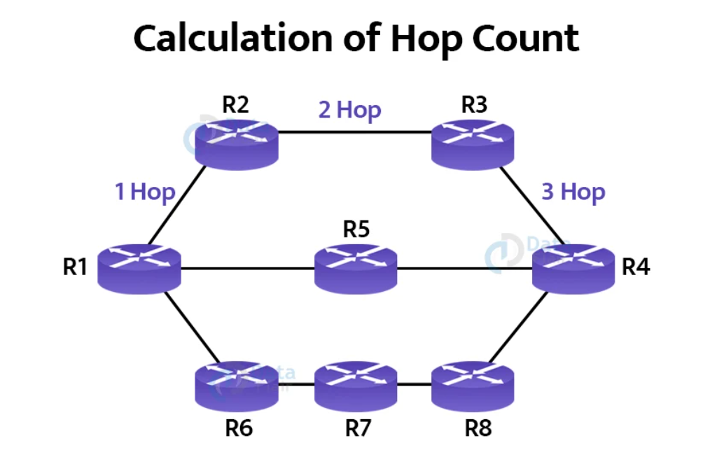
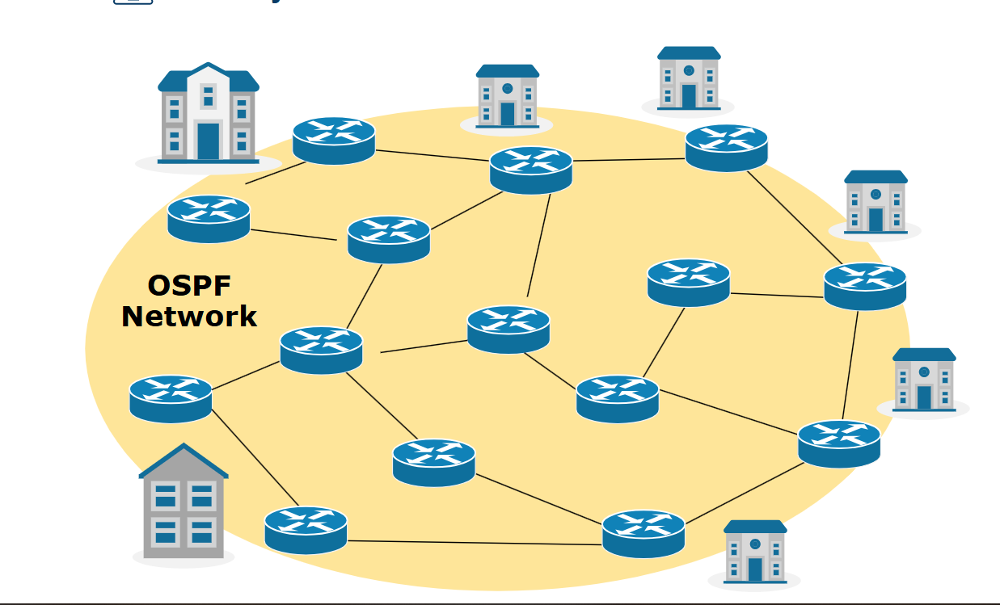
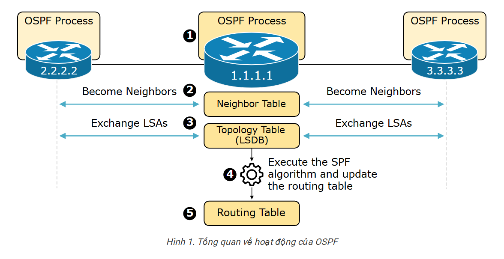
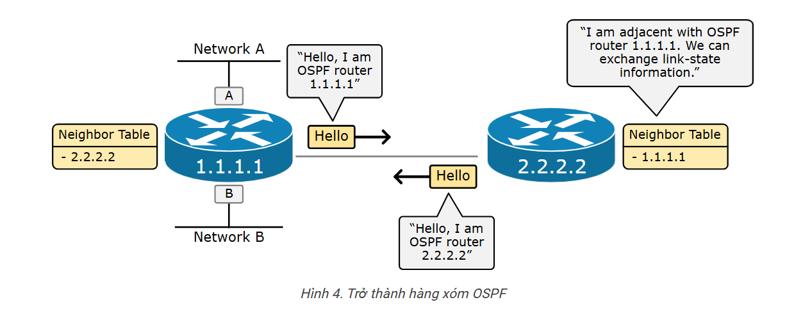
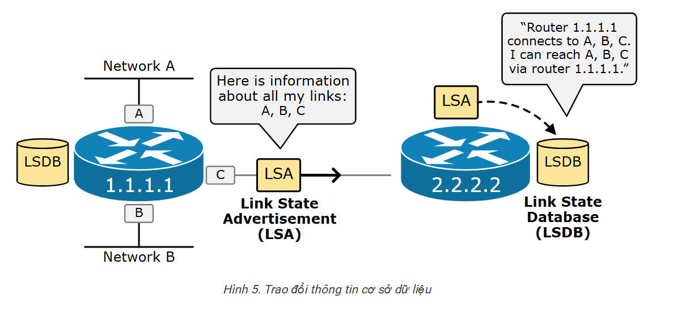

# Hệ thống tự trị (AS-Autonomous System)

- Hệ thống tự trị là một nhóm các mạng và bộ định tuyến có chung chính sách quản trị.

- Các giao thức định tuyến được sử dụng bên trong một AS được gọi là giao thức định tuyến nội miền IGP (Interior Gateway Protocol).

 - Chia thành ba nhóm chính:
     - Distance-Vector: RIP (Routing Information Protocol).
    - Link-State: OSPF (Open Shortest Path First) và IS-IS (Intermediate System to Intermediate System).
    - Hybrid (kết hợp): EIGRP (Enhanced Interior Gateway Routing Protocol).

- Để thực hiện định tuyến giữa các AS với nhau chúng ta phải sử dụng một giao thức riêng gọi là giao thức định tuyến ngoại miền EGP (Exterior Gateway Protocol).

# RIP (Routing Information Protocol )
- Routing Information Protocol (RIP) được thiết kế như là một giao thức IGP dùng cho các AS có kích thước nhỏ, không sử dụng cho hệ thống mạng lớn và phức tạp.

- RIP sử dụng thuật toán định tuyến theo véctơ khoảng cách DVA (Distance Vectơ Algorithms)
Trong giao thức định tuyến RIP, hop count được sử dụng để đo lường khoảng cách mạng.

-  Cách tính đường đi
    - RIP chọn đường đi ngắn nhất dựa trên số lượng hop (mỗi router đi qua = 1 hop).
    - Giới hạn tối đa 15 hop (nếu lớn hơn 15 → bị loại bỏ).
    - Cập nhật định kỳ mỗi 30 giây → dễ gây nghẽn mạng.

- Mỗi router chạy RIP sẽ duy trì một bảng định tuyến chứa thông tin về mạng đích, khoảng cách (hop count), và router tiếp theo.

 # OSPF (Open Shortest Path First)
OSPF (Open Shortest Path First) là giao thức định tuyến nội bộ hoạt động dựa trên thuật toán link state routing.

## **Hoạt động của OSPF**

- **Bước 1.** Bật tiến trình OSPF cục bộ và chọn RID :
    - Mỗi router cần có một ID duy nhất để định danh trong mạng OSPF.
- **Bước 2.** Thiết lập mối quan hệ láng giềng : 
    - Khi tiến trình OSPF được kích hoạt, router sẽ gửi gói tin Hello trên tất cả các giao diện đã bật OSPF.
    - Nếu có router khác cũng chạy OSPF trên cùng một phân đoạn mạng, hai router sẽ xác nhận nhau và thiết lập quan hệ láng giềng.
    - Chúng sẽ so sánh thông số như Area ID, Hello Timer, Dead Timer… để đảm bảo tương thích.

    

- **Bước 3.** Trao đổi LSA và xây dựng bảng (LSDB): 
    - Khi hai router trở thành láng giềng, chúng sẽ trao đổi các Link-State Advertisement (LSA).
    - LSA chứa thông tin về các liên kết kết nối trực tiếp của router, bao gồm chi phí (cost), IP, trạng thái liên kết….
    - Router sẽ gửi LSA đến tất cả láng giềng trong vùng, và mỗi router trong cùng một khu vực sẽ có cùng một LSDB (Link-State Database).
    - Quá trình này được gọi là LSA flooding (lan truyền LSA).

    

- **Bước 4.** Thực hiện thuật toán SPF: 
    - Sau khi có LSDB hoàn chỉnh, router sử dụng thuật toán Dijkstra (SPF) để tính toán đường đi ngắn nhất đến từng mạng.

    - SPF:	Xây dựng cây đường đi ngắn nhất từ một điểm gốc đến tất cả các điểm.

- **Bước 5.** Cập nhật bảng định tuyến với các đường dẫn tốt nhất: 
    - Sau khi thuật toán SPF tính toán xong, router cập nhật các đường đi tốt nhất vào bảng định tuyến (Routing Table).
    - Khi có gói tin cần gửi, router sẽ dựa vào bảng định tuyến để quyết định chuyển tiếp gói tin theo đường tối ưu nhất.
# EIGRP (Enhanced Interior Gateway Routing Protocol)

- EIGRP là Hybrid (kết hợp Distance-Vector & Link-State), sử dụng thuật toán DUAL (Diffusing Update Algorithm) để tính toán đường đi và hội tụ nhanh hơn.

- DUAL: Là tìm tuyến đường chính (Successor) và tuyến dự phòng (Feasible Successor) giữa các router lân cận. 

- EIGRP sử dụng nhiều thông số để tính toán đường đi tối ưu:
    - Bandwidth (Băng thông)
    - Delay (Độ trễ)
    - Load (Mức tải trên đường truyền)
    - Reliability (Độ tin cậy)
    - MTU (Maximum Transmission Unit - kích thước gói tin tối đa)
- EIGRP chỉ cập nhật các thay đổi nhỏ (Partial Updates), giúp tiết kiệm băng thông và tăng tốc độ hội tụ.
- EIGRP nhanh hơn nhờ Feasible Successor (Đường thay thế sẵn có), giúp router không cần tính toán lại toàn bộ khi đường chính bị lỗi.
- EIGRP hỗ trợ cả Equal-Cost và Unequal-Cost Load Balancing (chia tải ngay cả khi các tuyến có chi phí khác nhau), giúp tối ưu hiệu suất mạng.

# BGP (Border Gateway Protocol)
- BGP là một giao thức EGP được thiết kết để phân phối thông tin định tuyến giữa các AS.
- BGP là một giao thức định tuyến vecto khoảng cách.
- Bảng định tuyến chứa tất cả các đích mà router biết và địa chỉ hop tiếp theo mà router phải gửi để đến đích cũng như metric cost của con đường đó.
- Nếu một router có thể chọn nhiều hop để gửi data tới đích, nó sẽ quyết định chọn một hop dựa vào so sánh các metric phải trả khi gửi data