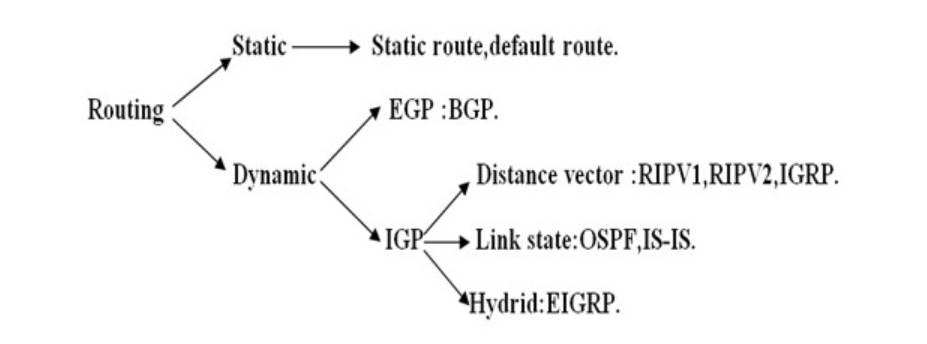

# Tìm hiểu về routing, Static Routing
## 1 Routing
- Định tuyến( routing ) là chức năng của router giúp xác định quá trình tìm đường đi cho các gói tin từ nguồn tới đích thông qua các nút trung gian là các bộ định tuyến router. 

- Routing đóng vai trò quan trọng đến tốc độ việc truyền dữ liệu trong mạng. Không có định tuyến mạng đường truyền dẫn dữ liệu sẽ diễn ra hỗn loạn, có thể khiến các đường truyền bị quá tải, truyền dẫn dữ liệu bị chậm.

- Định tuyến trực tiếp quyết định hiệu suất mạng bằng việc xác định đường đi tối ưu nhất để truyền dẫn dữ liệu, tránh các đường truyền dẫn quá tải và phân bố lưu lượng mạng một cách cân đối.

- Router dựa vào địa chỉ IP đích (destination IP) trong các gói tin và sử dụng bảng định tuyến (routing table) để xác định đường đi cho chúng.

- Bảng định tuyến của mỗi giao thức định tuyến là khác nhau, nhưng có thể bao gồm những thông tin sau:

    - Địa chỉ đích của mạng đích

    - Địa chỉ IP của router chặng kế tiếp phải đến.

    - Giao tiếp vật lí phải sử dụng để đi đến Router kế tiếp.

    - Subnet mask của địa chỉ đích.

## 1.1 Chỉ số và các giá trị routing
- Các chỉ số và giá trị routing được sử dụng để xác định đường đi tốt nhất đến điểm đích. 

- Các giá trị chỉ số phổ biến nhất được đưa ra dưới đây:

    - **Hop count** : Hop count được định nghĩa là số lần truyền qua router, một gói tin phải di chuyển trong một lộ trình để di chuyển từ nguồn đến đích. 

    - **Độ trễ**: Là khoảng thời gian do bộ routing thực hiện để xử lý, xếp hàng và truyền một gói dữ liệu tới một giao diện. Đường dẫn có giá trị trễ thấp nhất sẽ được coi là đường dẫn tốt nhất.

    - **Băng thông**: Dung lượng của liên kết được gọi là băng thông của liên kết. Giao thức sẽ xác định dung lượng băng thông cho tất cả các liên kết dọc theo đường dẫn và băng thông tổng thể cao hơn sẽ được coi là đường tốt nhất.

    - **Tải**:  thể hiện mức độ sử dụng tài nguyên mạng, bao gồm băng thông, CPU, và khả năng xử lý gói tin của router hoặc liên kết mạng.Giá trị này thay đổi động theo lưu lượng mạng hiện tại.

    - **Độ tin cậy**: Độ tin cậy là một chỉ số thể hiện tính ổn định của tuyến đường. Nó phản ánh tần suất lỗi hoặc mất kết nối của một tuyến mạng.
    
## 2 Phân loại định tuyến

- Có 2 loại định tuyến : Định tuyến động và định tuyến tĩnh 
### 2.1 Định tuyến tĩnh - static routing
- Định tuyến tĩnh là loại định tuyến mà trong đó router sử dụng các tuyến đường đi tĩnh để vận chuyển dữ liệu đi. Các tuyến đường đi tĩnh này có được do người quản trị cấu hình thủ công vào các router.

- Default route được sử dụng để gửi các gói tin đi trong trường hợp mạng đích không tìm thấy trong bảng định tuyến. 

**Cách hoạt động của định tuyến tĩnh**
- Bước 1: Khi một gói tin đến router, router kiểm tra địa chỉ IP đích trong gói tin.
- Bước 2: Router tra cứu bảng định tuyến để tìm tuyến đường phù hợp.
- Bước 3: Nếu địa chỉ đích khớp với một tuyến tĩnh, router chuyển tiếp gói tin qua giao diện hoặc địa chỉ next-hop được chỉ định.
- Bước 4: Nếu không tìm thấy tuyến đường phù hợp, gói tin sẽ bị loại bỏ hoặc được gửi qua tuyến mặc định (nếu có).

**Ưu điểm**

- Sử dụng ít băng thông hơn so với các phương thức định tuyến khác.
- Không tiêu tốn tài nguyên để tính toàn và phân tích gói tin định tuyến.
- Có tính bảo mật tốt hơn.

**Nhược điểm của routing tĩnh:**

- Không có khả năng tự động cập nhật đường đi.
- Phải cấu hình thủ công khi mạng có sự thay đổi.
- Khả năng mở rộng kém, phù hợp với mô hình mạng nhỏ.

### 2.2. Định tuyến động
- Định tuyến động là loại định tuyến mà trong đó router sử dụng các tuyến đường đi động để vận chuyển dữ liệu đi. Các tuyến đường đi động này có được do các router sử dụng các giao thức định tuyến động trao đổi thông tin định tuyến với nhau tạo ra. 

**Ưu điểm của routing động:**

- Nó dễ dàng hơn để cấu hình trong một mạng lớn.
- Sẽ hiệu quả hơn trong việc lựa chọn tuyến đường tốt nhất để đáp ứng với những thay đổi trong điều kiện hoặc cấu trúc liên kết. 

**Nhược điểm của routing động:**
- Nó đắt hơn về việc sử dụng CPU và băng thông.
- Nó kém an toàn bảo mật hơn so với routing mặc định và tĩnh.
