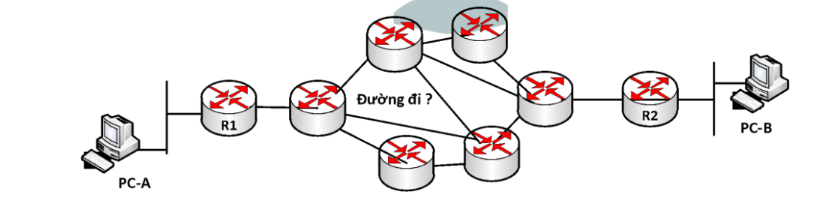

# Tìm hiểu về routing
## 1 Giới thiệu
- Định tuyến( routing ) là chức năng của router giúp xác định quá trình tìm đường đi cho các gói tin từ nguồn tới đích thông qua hệ thống mạng. 

- Router dựa vào địa chỉ IP đích (destination IP) trong các gói tin và sử dụng bảng định tuyến (routing table) để xác định đường đi cho chúng.

- Trong bảng định tuyến, mỗi mạng mà router có thể chuyển đi (mạng đích) thể hiện bằng một dòng. Mỗi mạng này có được có thể do chúng đang kết nối trực tiếp với router đang xét hay router học được thông qua việc cấu hình định tuyến.

## 1.1 Chỉ số và các giá trị routing
- Các chỉ số và giá trị routing được sử dụng để xác routing đường tốt nhất đến điểm đến. Các yếu tố được sử dụng bởi các giao thức để xác định đường đi ngắn nhất, những yếu tố này được gọi là một thước đo.

- Chỉ số là các biến mạng được sử dụng để xác định đường đi tốt nhất đến đích. Đối với một số giao thức sử dụng số liệu tĩnh có nghĩa là giá trị của chúng không thể thay đổi được và đối với một số giao thức routing khác, sử dụng số liệu động nghĩa là giá trị của chúng có thể được chỉ định bởi quản trị viên hệ thống.

- Các giá trị chỉ số phổ biến nhất được đưa ra dưới đây:

    - **Hop count** : Hop count được định nghĩa là một số liệu chỉ định số lần truyền qua các thiết bị kết nối internet như bộ routing, một gói tin phải di chuyển trong một lộ trình để di chuyển từ nguồn đến đích. 

    - **Độ trễ**: Là khoảng thời gian do bộ routing thực hiện để xử lý, xếp hàng và truyền một gói dữ liệu tới một giao diện. Các giao thức sử dụng số liệu này để xác định giá trị độ trễ cho tất cả các liên kết dọc theo đường dẫn end-to-end. Đường dẫn có giá trị trễ thấp nhất sẽ được coi là đường dẫn tốt nhất.

    - **Băng thông**: Dung lượng của liên kết được gọi là băng thông của liên kết. Băng thông được đo bằng bit trên giây. Liên kết có tốc độ truyền cao hơn như gigabit được ưu tiên hơn liên kết có dung lượng thấp hơn như 56 kb. Giao thức sẽ xác định dung lượng băng thông cho tất cả các liên kết dọc theo đường dẫn và băng thông tổng thể cao hơn sẽ được coi là đường tốt nhất.

    - **Tải**: Tải cho biết mức độ mà tài nguyên mạng như bộ routing hoặc liên kết mạng đang bận. Một tải có thể được tính theo nhiều cách khác nhau như sử dụng CPU, các gói được xử lý mỗi giây. Nếu lưu lượng truy cập tăng, thì giá trị tải cũng sẽ được tăng lên. Giá trị tải thay đổi theo sự thay đổi trong lưu lượng.

    - **Độ tin cậy**: Độ tin cậy là một yếu tố thước đo có thể bao gồm một giá trị cố định. Nó phụ thuộc vào các liên kết mạng và giá trị của nó được đo động. Một số mạng gặp sự cố thường xuyên hơn những mạng khác. Sau khi lỗi mạng, một số liên kết mạng được sửa chữa dễ dàng hơn các liên kết mạng khác. Bất kỳ hệ số độ tin cậy nào cũng có thể được xem xét để chỉ định xếp hạng độ tin cậy, thường là các giá trị số được chỉ định bởi người quản trị hệ thống.
## 2 Phân loại định tuyến

Có 2 loại định tuyến : Định tuyến động và định tuyến tĩnh 
### 2.1 Định tuyến tĩnh - static routing
- Định tuyến tĩnh là loại định tuyến mà trong đó router sử dụng các tuyến đường đi tĩnh để vận chuyển dữ liệu đi. Các tuyến đường đi tĩnh này có được do người quản trị cấu hình thủ công vào các router.
- Default route nằm ở cuối bảng định tuyến và được sử dụng để gửi các gói tin đi trong trường hợp mạng đích không tìm thấy trong bảng định tuyến. Nó rất hữu dụng trong các mạng dạng “stub network” như kết nối từ mạng nội bộ ra ngoài Internet.

**Ưu điểm**
- Sử dụng ít băng thông hơn so với các phương thức định tuyến khác.
- Không tiêu tốn tài nguyên để tính toàn và phân tích gói tin định tuyến.
- Dễ dàng triển khai, cấu hình.
- Có tính bảo mật tốt hơn.

**Nhược điểm của routing tĩnh:**

- Không có khả năng tự động cập nhật đường đi.
- Phải cấu hình thủ công khi mạng có sự thay đổi.
- Khả năng mở rộng kém, phù hợp với mô hình mạng nhỏ.

### 2.2. Định tuyến động
- Định tuyến động là loại định tuyến mà trong đó router sử dụng các tuyến đường đi động để vận chuyển dữ liệu đi. Các tuyến đường đi động này có được do các router sử dụng các giao thức định tuyến động trao đổi thông tin định tuyến với nhau tạo ra. 

**Giao thức động phải có các tính năng sau:**
- Tất cả các bộ routing phải có cùng một giao thức routing động để trao đổi các tuyến.
- Nếu bộ routing phát hiện ra bất kỳ thay đổi nào trong điều kiện hoặc cấu trúc liên kết, thì bộ routing sẽ phát thông tin này đến tất cả các bộ routing khác.

**Ưu điểm của routing động:**

- Nó dễ dàng hơn để cấu  trong một mạng lớn.
- Sẽ hiệu quả hơn trong việc lựa chọn tuyến đường tốt nhất để đáp ứng với những thay đổi trong điều kiện hoặc cấu trúc liên kết. 

**Nhược điểm của routing động:**
- Nó đắt hơn về việc sử dụng CPU và băng thông.
- Nó kém an toàn hơn so với routing mặc định và tĩnh.
