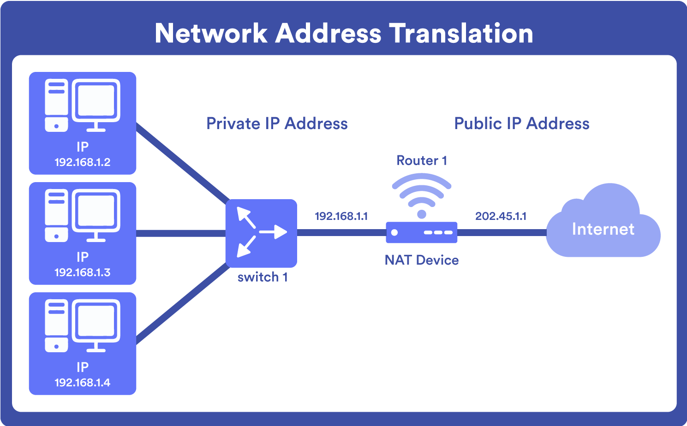
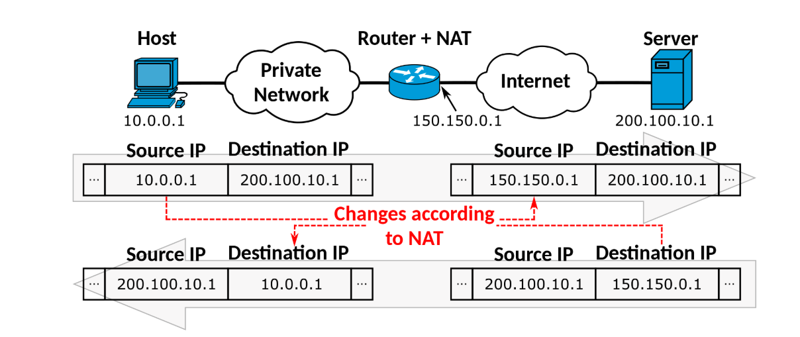

# Tìm hiểu về NAT:

## 1. NAT
### 1.1 NAT là gì ?

- NAT (Dịch địa chỉ mạng) là một kỹ thuật cho phép chuyển đổi địa chỉ IP giữa mạng nội bộ (private) và mạng bên ngoài (public).
- NAT giúp nhiều thiết bị trong mạng nội bộ chia sẻ một địa chỉ IP public duy nhất để truy cập Internet.

### 1.2 Chức năng của NAT

- Tiết kiệm địa chỉ IPv4
    - Giúp nhiều thiết bị nội bộ sử dụng một địa chỉ IP public duy nhất, giảm tiêu thụ địa chỉ IPv4.

- Bảo mật mạng nội bộ
    - Thiết bị bên ngoài không thể truy cập trực tiếp vào các máy trong mạng LAN vì địa chỉ IP private không hiển thị trên Internet.

- Điều hướng lưu lượng mạng
    - NAT giúp router kiểm soát luồng dữ liệu, chuyển đổi địa chỉ nguồn/dích khi gói tin đi ra hoặc vào mạng nội bộ.

- Hỗ trợ kết nối mạng nội bộ với Internet
    - Nếu không có NAT, các địa chỉ IP private không thể giao tiếp trực tiếp với Internet.

## 2.Các loại NAT ?
NAT (Network Address Translation) trong mạng có thể được phân loại thành 3 loại chính dựa trên cách thức thực hiện chuyển đổi địa chỉ IP:

- ### Static NAT:
    - Định nghĩa:
        - Ánh xạ một địa chỉ IP Private cố định với một địa chỉ IP Public cố định
        - Được thiết lập thủ công và cố định bởi quản trị viên mạng

    - Hoạt động:
        - Mỗi thiết bị trong mạng nội bộ được gán riêng một địa chỉ IP công cộng
        - Ánh xạ này không thay đổi, luôn cố định

    - Ưu điểm:
        - Cho phép kết nối hai chiều (từ ngoài vào và từ trong ra)
        - Dễ dàng quản lý và dự đoán

    - Nhược điểm:
        - Tốn kém về địa chỉ IP công cộng (1:1)
        - Không hiệu quả với mạng có nhiều thiết bị

- ### Dynamic NAT: 
    - Định nghĩa: 
        - Ánh xạ nhiều địa chỉ IP riêng với một nhóm (pool) địa chỉ IP công cộng

    - Hoạt động:
        - Thiết bị chỉ được cấp địa chỉ IP công cộng khi cần kết nối ra Internet
        - Khi kết nối hoàn tất, địa chỉ IP công cộng được trả lại pool để thiết bị khác sử dụng
        - Ánh xạ là tạm thời và không cố định

    - Ưu điểm:
        - Linh hoạt hơn Static NAT
        - Tiết kiệm địa chỉ IP công cộng (nhiều thiết bị có thể dùng chung pool)

    - Nhược điểm:
        - Số kết nối đồng thời vẫn bị giới hạn bởi kích thước pool
        - Khó thực hiện các kết nối từ bên ngoài vào mạng nội bộ

- ### Port Address Translation (PAT): 
    - Định nghĩa: 
        - Nhiều địa chỉ IP riêng dùng chung một địa chỉ IP công cộng duy nhất
        - Sử dụng thông tin cổng (port) để phân biệt các kết nối
        - Một địa chỉ IP công cộng có thể hỗ trợ tới nhiều kết nối đồng thời

    - Cơ chế chi tiết:
        - Router duy trì bảng theo dõi bộ tứ thông tin: (IP nguồn nội bộ, cổng nguồn, IP đích, cổng đích)
        - Khi gói tin ra ngoài, router thay địa chỉ IP nguồn và có thể thay đổi cả cổng nguồn
        - Mỗi kết nối được định danh bởi cặp IP công cộng + cổng duy nhất

    - Ví dụ cụ thể:
        - Máy A (10.0.0.1:3000) và máy B (10.0.0.2:3000) cùng truy cập server.com:80
        - Router ánh xạ: A → 150.150.0.1:10001 và B → 150.150.0.1:10002
        - Server nhận thấy hai kết nối khác nhau, phản hồi tương ứng

Phổ biến: Hầu hết các router gia đình và doanh nghiệp nhỏ đều sử dụng PAT

## 3.Cơ chế hoạt động của NAT

3.1 Quy trình khi gói tin đi ra internet:

- Máy tính trong mạng nội bộ gửi gói tin
- Router nhận gói tin và thay thế địa chỉ IP nguồn bằng địa chỉ IP công cộng của router
- Router thường cũng thay đổi số cổng nguồn
- Router cập nhật bảng NAT và chuyển tiếp gói tin đã được sửa đổi

3.2 Quá trình nhận gói tin từ Internet:

- Router nhận gói tin phản hồi từ internet
- Router kiểm tra bảng NAT để xác định gói tin này thuộc về máy tính nào trong mạng nội bộ
- Router thay thế địa chỉ IP đích (địa chỉ của router) bằng địa chỉ IP của máy tính đích trong mạng nội bộ
- Router chuyển tiếp gói tin đến máy tính đó

3.3 Ví dụ

Trong hình:

Cấu trúc mạng:
- Host (máy tính) có địa chỉ IP riêng: 10.0.0.1
- Router+NAT là thiết bị kết nối giữa mạng riêng và Internet, có địa chỉ IP công cộng: 150.150.0.1
- Server (máy chủ) trên Internet có địa chỉ IP công cộng: 200.100.10.1

Quá trình gói tin đi từ Host đến Server:

- Gói tin ban đầu từ Host: Source IP = 10.0.0.1, Destination IP = 200.100.10.1
- Router+NAT thay đổi Source IP thành địa chỉ công cộng của nó: Source IP = 150.150.0.1, Destination IP = 200.100.10.1
- Router+NAT cũng lưu trữ thông tin ánh xạ này trong bảng NAT để biết cách định tuyến gói tin trả về

Quá trình gói tin trả về từ Server đến Host:

- Gói tin từ Server: Source IP = 200.100.10.1, Destination IP = 150.150.0.1
- Router+NAT nhận được gói tin và kiểm tra bảng NAT
- Router+NAT thay đổi Destination IP thành địa chỉ IP riêng của Host: Source IP = 200.100.10.1, Destination IP = 10.0.0.1