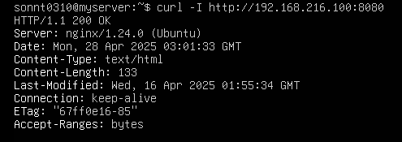

# 1 Tìm hiểu về lệnh Curl
## 1.1. cURL là gì?
curl (Client URL) là một công cụ dòng lệnh mạnh mẽ dùng để truyền dữ liệu qua nhiều giao thức, phổ biến nhất là HTTP/HTTPS. Nó được sử dụng để gửi yêu cầu đến server và nhận phản hồi, thường dùng trong kiểm thử API, tải xuống dữ liệu, hoặc tương tác với các dịch vụ web.
## 1.2 Các tính năng chính của curl
- Hỗ trợ nhiều giao thức: HTTP, HTTPS, FTP, SFTP, SMTP, v.v.
- Gửi các phương thức HTTP: GET, POST, PUT, DELETE, HEAD, v.v.
- Xử lý header, cookie, dữ liệu form, JSON, và xác thực (Basic Auth, OAuth, v.v.).
- Tải lên/tải xuống file.
- Hỗ trợ proxy, SSL/TLS, và các tùy chọn cấu hình chi tiết.
## Sử dụng curl trong Linux

- Trong Linux, curl thường được cài sẵn hoặc có thể cài qua trình quản lý gói:

    - Ubuntu/Debian: `sudo apt install curl`
    - CentOS: `sudo yum install curl`
- Sau khi cài đặt xong ta kiểm tra thử phiên bản đã cài đặt 

`curl --version` 

## Cú pháp cơ bản

```curl [tùy chọn] [URL]```


## Các tùy chọn phổ biến:

- X : Chỉ định phương thức (GET, POST, PUT, DELETE)
- d : Dữ liệu gửi đi (body request)
- H : Thêm custom header
- i : Hiển thị Header + Body
- I : Chỉ Header, không Body
- o : Lưu nội dung vào file
- O : Download file, giữ tên file gốc

## Ví dụ:


