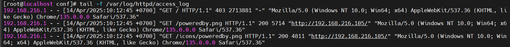

# File Log Apache
## 1. Đường dẫn file log Apache
## Trên CentOS
- Tên gói: httpd
- Đường dẫn mặc định:
    - Access Log (ghi lại các yêu cầu truy cập): `/var/log/httpd/access_log`
    - Error Log (ghi lại lỗi): `/var/log/httpd/error_log`
- File cấu hình liên quan: Các đường dẫn này được định nghĩa trong `/etc/httpd/conf/httpd.conf.`
## Trên Ubuntu
- Tên gói: apache2
- Đường dẫn mặc định:
    - Access Log: `/var/log/apache2/access.log`
    - Error Log: `/var/log/apache2/error.log`
- File cấu hình liên quan: Định nghĩa trong`/etc/apache2/apache2.conf` hoặc `/etc/apache2/sites-available/000-default.conf.`

## 2.Cách xem và quản lý log
## Xem log
- Access Log:
```
tail -f /var/log/httpd/access_log  # CentOS
tail -f /var/log/apache2/access.log  # Ubuntu
```
- Error Log:
```
tail -f /var/log/httpd/error_log  # CentOS
tail -f /var/log/apache2/error.log  # Ubuntu
```

## Tùy chỉnh định dạng log
- Trong file cấu hình Apache (httpd.conf hoặc apache2.conf):
    - Tìm dòng LogFormat để chỉnh định dạng.

 ```
LogFormat "%h %l %u %t \"%r\" %>s %b \"%{Referer}i\" \"%{User-Agent}i\"" combined

CustomLog /var/log/httpd/access_log combined  # CentOS
```
- Trong đó:

    - %h: địa chỉ của máy client    
    - %l: nhận dạng người dùng được xác định bởi identd (thường không SD vì không tin cậy)    
    - %u: tên người dung được xác định bằng xác thức HTTP   
    - %t: thời gian yêu cầu được nhận    
    - %r: là yêu cầu từ người sử dụng (client)    
    - %>s: mã trạng thái được gửi từ máy chủ đến máy khách    
    - %b: kích cỡ phản hồi đối với client    
    - Refer: tiêu đề Refeer của yêu cầu HTTP (chứa URL của trang mà yêu cầu này được khởi tạo)    
    - User_agent: chuỗi xác định trình duyệt
# File Log Ngnix

- Cấu hình Log trong Nginx mặc định được đặt trong file `/etc/nginx/nginx.conf` . Cấu hình này sẽ áp dụng cho toàn bộ.
- Các log của Nginx thường được lưu tại:

    - Log truy cập: `/var/log/nginx/access.log`
    - Log lỗi: `/var/log/nginx/error.log`

## Cấu Hình Log Trong File Cấu Hình Nginx    
- Để tùy chỉnh cấu hình log, chỉnh sửa file cấu hình Nginx. Mở file bằng các lệnh chỉnh sử văn bản :
ví dụ: 
```
sudo vi /etc/nginx/nginx.conf
````
- Để tùy chỉnh log, sử dụng các directive `error_log` và `access_log` vào các khối http, server, hoặc location trong tệp cấu hình Nginx Virtual hosting của bạn

- kiểm tra cấu hình để phát hiện lỗi:
```
sudo nginx -t
```
- reload Nginx
```
sudo systemctl reload nginx
```

## Giám Sát Log

Để kiểm tra log, Sử dụng các công cụ như tail :
- Giám Sát Log Error Log
```
sudo tail -f /var/log/nginx/error.log
```
- Giám Sát Log Access Log
```
sudo tail -f /var/log/nginx/access.log
```
## Log Format Mặc Định
Log format mặc định của Nginx là combined, bao gồm các chi tiết cơ bản về yêu cầu và phản hồi:

Giải Thích Các Thành Phần:
- remote_addr : Địa chỉ IP của client.
- remote_user : Tên user đã xác thực (nếu có).
- time_local : Thời gian và ngày giờ của yêu cầu theo local.
- request : Dòng yêu cầu HTTP đầy đủ. bao gồm method, path
    - Ví dụ: "GET /index.php HTTP/1.1"
- status : Mã trạng thái HTTP (e.g., 200, 404).
- body_bytes_sent : Kích thước của body phản hồi tính bằng byte.
- http_referer : URL của trang web dẫn đến yêu cầu.
- http_user_agent : Chuỗi user agent (trình duyệt, bot, v.v.) của client.

Có thể định nghĩa các log format tùy chỉnh để thu thập thêm dữ liệu hoặc đơn giản hóa các dòng log. Sử dụng directive `log_format` để tạo format và gán tên cho nó.


