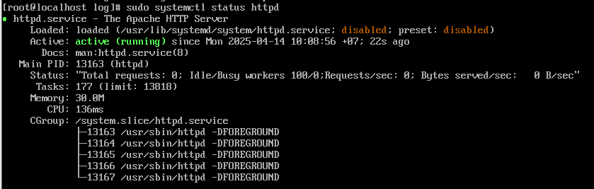
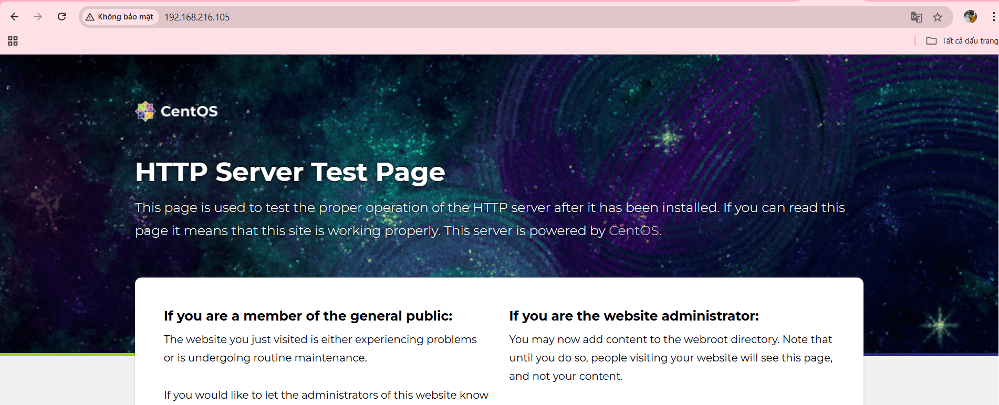
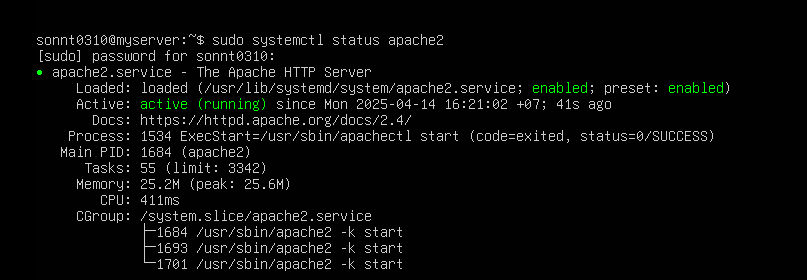
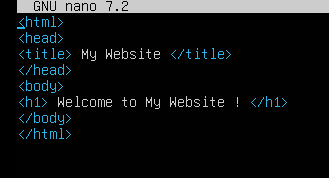
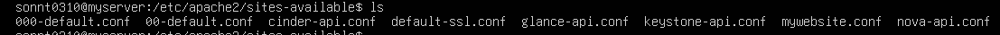
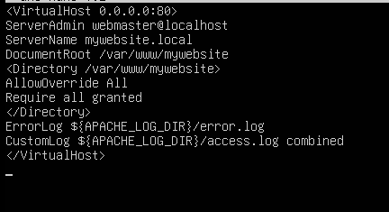
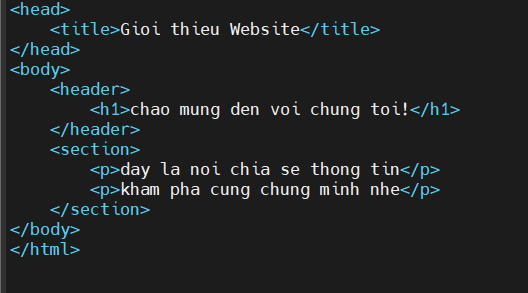
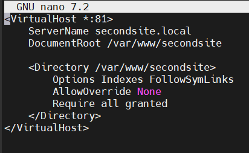
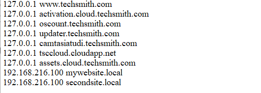

# Cài đặt Apache trên Ubuntu và CentOS

## 1. Cài đặt Apache trên CentOS 

### 1: Cập nhật hệ thống

```
sudo yum update -y 
```
### Bước 2: Cài đặt Apache

Trên CentOS, Apache được gọi là httpd:
```
sudo yum install httpd -y
```
### Bước 3: Khởi động và kích hoạt Apache

- Khởi động dịch vụ:
```
sudo systemctl start httpd
```
- Kích hoạt để chạy khi khởi động máy:
```
sudo systemctl enable 
```
### Bước 4: Kiểm tra trạng thái
```
sudo systemctl status httpd
```


Nếu đang chạy, bạn sẽ thấy trạng thái `active (running).`
### Bước 5: Truy cập Apache
Mở trình duyệt và truy cập: `http://your_server_ip.`
Nếu thấy trang mặc định của Apache, cài đặt thành công.



### Bước 6 (Tùy chọn): Mở cổng firewall
Nếu firewall đang chạy, mở cổng 80 (HTTP) và 443 (HTTPS):
```
sudo firewall-cmd --permanent --add-service=http
sudo firewall-cmd --permanent --add-service=https
sudo firewall-cmd --reload
```

## 2. Cài đặt Apache trên Ubuntu
### Bước 1: Cập nhật hệ thống
```
sudo apt update && sudo apt upgrade -y
```
### Bước 2: Cài đặt Apache
Trên Ubuntu, Apache được gọi là apache2:
```
sudo apt install apache2 -y
```
### Bước 3: Khởi động và kích hoạt Apache
- Khởi động dịch vụ:
```
sudo systemctl start apache2
```
- Kích hoạt để chạy khi khởi động máy
```
sudo systemctl enable apache2
```
### Bước 4: Kiểm tra trạng thái
```
sudo systemctl status apache2
```


Nếu đang chạy, bạn sẽ thấy trạng thái ```active (running). ```
### Bước 5: Truy cập Apache
Mở trình duyệt và truy cập: `http://your_server_ip.`
Nếu thấy trang mặc định của Apache, cài đặt thành công.
### Bước 6 (Tùy chọn): Mở cổng firewall

Nếu UFW (firewall) đang chạy, mở cổng 80 (HTTP) và 443 (HTTPS):
```
sudo ufw allow 80/tcp
sudo ufw allow 443/tcp
sudo ufw reload
```

# Cấu hình 1 web tĩnh với Apache
- Tạo một web tĩnh ở đường dẫn `/var/www/mywebsite`
```
sudo mkdir -p /var/www/mywebsite
```
- Tạo một file HTML đơn giản: `index.html` trong thư mục `mywebsite`

- Tạo file cấu hình Apache cho website



``` 
sudo nano /etc/apache2/sites-available/mywebsite.conf
```
 

- Kích hoạt website
```
sudo a2ensite mywebsite.conf

sudo systemctl reload apache2
```

- Tắt trang mặc định nếu cần:
```
sudo a2dissite 000-default.conf
sudo systemctl reload apache2
```

# CẤU HÌNH NHIỀU VIRTUAL HOST TRÊN 1 SERVER

Cấu hình thêm 1 vitrual host
- Tạo một web tĩnh ở đường dẫn `/var/www/secondsite`
```
sudo mkdir -p /var/www/secondsite
```
- Tạo một file HTML : `index.html` trong thư mục secondsite



- Tạo file cấu hình Apache cho website

```
sudo nano /etc/apache2/sites-available/mywebsite.conf
```

- Kích hoạt website
```
sudo a2ensite secondsite.conf

sudo systemctl reload apache2
```
## Cập nhật file hosts trên máy thật
- Chỉnh sửa file : `C:\Windows\System32\drivers\etc\hosts`
- Thêm dòng
```
192.168.216.100 mywebsite.local
192.168.216.100 secondsite.local
```


- Chỉnh ` ports.conf ` để Apache lắng nghe port mới
```
sudo nano /etc/apache2/ports.conf
```
- Sửa hoặc thêm dòng : 
``` 
Listen 81
```
- Chỉnh Sửa các file `*.conf` trong `sites-available ` cho tương ứng 
```
<VirtualHost *:81>
```
- (Nếu có firewall) Mở port mới
```
sudo ufw allow 81
```
- Reload Apache để áp dụng
```
sudo systemctl reload apache2
```

- Sau khi cập nhật xong truy cập để kiểm tra :
    - Truy cập: http://mywebsite.local

    - Truy cập: http://secondsite.local:81