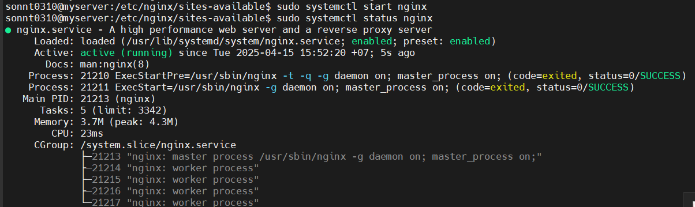
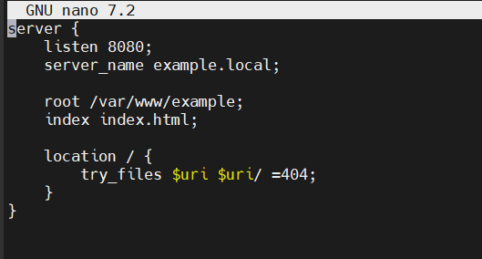
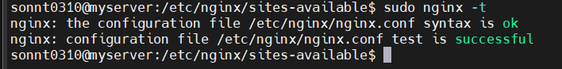
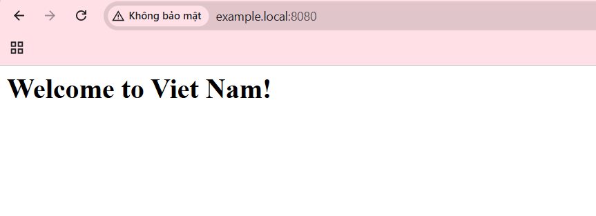

# CẤU HÌNH WEB TĨNH VỚI NGINX Ubuntu
## Bước 1: Cài Nginx
```
sudo apt update
sudo apt install nginx -y

```
- Mặc định cả Apache và Nginx đều sử dụng cổng 80 không thể chạy được. Thay đổi port Nginx trong file:
```
sudo nano /etc/nginx/sites-available/default
```
-  Sửa dòng `listen 80`. ví dụ: `listen 8080`
- khởi chạy nginx: `sudo systemctl restart nginx`
- Kiểm tra trạng thái
```
sudo systemctl status nginx
```
Nếu thấy dòng active (running) là OK.


# Tạo Virtual Host trong Nginx trên 
## Tạo một virtual host cho domain: `example.local`, trỏ đến thư mục `/var/www/example`
### Bước 1: Tạo thư mục web
```
sudo mkdir -p /var/www/example
```
- Cấp quyền:
```
sudo chown -R $USER:$USER /var/www/example
```
- Tạo file index và ghi nội dung :
```
sudo nano /var/www/examle/index.html
```
- Phân quyền thư mục: Đảm bảo Nginx có quyền truy cập
```
sudo chown -R www-data:www-data /var/www/example
sudo chmod -R 755 /var/www/example
```
### Bước 2: Tạo file cấu hình cho Virtual Host
```
sudo nano /etc/nginx/sites-available/example
```



### Bước 3: Kích hoạt Virtual Host
- Tạo symbolic link:
```
sudo ln -s /etc/nginx/sites-available/example /etc/nginx/sites-enabled/
```
- Kiểm tra cấu hình:
```
sudo nginx -t
```



- Khởi động lại Nginx:
```
sudo systemctl restart nginx
```
### Cập nhật file hosts trên máy thật
- Chỉnh sửa file : `C:\Windows\System32\drivers\etc\hosts`
- Thêm dòng
```
192.168.216.100 example.local
```
- Kiểm tra trên trình duyệt : ```example.local:8080```


# CẤU HÌNH WEB TĨNH VỚI NGINX CentOs
1. Cài đặt Nginx
```
sudo yum update -y
sudp yum install nginx -y
```
2. Bật và khởi động dịch vụ Nginx
```
sudo systemctl enable nginx
sudo systemctl start nginx
```
3. Kiểm tra trạng thái Nginx
```
sudo systemctl status nginx
```
Nếu thấy dòng active (running) là OK

4. Đổi port mặc định Nginx để không trùng với Apache

Sửa dòng `listen       80;`thành `listen 8080` tại file cấu hình Nginx `sudo nano /etc/nginx/nginx.conf`

Mở port 8080 trên firewall 
```
sudo firewall-cmd --permanent --add-port=8080/tcp
sudo firewall-cmd --reload
```

Sau đó restart lại chương trình 

5. Kiểm tra Nginx hoạt động

- Mở trình duyệt và truy cập địa chỉ IP của server 
- Sẽ thấy trang mặc định của Nginx: “Welcome to nginx!”