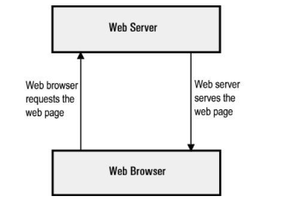

# Web server là gì?
-   Web server là máy chủ cài đặt các chương trình phục vụ các ứng dụng web. Webserver có khả năng tiếp nhận request từ các trình duyệt web và gửi phản hồi đến client thông qua giao thức HTTP hoặc các giao thức khác. Có nhiều web server khác nhau như: Apache, Nginx
# Web server hoạt động như thế nào?

# Một số Web Server phổ biến

## Apache HTTP Server:
- Là một trong những web server phổ biến nhất trên thế giới. Nó có khả năng mở rộng cao, ổn định và hỗ trợ nhiều tính năng linh hoạt. Apache chạy trên nhiều hệ điều hành như Linux, Unix, Windows và MacOS.

## Nginx: 
- Cũng là một web server phổ biến và mạnh mẽ. Nó được thiết kế để xử lý đồng thời nhiều yêu cầu và có khả năng xử lý tải cao. Nginx thường được sử dụng làm proxy ngược (reverse proxy) hoặc load balancer cũng như web server chính.

## Microsoft Internet Information Services (IIS):
- Là web server được phát triển bởi Microsoft và chạy trên hệ điều hành Windows. Nó tích hợp tốt với các công nghệ Microsoft như ASP.NET và có khả năng quản lý dễ dàng thông qua giao diện người dùng đồ họa.

## Lighttpd: 
- (Còn được gọi là Lighty) là một web server nhẹ và tối ưu hóa cho hiệu suất. Nó thích hợp cho các ứng dụng có lưu lượng truy cập lớn hoặc có yêu cầu tải nhanh.