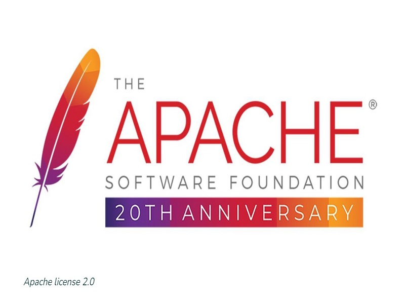
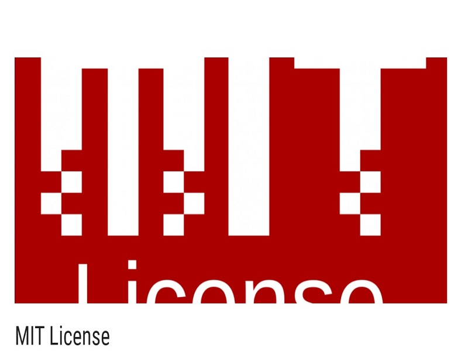
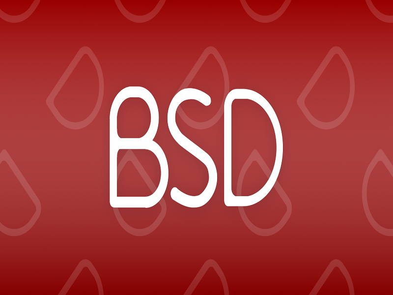

# Giấy phép mã nguồn mở 

1. Giấy phép mã nguồn mở là gì? 

- Giấy phép mã nguồn mở là một loại giấy phép cho phần mềm máy tính và các sản phẩm khác cho phép mã nguồn, bản thiết kế hoặc thiết kế được sử dụng, sửa đổi hoặc chia sẻ theo các điều khoản và điều kiện được xác định. 

- Việc cấp giấy phép mã nguồn mở cho phép người dùng cuối cùng và các công ty thương mại có thể xem và sửa đổi, kế hoạch chi tiết hoặc thiết kế cho các nhu cầu tùy chỉnh hoặc khắc phục sự cố của riêng họ. Phần mềm được cấp phép nguồn mở hầu hết có sẵn miễn phí hoặc có trả phí tùy thuộc vào điều kiện sử dụng.

# 2. Các loại giấy phép mã nguồn mở phổ biến hiện nay    
2.1  Giấy phép Apache license 2.0

Apache License 2.0 được phát hành vào tháng 1 năm 2004 của Quỹ phần mềm Apache (Apache Software Foundation – ASF). Giấy phép này cho người dùng phần mềm nguồn mở, quyền tự do sử dụng phần mềm với bất kỳ mục đích nào, phân phối chỉnh sửa và phân sửa đổi theo các điều khoản của giấy phép mà không lo vấn đề bản quyền.

Các điều kiện của giấy phép Apache License 2.0:

- Apache License 2.0 cho phép người dùng tự do sử dụng phần mềm với bất kỳ mục đích nào, tự do phân phối, sửa đổi. 

- Giấy phép không yêu cầu bản sửa đổi của phần mềm phải được phân phối dưới cùng giấy phép với bản gốc và không yêu cầu bản sửa đổi phải được phân phối dưới dạng mã nguồn mở.

2.2 Giấy phép MIT License

- Giấy phép mã nguồn mở này được phát hành bởi Massachusetts Institute of Technology (MIT). Đây là một trong những giấy phép cho phép người dùng tự do nhất, nó có thể kết hợp với các mã nguồn khác và đảm bảo tương thích theo điều kiện của mọi loại giấy phép khác .

- Với MIT License bạn có thể sử dụng , sao chép , sửa đổi , hợp nhất , xuất bản , phân phối và/hoặc bán các bản sao của phần mềm mà không vi phạm bản quyền. Chỉ cần tuân thủ điều kiện thông báo cho phép của phần mềm gốc sử dụng giấy phép MIT.
2.3 Giấy phép công cộng GNU
- Giấy phép công cộng GNU (hay GNU General Public License - GNU GPL) là giấy phép phần mềm tự do phổ biến nhất, mới đầu do Richard Stallman viết cho dự án GNU.

- Phiên bản hiện hành của giấy phép này là phiên bản 3 năm 2007(GPL v3), phiên bản được sử dụng nhiều nhất hiện nay là phiên bản 2 năm 1991.

- Tư tưởng của GNU GPL là:

    - Phần mềm GPL phải là phần mềm tự do.

    - Phần mềm phái sinh từ phần mềm GPL cũng phải là phần mềm GPL.

- Giấy phép GNU có đặc tính virus, bởi sức lây lan và kế thừa của nó. Một người nhận sản phẩm từ người mang giấy phép GNU thì ngay lập tức người đó cũng mang giấy phép GNU.

=> Hệ quả là GNU là giấy phép phổ biến nhất, bởi mã nguồn luôn ở dạng công cộng cho phép ai cũng có thể tham gia ở bất kì thời điểm nào.

- Mặc dù giấy phép GNU yêu cầu mã nguồn và chương trình phải được cung cấp miễn phí, song nó cho phép người phân phối có thể kinh doanh với sản phẩm nhờ đưa ra các chính sách về bảo hành, tính chi phí phân phối sản phẩm, đào tạo sử dụng …

- Một số phần mềm sử dụng giấy phép GNU nổi bật: RedHat Enterprise Linux, Ubuntu, GIMP, Drupal, WordPress, Joomla…  

2.4 Giấy phép BSD

Giấy phép BSD (Berkeley Software Distribution License) là một giấy phép phần mềm tự do với các điều kiện rất đơn giản được sử dụng rộng rãi cho phần mềm máy tính.

- Giấy phép BSD cho phép sử dụng và phân phối lại mã nguồn và sản phẩm, có hoặc không có sửa đổi, miễn là tuân thủ các yêu cầu sau:

    - Giữ nguyên thông báo bản quyền của sản phẩm.

    - Không được sử dụng tên dự án hay tên nhà phân phối vào mục đích quảng bá bản thân nếu không được cho phép.

=> Cho phép các nhà phát triển phần mềm có thể thương mại hóa thực sự các sản phẩm phần mềm có sử dụng mã nguồn mở dùng giấy phép BSD, tức kiếm tiền dựa trên mã nguồn của chương trình.

- Cho phép các nhà phát triển thay thế, bổ sung thêm các điều khoản vào trong giấy phép cho phù hợp với mình, hoặc thậm chí sử dụng một giấy phép khác.

- Một số phần mềm sử dụng giấy phép BSD: Window Xfree86, FreeBSD, NetBSD, OpenBSD..