# Cấu trúc file và thư mục
## 1 Hệ thống file 
- Trong hệ thống Linux, tất cả đều được cấu hình và coi như là file. Không chỉ bao gồm file text, ảnh, các chương trình biên dịch mà còn cả các thư mục, phân vùng và drive thiết bị phần cứng đều được hệ thống nhìn nhận như một file.

- Tất cả các file và thư mục đều xuất hiện trong thư mục root, kể cả khi các thư mục còn lại được lưu trong các thiết bị vật lý khác nhau (trên ổ cứng khác, hoặc trên ổ cứng của máy tính khác)

- Với nhân Linux, hệ thống file là phẳng. Nghĩa là - nó không là một cấu trúc phân cấp, phân biệt giữa các thư mục , tệp tin, hoặc các chương trình. Thay vào đó, kernel sử dụng khái niệm inode để đại diện cho từng file.

- Mỗi inode chứa thông tin về một file bao gồm: số inode của nó (nhận dạng duy nhất trong hệ thống), các chủ sở hữu và nhóm liên kết với file, loại file (file thông thường, hay file link liên kết hay thư mục, ...), quyền truy cập file, thời gian tạo file, kích thước tệp tin và địa chỉ nơi mà file được lưu trữ.

## 2 Cấu trúc thư mục trong linux 
- Linux quản lý hệ thống trên một "hệ thống tệp tin" duy nhất, bắt đầu ở gốc là thư mục root (/) đây là thư mục ở cấp cao nhất. Cấu trúc cơ bản của hệ thống Linux như sau:

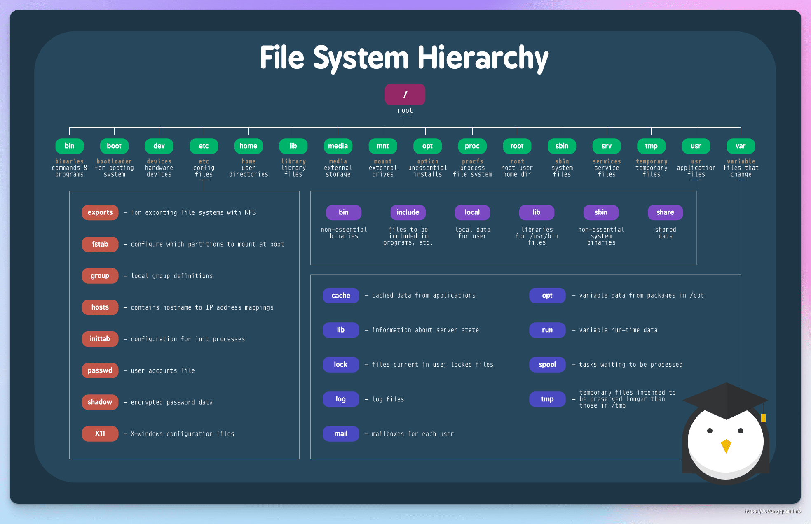
 
Trên hệ điều hành Linux, cấu trúc thư mục được tổ chức theo một hệ thống phân cấp theo tên gọi hợp lý để dễ dàng quản lý các tài nguyên hệ thống.

- / (Root) – Thư mục gốc của hệ thống

    - Thư mục này là thư mục cấp cao nhất của hệ thống Linux và nó chứa tất cả các thư mục và tệp trong hệ thống. Thư mục gốc có thể được truy cập bởi mọi người dùng, tuy nhiên, hầu hết các tệp và thư mục trong đó yêu cầu quyền truy cập của người dùng root để có thể sửa đổi.

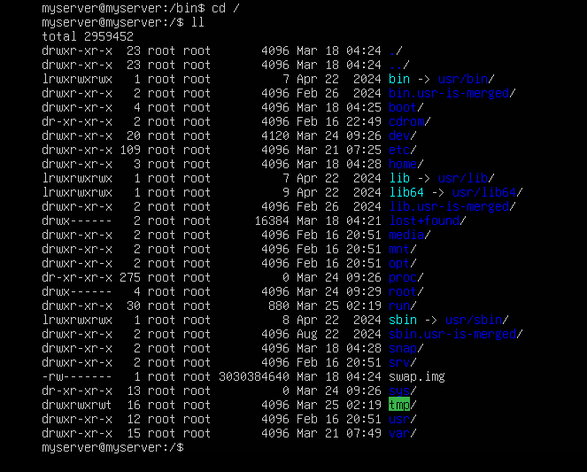

- /bin – Thư mục chứa các lệnh thực thi hệ thống

    - Thư mục này chứa các tệp thực thi (như lệnh) mà hệ thống sử dụng để khởi động và hoạt động. Các tệp thực thi này không phụ thuộc vào bất kỳ thư viện động nào và nên được sử dụng trong trường hợp hệ thống không thể tìm thấy các thư viện động phù hợp.

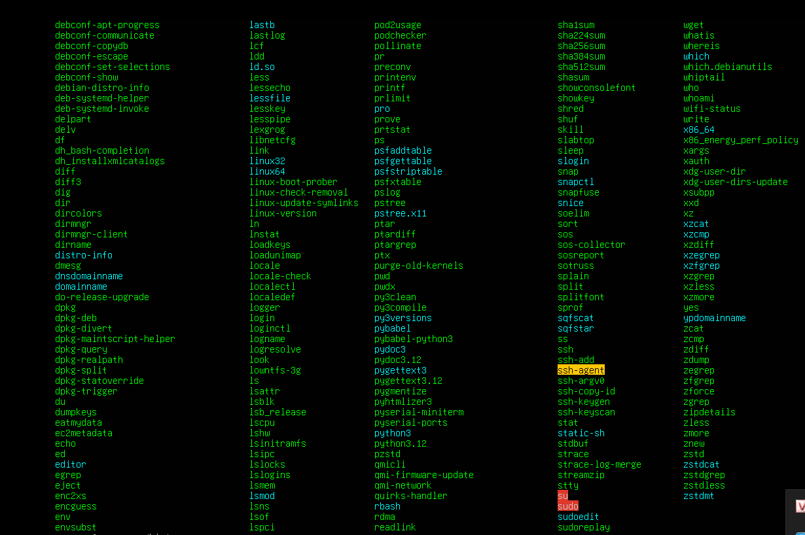

- /boot – Thư mục chứa các tệp khởi động
    - Thư mục này chứa các tệp cần thiết để khởi động hệ thống, bao gồm các tệp kernel, tệp cấu hình khởi động và các tệp liên quan khác.

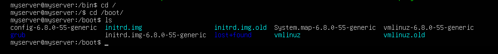

- /dev – Thư mục chứa các thiết bị
    - Thư mục này chứa các tệp thiết bị và tệp đặc biệt để thể hiện các thiết bị phần cứng như ổ đĩa, bàn phím, chuột, cổng USB, v.v.

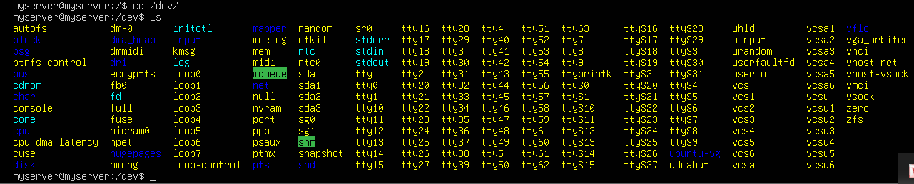

- /etc – Thư mục chứa các tệp cấu hình
    - Thư mục này chứa các tệp cấu hình hệ thống, như tệp cấu hình mạng, tệp cấu hình phần mềm và tệp cấu hình hệ thống.

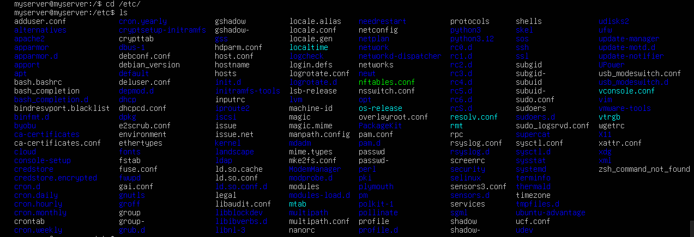

-  /home – Thư mục chứa thư mục người dùng
    - Thư mục này chứa các thư mục người dùng, mỗi người dùng có một thư mục riêng để lưu trữ các tệp và thư mục.

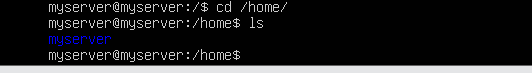

-  /lib – Thư mục chứa các thư viện
    - Chứa các file library hỗ trợ cho các file thực binary. Mỗi khi cài đặt phần mềm trên Linux, các thư viện cũng tự động được download, và chúng hầu hết được bắt đầu với lib*.. Đây là các thư viện cơ bản mà Linux cần đề làm việc. Không giống như trong Windows, các thư viện có thể chia sẻ và dùng chung cho các chương trình khác nhau. Đó là một lợi ích trong hệ thống tệp tin của Linux.

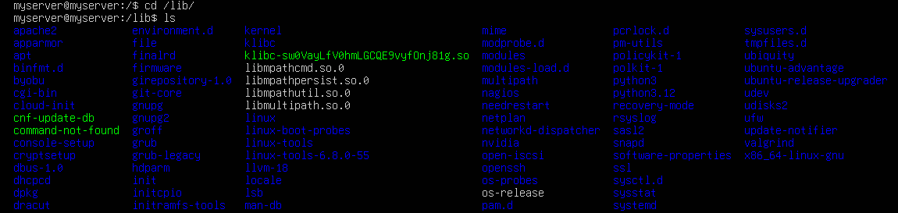

- /media – Thư mục chứa các thiết bị lưu trữ tạm thời
    - Thư mục này được sử dụng để gắn kết các thiết bị lưu trữ tạm thời như đĩa CD, USB hoặc ổ đĩa cứng bên ngoài. Hiểu như là ổ D:/Data trong Windows

- /mnt – Thư mục chứa các thiết bị lưu trữ tạm thời
    - Thư mục này được sử dụng để gắn kết các thiết bị lưu trữ tạm thời như đĩa CD, USB hoặc ổ đĩa cứng bên ngoài. Tuy nhiên, /mnt được sử dụng cho các thiết bị lưu trữ tạm thời có tính chất tạm thời hơn so với /media.

- /opt – Thư mục chứa các ứng dụng tùy chỉnh
    - Thư mục này được sử dụng để cài đặt các ứng dụng tùy chỉnh như phần mềm thương mại hoặc các ứng dụng không phải từ kho lưu trữ chính thức của hệ thống.

- /proc – Thư mục chứa thông tin về tiến trình hệ thống
    - Thư mục này chứa các tệp hệ thống đặc biệt được sử dụng để hiển thị thông tin về các tiến trình hệ thống đang chạy, tài nguyên hệ thống và các thông số khác.

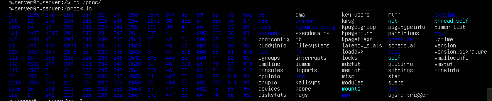

- /root – Thư mục chứa thư mục người dùng root
    - Thư mục này là thư mục người dùng chính của người dùng root và chứa các tệp và thư mục riêng của người dùng root.

- /run – Thư mục chứa dữ liệu chạy tạm thời
    - Thư mục này được sử dụng để lưu trữ dữ liệu chạy tạm thời cho các tiến trình và các ứng dụng khác trong hệ thống.

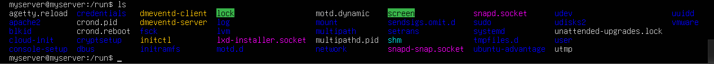

- /sbin – Thư mục chứa các lệnh hệ thống thực thi của quản trị viên
    - Thư mục này chứa các tệp thực thi hệ thống giống như thư mục /bin, nhưng các tệp thực thi này chỉ được sử dụng bởi các quản trị viên hệ thống.

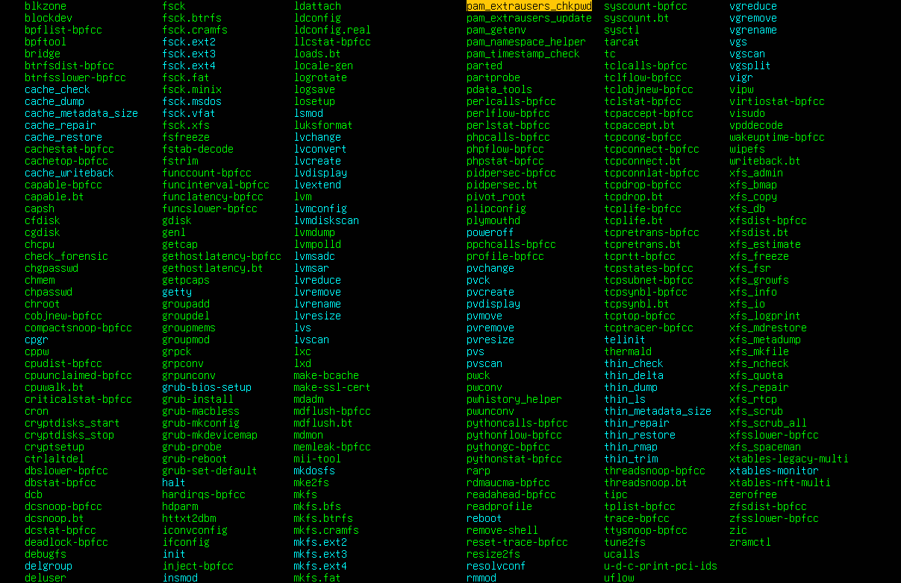

- /srv – Thư mục chứa dữ liệu cho các dịch vụ
    - Thư mục này chứa các dữ liệu và tài nguyên cần thiết cho các dịch vụ hệ thống cung cấp.
- /sys – Thư mục chứa thông tin về hệ thống
    - Thư mục này chứa các tệp và thư mục dùng để quản lý các thông tin hệ thống, chẳng hạn như thông tin về phần cứng và thiết bị.

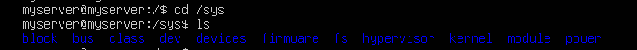

- /tmp – Thư mục chứa tệp tạm thời
    - Thư mục này chứa các tệp tạm thời được tạo ra bởi các ứng dụng hoặc quá trình khác trên hệ thống. Thư mục này được xóa tự động khi hệ thống khởi động lại.

- /usr – Thư mục chứa các tệp và thư mục chia sẻ cho các người dùng
    - Thư mục này chứa các tệp và thư mục chia sẻ cho các người dùng trong hệ thống, chẳng hạn như các tệp thực thi, thư viện, tài liệu và hình ảnh. Thư mục /usr được chia thành các thư mục con như /usr/bin, /usr/lib và /usr/share.
    
-  /var – Thư mục chứa các tệp và thư mục biến đổi
    - Thư mục này chứa các tệp và thư mục biến đổi, chẳng hạn như các tệp nhật ký, tệp trạng thái và các tệp khác mà nội dung thường xuyên được cập nhật hoặc biến đổi trong hệ thống.
