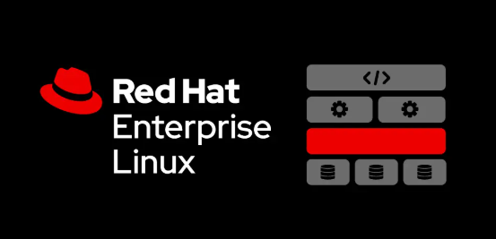
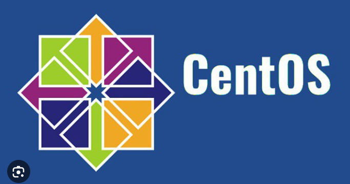
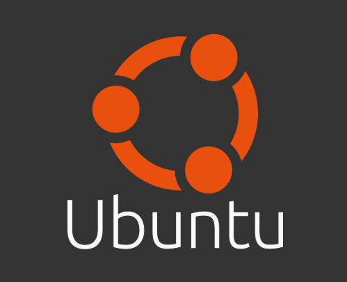

# Distro linux, phân loại distro 

## 1. Khái niệm distro

1.1. Giới thiệu distro
Distro là từ viết tắt thay thế cho Linux Distribution - bản phân phối của Linux - là một hệ điều hành được tập hợp từ nhiều phần mềm dựa trên nhân Linux (Linux Kernel) và thường có một hệ thống quản lý các gói tin.

## 2. Phân loại distro 
Các bản phân phối Linux thường được phân loại thành 3 nhánh chính, mỗi nhánh sử dụng một hệ quản lý gói (package manager) khác nhau. Dưới đây là chi tiết về các nhánh:

2.1 Debian-based (Dựa trên Debian):
Hệ quản lý gói: APT (Advanced Package Tool) với định dạng gói .deb.

Đặc điểm: Tập trung vào tính ổn định và dễ sử dụng, phù hợp với cả người dùng cá nhân và doanh nghiệp.

Các bản phân phối tiêu biểu:

- Debian

- Ubuntu
 
- Linux Mint
  
- Kali Linux

2.2 Red Hat-based (Dựa trên Red Hat):
Hệ quản lý gói: RPM (Red Hat Package Manager), thường kết hợp với dnf hoặc yum.

Đặc điểm: Hướng tới môi trường doanh nghiệp và máy chủ, với hỗ trợ kỹ thuật chuyên nghiệp.

Các bản phân phối tiêu biểu:

- Red Hat Enterprise Linux (RHEL)

- CentOS Stream

- Fedora

2.3 Arch-based (Dựa trên Arch Linux):
Hệ quản lý gói: Pacman với định dạng gói .pkg.tar.xz.

Đặc điểm: Tập trung vào tính tùy biến và tối giản, phù hợp với người dùng nâng cao.

Các bản phân phối tiêu biểu:

- Arch Linux

- Manjaro

# Một số distro phổ biến

## 1.  Red Hat Enterprise Linux
- Được phát triển bởi Red Hat và mục tiêu là hướng tới thị trường thương mại. Red Hat Enterprise Linux được phát hành cho các phiên bản máy chủ x86, x86-64, Itanium, PowerPC và IBM System z.

- Red Hat Enterprise Linux có hai phiên bản là RHEL và RHELAP.

  - RHEL(Red Hat Enterprise Linux) là phiên bản hỗ trợ 2 CPU.
  - RHELAS(Red Hat Linux Advanced Server) là phiên hỗ trợ CPU không giới hạn
Red Hat Enterprise Linux chủ yếu được sử dụng bởi các tổ chức có yêu cầu tính bảo mật cao (các cơ quan, tổ chức nhà nước chẳng hạn).

- Trình quản lý gói RPM được sử dụng trên Red Hat và các bản phân phối dựa trên nó (Red Hat Package Management).

## 2. CentOS

- CentOS là viết tắt của Community Enterprise Operating System và là một bản phân phối miễn phí của Red Hat Enterprise Linux (RHEL).

- Trên thực tế thì có rất nhiều doanh nghiệp sử dụng CentOS là hệ điều hành cho các Server, đơn giản vì nó là một bản phân phối của RHEL nên đảm bảo về mức độ bảo mật.

- Hai nữa là CentOS lại miễn phí, vậy nên các doanh nghiệp sẽ tiết kiệm được một khoản tiền khá lớn khi không phải trả tiền mua và duy trì dịch vụ.

## 3. Fedora

- Trước đây Fedora được gọi là Fedora Core và cũng là một bản phân phối Linux dựa trên RPM Package Manager. Fedora được cộng đồng Fedora Project phát triển và được bảo trợ bởi Red Hat.

- Do được tài trợ bởi Red Hat, Fedora được dùng để kiểm tra các tính năng mới của Red Hat phát triển trước khi tính năng đó được thương mại hóa với RHEL.

## 4. Debian Linux

- Debian Linux là phiên bản phân phối miễn phí của Linux, nó được phát triển bởi cộng đồng các lập trình viên và người dùng (phát triển dựa trên những phản hồi từ người dùng).

- Do Debian miễn phí nên mọi người có thể tham khảo Souce Code của dự án và sử dụng nó với các mục đích hợp pháp.

- Với hơn 23000 ứng dụng và công cụ cài đặt có sẵn thông qua dpkg thì chúng ta sẽ có rất nhiều lựa chọn khi cài đặt phần mềm, công cụ trên Debian.

## 5. Ubuntu

- Ubuntu có lẽ là cái tên quen thuộc 
- Ubuntu cũng miễn phí giống như Debian với khoảng 6 tháng sẽ được cập nhật một lần. 
- Ngoài ra thì Ubuntu cũng có hỗ trợ các phiên bản thương mại dành cho các tổ chức. Ubuntu được sử dụng với với nhiều mục đích khác nhau gồm cả desktop, server, IoT và Cloud..

- Ubuntu được đánh giá là một phân phối Linux dễ sử dụng, hiệu năng tương đối tốt và mang lại trải nghiệm tốt cho người dùng.

