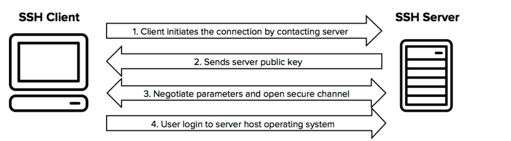

# Tìm hiểu SSH
## 1. SSH là gì ?

SSH tên đầy đủ là Secure SHell là một giao thức mạng mang tính bảo mật, cung cấp cách thức truy cập từ xa vào một thiết bị khác một cách an toàn thông qua các cơ chế mã hóa. Bằng cách sử dụng một số kỹ thuật mã hóa, xác thực mỗi bên với nhau để đảm bảo dữ liệu trao đổi giữa các máy trong phiên làm việc được mã hóa và giải mã nhằm mục đích giữ vững tính toàn vẹn của dữ liệu và bảo vệ an ninh thông tin.

## 2. Quá trình hoạt động của SSH 
- SSH hoạt động theo mô hình client-server để xác thực hai bên và mã hóa dữ liệu giữa chúng. Client sẽ là thành phần tạo phiên kết nối SSH đến thành phần khác, còn Server sẽ cho phép Client mở phiên SSH kết nối vào chính mình.

### Bước 1.Khi Client khởi tạo 1 kết nối TCP tới port 22 ở Server, sẽ có 2 thông tin được trao đổi:

- Phiên bản Protocol mà Server hỗ trợ
- Phiên bản của gói cài đặt SSH trên Server
Nếu phiên bản Protocol của Server phù hợp với Client thì kết nối mới được tiếp tục. 

### Bước 2.Thiết lập Transport Layer (Trao đổi khóa và mã hóa)

- Đây là giai đoạn quan trọng để thiết lập một kênh mã hóa an toàn. SSH-2 sử dụng thuật toán Diffie-Hellman (hoặc biến thể) để trao đổi khóa, thay vì chỉ dựa vào RSA như SSH-1.

### Thương lượng thuật toán:

- Server gửi danh sách các thuật toán mà nó hỗ trợ, 

- Client chọn một bộ thuật toán từ danh sách này và gửi lại lựa chọn của mình.

### Trao đổi khóa Diffie-Hellman:
- Mục tiêu: Tạo ra một shared secret (bí mật chung) mà cả Client và Server dùng để tạo khóa mã hóa, mà không cần gửi trực tiếp khóa qua mạng.

- Quy trình:
    - Server gửi Host Key (thường là RSA, DSA, hoặc ECDSA) để định danh chính nó, kèm theo chữ ký số để chứng minh tính xác thực.
    - Client và Server thực hiện trao đổi Diffie-Hellman:
    Client tạo cặp khóa tạm thời (public/private) và gửi khóa công khai của nó.
    - Server cũng tạo cặp khóa tạm thời và gửi khóa công khai của nó.
    - Cả hai dùng khóa riêng của mình và khóa công khai của bên kia để tính toán shared secret.
- Từ shared secret, cả hai bên tạo ra:
    - Session Key: Khóa đối xứng để mã hóa dữ liệu.
    
### Xác thực Server:
- Client kiểm tra Host Key của Server:
    - Nếu Client đã lưu Host Key từ trước (trong known_hosts), nó so sánh để xác nhận Server.
    - Nếu là lần đầu kết nối, Client hỏi người dùng có chấp nhận Host Key không (hiển thị fingerprint).
    - Sau khi xác thực Server và trao đổi khóa thành công, kênh mã hóa được thiết lập.
- Mã hóa và kiểm tra toàn vẹn:
    - Dữ liệu từ đây được mã hóa bằng Session Key 
    - Mỗi gói tin được gắn thêm MAC (Message Authentication Code) để đảm bảo không bị thay đổi.
### Bước 3. User Authentication (Xác thực Client)
Sau khi kênh mã hóa được thiết lập, Server cần xác thực Client để đảm bảo người dùng hợp lệ. SSH-2 hỗ trợ nhiều phương pháp xác thực, phổ biến nhất là:

- Password Authentication:
    - Server yêu cầu Client gửi username và password.
    - Client mã hóa password bằng Session Key và gửi qua kênh an toàn.
    - Server giải mã và kiểm tra với cơ sở dữ liệu (thường là /etc/passwd).
    - Nếu khớp, Client được xác thực.

- Public Key Authentication:
    - Sử dụng cặp khóa Public key và Private key để xác thực.
### Bước 4 4. Connection Protocol (Thiết lập kênh giao tiếp)
- Sau khi xác thực thành công, SSH-2 mở các kênh (channels) để Client và Server giao tiếp

## 4. SSH key
- SSH key (Secure Shell key) là một cặp mã hóa bao gồm một khóa riêng tư (private key) và một khóa công khai (public key) được sử dụng trong giao thức SSH để xác thực và bảo mật quá trình truyền tải dữ liệu và đăng nhập từ xa vào các máy chủ. SSH key thường được sử dụng để thay thế việc nhập mật khẩu khi kết nối đến một máy chủ từ xa.

- Public Key (Khóa công khai)
Đây là phần của cặp khoá SSH được đặt trên máy chủ hoặc bất kỳ thiết bị mạng nào mà người dùng muốn truy cập. Public Key thường được chia sẻ và phân phối một cách an toàn vì nó không bao gồm thông tin nhạy cảm của người dùng.

- Private Key (Khóa cá nhân)
Đây là phần mật của cặp khoá SSH mà người dùng giữ bí mật trên máy tính hoặc thiết bị cá nhân. Mọi thông tin liên quan đến Private Key cần được bảo vệ chặt chẽ vì nó đóng vai trò quan trọng trong quá trình xác thực và truy cập.

### Cách hoạt động của SSH key
 
- Máy khách bắt đầu bằng cách gửi ID đến cặp khóa mà nó muốn xác thực trên máy chủ từ xa.
- Máy chủ sẽ kiểm tra xem có khóa công khai nào có cùng ID khóa trong tài khoản mà máy khách đang cố gắng đăng nhập hay không.
- Nếu tìm thấy khóa công khai trùng khớp, máy chủ sẽ tạo một số ngẫu nhiên, mã hóa nó bằng khóa công khai và gửi cho máy khách.
- Máy khách giải mã tin nhắn bằng khóa riêng và cùng với sự trợ giúp của khóa phiên, tính toán giá trị băm MD5 của tin nhắn.
- Sau đó, máy khách sẽ mã hóa giá trị băm và gửi đến máy chủ.
- Trong khi đó, máy chủ cũng tính toán giá trị băm MD5 của tin nhắn được gửi đến máy khách (với sự trợ giúp của khóa phiên). Nếu hai giá trị này khớp nhau, điều đó chứng tỏ máy khách sở hữu khóa riêng tương ứng và máy khách được xác thực trên máy chủ. 
## 5. Các kỹ thuật mã hóa SSH

### 5.1 Symmetrical Encryption
- Là một dạng mã hóa sử dụng secret key (chìa khóa bí mật) ở cả 2 chiều mã hóa và giải mã tin nhắn bởi cả host và client. Quá trình tạo symmetric key được thực hiện bởi key exchange algorithm. Khi thực hiện kỹ thuật này, chỉ những người có chìa khóa (mật khẩu) mới có thể giả mã tin nhắn trong quá trình chuyển.

- Lưu ý, key không được truyền giữa client và host. Thay vào đó, cả 2 máy tính chia sẻ thông tin chung và sau đó sử dụng chúng để tính ra khóa bí mật. Điều này đảm bảo, dù có bị máy tính khác bắt được đường truyền chung thì thông tin vẫn được an toàn vì không tính được thuật toán tạo key.

### 5.2 Asymmetrical Encryption
- Asymmetrical encryption sử dụng 2 khóa khác nhau là public key và private key để mã hóa và giải mã. Hay còn biết đến là cặp khóa public-private key pair. Giống như tên gọi, khóa public sẽ được công khai cho tất cả các bên liên quan còn private key phải luôn luôn được đảm bảo an toàn.

- Asymmetrical Encryption chỉ được sử dụng trong quá trình trao đổi thuật toán của khóa của symmetric encryption, server sử dụng public key của client để tạo, challenge và truyền nó tới client để chứng thực. Nếu client giải mã được thông tin nghĩa là nó đang giữa đúng private key cần thiết.

### 5.3 Hashing
- Hashing được SSH sử dụng để  để xác nhận tính xác thực của tin nhắn. Bằng cách tạo ra một giá trị duy nhất với độ dài nhất định cho mỗi lần nhập liệu mà không có hướng nào khác để khai thác.

- SSH được thực hiện bởi HMACs, đảm bảo lệnh không bị giả mạo bởi bất kỳ phương thức nào.

