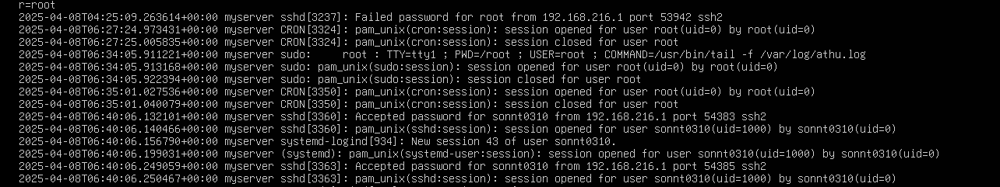
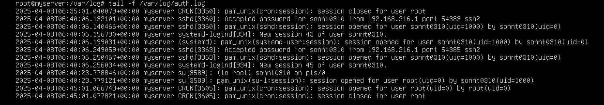
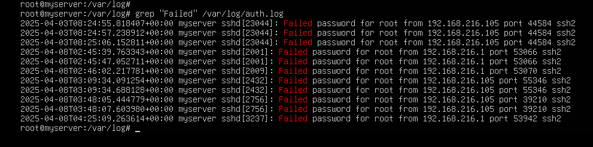

# File Log
- Khi quản trị hệ thống Linux, bạn cần kiểm tra log SSH để xem thông tin về các kết nối, lỗi xác thực hoặc cảnh báo bảo mật

- Các bản ghi đăng nhập và lỗi SSH thường được lưu trữ tại:

Ubuntu/Debian: ```/var/log/auth.log```

CentOS/RHEL: ```/var/log/secure```


# Vị trí File Log SSH
Trên Ubuntu 24.04:

- File log SSH chính: /var/log/auth.log
- File log hệ thống: /var/log/syslog
- File log về kết nối SSH: /var/log/auth.log

Trên CentOS 9:

- File log SSH chính: /var/log/secure
- File log hệ thống: /var/log/messages
- File log systemd: journalctl -u sshd

#  Các lệnh cơ bản đọc file log

## Xem toàn bộ nội dung file log:

- Ubuntu
```
cat /var/log/auth.log
```
- CentOS
```
cat /var/log/secure
```


## Xem nội dung file log theo thời gian thực:

- Ubuntu
```
tail -f /var/log/auth.log
```
- CentOS
```
tail -f /var/log/secure
```

## Lọc log theo từ khóa:
- Tìm thông tin đăng nhập thành công
```
grep "Accepted" /var/log/auth.log  # Ubuntu
grep "Accepted" /var/log/secure    # CentOS
```
- Tìm thông tin đăng nhập thất bại
```
grep "Failed" /var/log/auth.log    # Ubuntu
grep "Failed" /var/log/secure      # CentOS
```



# Phân tích các mục log SSH phổ biến
1. Đăng nhập thất bại:

```
2025-04-08T08:24:55.018407+00:00 myserver sshd[23044]: Failed password for root from 192.168.216.105 port 44584 ssh2
```

- 2025-04-08T08:24:55.018407+00:00 → Dấu thời gian của sự kiện (ngày, giờ, múi giờ).
- myserver → Tên máy chủ của bạn.
- sshd[23044] → Dịch vụ SSH đang chạy, [23044] là ID của tiến trình (PID).
- Failed password → Xác thực mật khẩu thất bại.
- for root → Tài khoản bị cố gắng truy cập là root.
- from 192.168.216.105 → Địa chỉ IP nguồn thực hiện kết nối.
- port 44584 → Số cổng nguồn mà client sử dụng để kết nối.
- ssh2 → Phiên bản giao thức SSH đang được sử dụng.

2. Đăng nhập thành công:

```
2025-04-08T08:24:55.018407+00:00 server-name sshd[12345]: Accepted password for username from 192.168.1.100 port 54321 ssh2
```
- 2025-04-08T08:24:55.018407+00:00: Thời gian sự kiện xảy ra
- server-name: Tên của server
- sshd[12345]: Tiến trình SSH daemon và ID tiến trình
- Accepted password: Phương thức xác thực được chấp nhận
- username: Tên người dùng đăng nhập
- 192.168.1.100: Địa chỉ IP nguồn kết nối
- port 54321: Cổng nguồn kết nối
- ssh2: Phiên bản SSH được sử dụng
3. Đăng nhập thất bại nhiều lần:
```
Apr 6 10:25:10 server-name sshd[12347]: Failed password for invalid user admin from 192.168.1.200 port 56790 ssh2
```
```invalid user```: Cho biết người dùng không tồn tại trong hệ thống

4. Phiên SSH kết thúc:
```
Apr 6 11:30:22 server-name sshd[12345]: Received disconnect from 192.168.1.100 port 54321:11: disconnected by user
```
```Received disconnect```: Báo hiệu phiên kết nối SSH đã đóng

# Công cụ phân tích log nâng cao
- Sử dụng journalctl (systemd):
## Xem log của dịch vụ SSH
```
journalctl -u ssh      # Ubuntu
journalctl -u sshd     # CentOS
```
## Xem log theo thời gian thực
```
journalctl -f -u sshd
```
## Lọc log theo thời gian
```
journalctl -u sshd --since "2025-04-06 10:00:00" --until "2025-04-06 11:00:00"
```