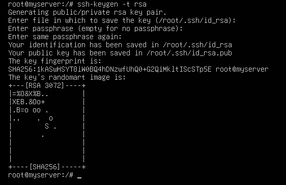
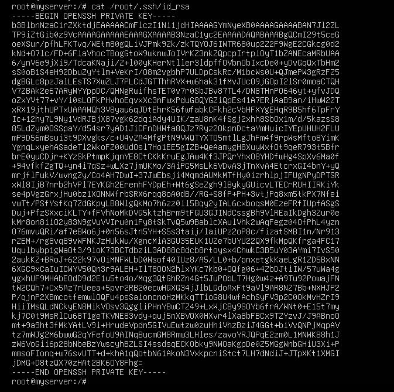
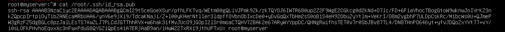
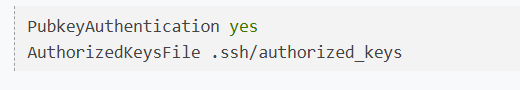

# Cơ chế xác thực bằng SSH Key
Ngoài cơ chế xác thức bằng cách nhập mật khẩu còn có cơ chế sử dụng SSH Key để xác thực. Để tạo nên xác thực này cần có hai file, một file lưu Private Key và môt lưu Public key

- Public Key khóa chung, là một file text - nó lại lưu ở phía Server SSH, nó dùng để khi Client gửi Private Key (file lưu ở Client) lên để xác thực thì kiểm tra phù hợp giữa Private Key và Public Key này. Nếu phù hợp thì cho kết nối.
- Private Key khóa riêng, là một file text bên trong nó chứa mã riêng để xác thực (xác thực là kiểm tra sự phù hợp của Private Key và Public Key). Máy khách kết nối với máy chủ phải chỉ ra file này khi kết nối SSH thay vì nhập mật khẩu. Hãy lưu file Private key cận thận, bất kỳ ai có file này có thể thực hiện kết nối đến máy chủ của bạn

# Tạo SSH Key (Public/Private)
-  file Public Key lưu ở vị trí phù hợp tại Server (xem trên), còn Private key dùng ở máy khách để kết nối.

Dưới đây là một cách có được cặp file này (dùng lệnh ssh-keygen của OpenSSH chạy ở Server hoặc Client đều được):
```
ssh-keygen -t rsa
```


Đầu tiên nó hỏi nhập thư mục sẽ lưu key sinh ra, hãy nhập thư mục - tên file muốn lưu hoặc nhấn ```Enter``` để sử dụng đường dẫn nó gợi ý. Sau đó nó yêu cầu nhập passphase, nhấn ```Enter``` để rỗng. Cuối cùng nó sinh ra hai file key có tên id_rsa và id_rsa.pub ở thư mục đã nhập trên.

Kết quả lệnh trên bạn đã có:

- Private Key chứa trong file /root/.ssh/id_rsa,nó được dùng để SSH client (máy local) kết nối đến Server. Mở file này ra, đoạn mã Private Key có dạng



- Public Key chứa trong file /root/.ssh/id_rsa.pub . Nó được lưu (dùng) ở máy Server để xác thực khi có Private key gửi đến. Nếu mở file này ra, thì nội dung mã Public key nhìn thấy có dạng:



# Xác thực bằng SSH Key

Khi SSH Server bật chế độ cho phép xác sự bằng SSH Key, thì tại Server cấu hình để nó nhận biết có Public Key lưu ở file nào đó trên Server. Sau đó, ở máy Client (local) khi kết nối sẽ gửi Private Key lên, nếu nó kiểm tra thấy phù hợp giữa Public Key và Private Key thì cho kết nối.

## Cấu hình Public key cho SSH Server

- Mở file config của SSH Service ra (```/etc/ssh/sshd_config``` ), hãy đảm bảo nó có dòng cấu hình:



- Copy public key qua máy server (centos)

Chạy lệnh sau trên máy client (ubuntu):
```
ssh-copy-id -i /root/.ssh/id_rsa.pub root@192.168.216.105
```

kiểm tra trên server: 

```
cat /root/.ssh/authorized_keys
```

## SSH vào server

Chạy lệnh:
```
ssh root@192.168.216.105
```


