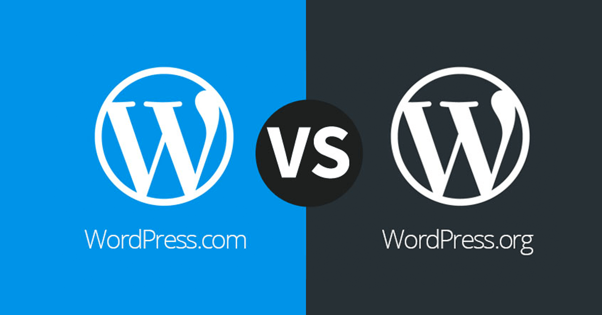
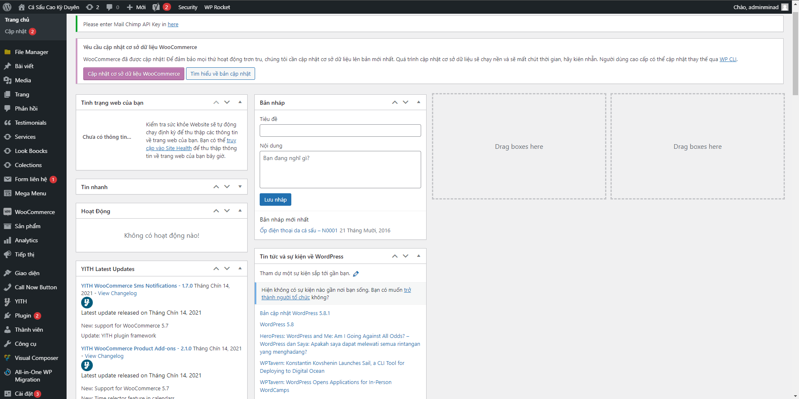
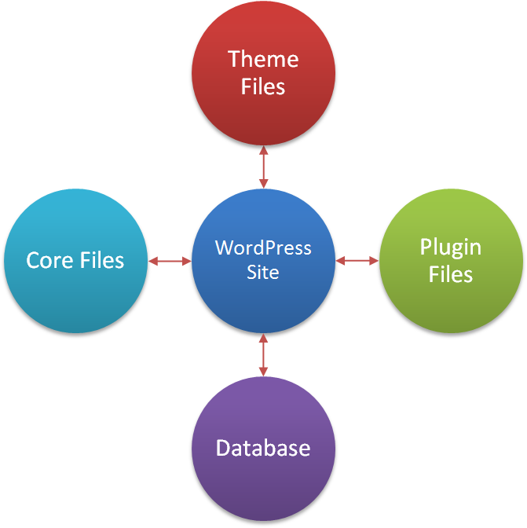
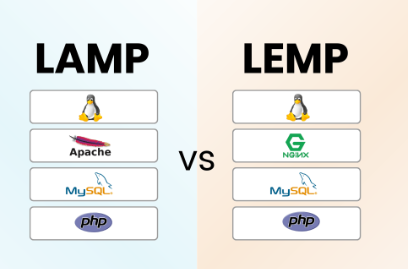

# Wordpress là gì?
WordPress là một Hệ quản trị nội dung (CMS - Content Management System) mã nguồn mở, giúp bạn tạo website/blog/dự án nhanh chóng mà không cần biết lập trình sâu.
# Phân loại
WordPress được phân loại thành hai phiên bản chính: WordPress.org và WordPress.com. 

## WordPress.org
- WordPress.org là phiên bản mã nguồn mở của WordPress, được tải về miễn phí từ trang web chính thức (wordpress.org). Người dùng cài đặt phần mềm này trên máy chủ của họ (thông qua nhà cung cấp hosting như Bluehost, SiteGround, hoặc AWS).
- Yêu cầu người dùng tự quản lý toàn bộ hạ tầng, bao gồm hosting, tên miền, bảo mật, sao lưu, và cập nhật.
- Ưu điểm:
    - Có thể chỉnh sửa mã nguồn, phát triển theme/plugin riêng.
    - Người dùng quản lý hosting, bảo mật, sao lưu, và cập nhật.
    - Từ blog đơn giản đến thương mại điện tử phức tạp.
- Nhược điểm:
    - Cần kiến thức cơ bản để cài đặt, cấu hình, và bảo trì.
    - Phải trả phí cho hosting, tên miền, và đôi khi theme/plugin cao cấp.
    - Trách nhiệm bảo mật và cập nhật nằm ở người dùng.
## WordPress.com
- WordPress.com là dịch vụ lưu trữ được quản lý bởi Automattic, công ty đứng sau WordPress. Người dùng đăng ký tài khoản và sử dụng WordPress mà không cần tự cài đặt hay quản lý máy chủ.
- Cung cấp các gói từ miễn phí đến cao cấp (Personal, Premium, Business, eCommerce).
- Ưu điểm:
    - Không cần cài đặt hay quản lý máy chủ, lý tưởng cho người mới.
    - Automattic lo cập nhật, bảo mật, và sao lưu.
    - Phù hợp cho blog cá nhân đơn giản.
- Nhược điểm:
    - Không thể cài plugin hoặc chỉnh sửa mã nguồn ở các gói thấp.
    - Các tính năng nâng cao (như plugin, theme tùy chỉnh, tên miền riêng) yêu cầu gói trả phí.
    - Người dùng không kiểm soát hoàn toàn dữ liệu hoặc máy chủ.
# Các thành phần chính trong trang quản trị của website WordPress

- Dashboard – Bảng tin: thống kê số bài viết hiện tại, số bình luận trên website của bạn, bản nháp, tin tức, tình trạng website,...
- Post – Bài viết: quản lý các bài viết trên trang. Có thể tạo bài viết mới, tạo chuyên mục, gắn thẻ bài viết, thêm ảnh, chỉnh sửa bài viết tùy ý
    - All Posts: tại đây bạn có thể xem, chỉnh sửa và quản lý tất các bài viết có trên website.
    - Add New: Tạo bài viết mới.
    - Categories: Quản lý các chuyên mục của bài viết.
    - Tags: quản lý các thẻ bài viết đang có

- Media – Thư viện: Có thể tải các hình ảnh, video lên Website qua mục này. Đây cũng là nơi lưu trữ các file media (hình ảnh, video, nhạc,...) của bạn.
- Library: thư viện media, quản lý các tập tin đã upload lên.
- Add New: thêm một file media mới.
- Pages: các trang trongwebsite của bạn. Có thể tạo trang mới cho website, thêm ảnh, thêm nội dung, chỉnh sửa trang theo ý muốn.

    - Add Pages: xem và quản lý toàn bộ pages hiện có

    - Add New: tạo trang mới.
- Comments: Trang quản lý các ý kiến bình luận trên website .Có thể xoá hoặc cấm bất kỳ người nào sử dụng chức năng này trên web của bạn.
- Appearance – Giao diện: là khu vực làm việc để tiến hành tinh chỉnh giao diện (theme) trên website hoặc đổi theme, cài đặt Widget, cài đặt Menu
- Plugins: Trang quản lý các Plugin bổ sung tính năng cho website của bạn. Bạn có thể cài đặt hoặc gỡ bỏ bất kỳ Plugin nào tại trang này. 
- Users: Trang quản lý người dùng đã đăng ký sử dụng tại website của bạn. Bạn có thể thêm, xoá hoặc phân quyền cho bất kỳ người dùng nào tại trang này.
- Tools: Trang quản lý xuất/nhập dữ liệu. Bạn có thể xuất ra file để làm file backup cho website phòng trường hợp website của bạn bị hack, bị mất dữ liệu trong tương lai, từ đó bạn có thể sử dụng công cụ import để khôi phục lại dữ liệu đã export.

- Settings: Trang chỉnh sửa các thông số chung cho website như url của web, timezone, Date Format, cấu trúc đường dẫn,…. Thông thường việc quản lý và chỉnh sửa thông số của các Plugin cũng được thực hiện tại đây.

# Các thành phần WordPress: 

- Source Code: bao gồm WordPress Core + Theme + Plugins

- Database: chạy trên MySQL.

- Data: gồm Text Data (bài viết, links, …) và Media Files ( ảnh, file âm thanh, video, .xml, .sql, ..pdf, ..file nén .zip, .rar…)

## Wordpress Core
- WordPress Core hay Nhân WordPress – là tất cả các files ngoài Theme, Plugins và các file khác được người dùng thêm vào.
- Với mỗi phiên bản WordPress, các files của WordPress Core không đổi và theo nguyên tắc – các plugin/ theme khi hoạt động cũng không thay đổi các file thuộc WordPress core.
## Theme Wordpress
- Theme – hay Giao diện là phần bắt buộc phải có của Website WordPress- ở các CMS hay phần mềm khác, Themes còn được gọi là Templates – nó điều khiển mọi thứ ở Front-End – tức phần mà chúng ta thấy khi vào Websites.
- Một site WordPress bắt buộc phải có theme mới hoạt động được.
- Theme được chứa trong thư mục wp-content/ themes/
- Các theme được phát triển để xử lý 2 phần: thiết kế và tính năng
    - Phần thiết kế: xử ý việc hiển thị Front-End: gồm layout, các thành phần nội dung khác (Menus, Widgets)…màu sắc, font chữ, các hiệu ứng
    - Phần tính năng: các chức năng trên Website (ví dụ sắp xếp bài viết, giới hạn số bài ở trang chủ…)
## Plugin Wordpress
- Plugins – hay ở nhiều CMS khác gọi là extension/ modules: là phần mở rộng có thể cài thêm vào WordPress để bổ sung hoặc mở rộng tính năng mà WordPress core hay theme không hỗ trợ.
- Khác với Theme – Website WordPress có thể hoạt động không cần có plugin nào được kích hoạt.

# Quy trình hoạt động
Quá trình hoạt động của WordPress từ lúc người dùng truy cập vào website cho đến khi trang được hiển thị là một chuỗi xử lý logic và tương tác giữa server – PHP – database – HTML/CSS.

1. Người dùng gửi yêu cầu (Request)
    - Người dùng truy cập vào một URL, ví dụ: https://example.com/blog

    - Trình duyệt gửi HTTP Request đến server.
2. Web Server nhận yêu cầu
    - Apache hoặc Nginx nhận được request.

    - Web server chuyển hướng yêu cầu đến `file index.php `của WordPress, thường là qua `.htaccess` (Apache) hoặc `rewrite rule` (Nginx).
3. WordPress khởi động (Bootstrap)
    `index.php` → gọi `wp-blog-header.php` → gọi `wp-load.php` → gọi `wp-config.php` → load toàn bộ hệ thống lõi (core system).

    - Kết nối tới Database.

    - Load các file cần thiết trong thư mục wp-includes/ và wp-admin/ (nếu là trang quản trị).
4. Plugins và Theme được kích hoạt
WordPress nạp tất cả các plugin đang kích hoạt.

    - Sau đó, nạp theme đang được sử dụng

    - Template hierarchy sẽ quyết định file nào được dùng (ví dụ: single.php, page.php, archive.php, v.v.).

5. WordPress xử lý yêu cầu
    - Sử dụng hệ thống Hook (actions & filters) để xử lý nội dung.

    - Xác định nội dung cần hiển thị (bài viết, trang, chuyên mục...).

    - Lấy dữ liệu từ database (sử dụng WP_Query).
6. Tạo HTML trả về cho trình duyệt
    - WordPress kết hợp nội dung từ database + giao diện theme → tạo thành HTML đầy đủ.

    - HTML được trả về cho trình duyệt người dùng.

7. Trình duyệt hiển thị trang
    - Trình duyệt render HTML, tải thêm CSS, JavaScript, hình ảnh từ server.

    - Trang web hoàn chỉnh hiển thị cho người dùng.
# Ưu và nhược điểm
## Ưu điểm

+ Dễ sử dụng: Thao tác sử dụng WordPress rất đơn giản, dễ hiểu và dễ vận hành nên người sử dụng không cần biết kiến thức lập trình nâng cao.

+ Dễ quản lý: Hệ thống quản trị dễ dàng, tất cả các mục như bài đăng, giao diện, cài đặt,... được sắp xếp dễ hiểu, khoa học và thân thiện với người dùng.

+ Tối ưu hóa SEO: Có các công cụ mặc định để giúp SEO trang web dễ dàng hơn và nhanh hơn.

+ Hỗ trợ nhiều loại ngôn ngữ: WordPress hỗ trợ 52 ngôn ngữ trong đó có tiếng Việt.

+ Thiết kế trang web đa dạng: Nhiều gói giao diện có sẵn, hệ thống Themes đồ sộ, có thể làm nhiều loại website.

+ Tiết kiệm chi phí: Có rất nhiều themes miễn phí và có sẵn để sử dụng, bạn có thể thiết kế một website riêng mà không tốn bất kỳ chi phí nào.

+ Cộng đồng sử dụng rộng lớn: Có thể học hỏi các mẹo vặt và thủ thuật dành cho WordPress từ những người khác trên Internet.
# Nhược điểm
+ Cài đặt template và plugin: Cài đặt không đơn giản, nếu cài đặt không đúng cách có thể dẫn đến nhiều xung đột xảy ra khi sử dụng.

+ Phù hợp với doanh nghiệp nhỏ: Có hiệu suất thấp trong việc xử lý các cơ sở dữ liệu dung lượng lớn nên không phù hợp với các doanh nghiệp có dung lượng máy chủ lớn.

+ Bảo mật: Vì phổ biến, WordPress dễ bị tấn công nếu không cập nhật thường xuyên hoặc không dùng plugin bảo mật.

+ Hiệu suất có thể chậm: Nếu sử dụng nhiều plugin hoặc theme nặng, trang web có thể tải chậm (PHP phải xử lý nhiều logic).

+ Khó tùy chỉnh nâng cao: Với người không biết lập trình, việc chỉnh sửa sâu (ví dụ: sửa Core Files) có thể khó khăn.

+ Chi phí ẩn: Mặc dù miễn phí, nhưng bạn có thể cần mua theme, plugin cao cấp hoặc hosting tốt để tối ưu.

# Các thành phần để xây dựng 1 website bằng wordpress

Các thành phần cần thiết cho website WordPress theo cấu trúc mới:
1. Hạ tầng cơ bản (Server Stack)

    - Web Server: Apache hoặc Nginx
    - PHP: Ngôn ngữ chạy WordPress
    - MySQL/MariaDB: Cơ sở dữ liệu
    - Hệ điều hành: Thường là Linux (Ubuntu, CentOS...)

2. Thành phần chính của WordPress

    - WordPress Core: Mã nguồn cốt lõi
    - Theme: Giao diện và bố cục website
    - Plugins cơ bản: Bổ sung chức năng thiết yếu
    - Media Library: Quản lý hình ảnh, video
    - Dashboard/Admin Panel: Giao diện quản trị

3. Hệ thống hỗ trợ (khuyến nghị)

    - Tên miền (domain): Địa chỉ truy cập website
    - Hosting/VPS/server: Dịch vụ lưu trữ phù hợp quy mô
    - Chứng chỉ SSL (HTTPS): Bảo mật kết nối
    - CDN (Content Delivery Network): Tăng tốc và bảo mật
    - Plugin SEO và bảo mật: Tối ưu hiển thị và an toàn
# LAMP và LEMP

##  LAMP
1. Là một bộ ứng dụng máy chủ bao gồm : LAMP = Linux + Apache + MySQL + PHP
    - Linux: Hệ điều hành (Ubuntu, CentOS, Debian,...) – nền tảng để cài đặt toàn bộ hệ thống.
    - Apache: Web server, xử lý yêu cầu HTTP, trả về HTML cho trình duyệt.
    - MySQL/MariaDB: Hệ quản trị cơ sở dữ liệu dùng để lưu dữ liệu web.
    - PHP: Ngôn ngữ lập trình chạy phía server – WordPress được viết bằng PHP.
2. Hoạt động:
    - Apache nhận request HTTP từ trình duyệt.

    - Nếu là trang PHP, Apache gọi PHP để xử lý.

    - PHP có thể truy vấn dữ liệu từ MySQL.

    - Trả về kết quả HTML cho trình duyệt.
## LEMP
1. LEMP = Linux + Nginx (Engine-X) + MySQL + PHP-FPM
- Nginx thay thế Apache, hiệu suất cao, nhẹ hơn, xử lý tốt hơn với traffic lớn.

- PHP-FPM (FastCGI Process Manager) giúp PHP chạy nhanh, độc lập với web server.

2.  Hoạt động:
- Nginx nhận request.

- Gửi yêu cầu .php tới PHP-FPM (qua FastCGI).

- PHP xử lý logic và truy vấn cơ sở dữ liệu.

- Trả kết quả HTML lại cho Nginx → trình duyệt.

